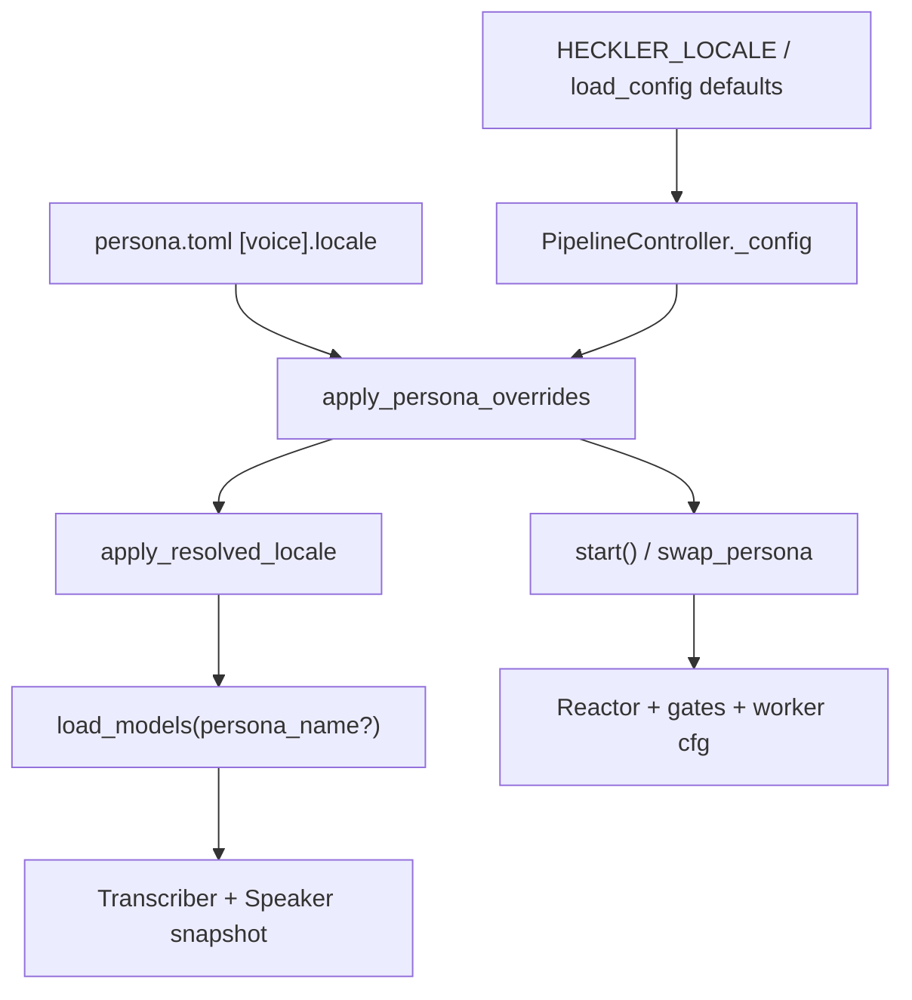
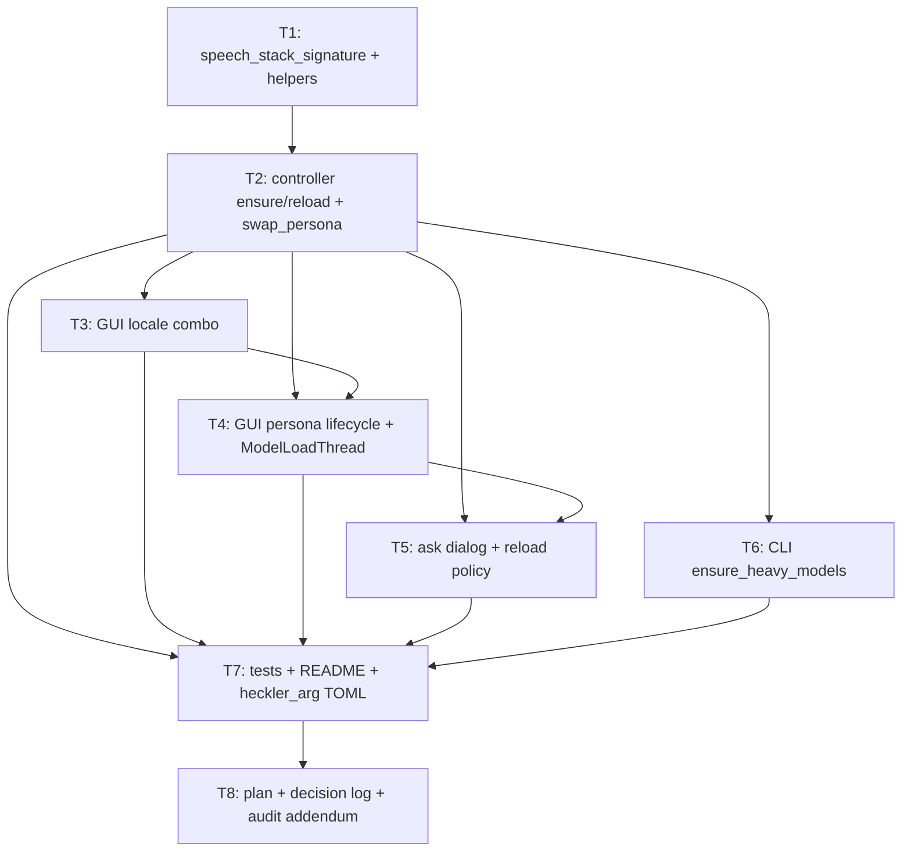

# Persona / speech-stack reload — final fix specification

**Status:** Locked for implementation (§24 decisions confirmed 2026-05-22)  
**Plan name:** `persona-speech-reload`  
**Date:** 2026-05-22  
**Purpose:** Third and intended **final** fix for locale/persona propagation into Whisper + Kokoro. Supersedes operator UX gaps left by `locale-lang-propagation` (especially GUI hot-swap and startup load paths).

**Related artifacts:**

| Artifact | Path |
|----------|------|
| Prior plan (landed) | `.dev/plans/locale-lang-propagation/plan.md` |
| Prior audit (rev 1 fail, rev 2 pass on wiring) | `.dev/audits/2026-05-22-locale-lang-propagation.md` |
| Decision logs (T1, T4, T7) | `.dev/decision-logs/locale-lang-propagation-*.md` |
| Locale module | `heckler/locale.py` |
| Controller | `heckler/controller.py` |
| GUI | `heckler/gui/app.py`, `heckler/gui/main_window.py` |

---

## Table of contents

1. [Problem statement](#1-problem-statement)
2. [Background: how locale works today](#2-background-how-locale-works-today)
3. [Root cause of the heckler_arg failure](#3-root-cause-of-the-heckler_arg-failure)
4. [Design principles](#4-design-principles)
5. [Core API (controller + locale)](#5-core-api-controller--locale)
6. [Reload policy (“the ask”)](#6-reload-policy-the-ask)
7. [Component A — GUI locale control](#7-component-a--gui-locale-control)
8. [Component B — Smart persona lifecycle](#8-component-b--smart-persona-lifecycle)
9. [Component C — Unified orchestration](#9-component-c--unified-orchestration)
10. [Persona bundle hygiene (heckler_arg)](#10-persona-bundle-hygiene-heckler_arg)
11. [CLI parity](#11-cli-parity)
12. [Non-goals (v1)](#12-non-goals-v1)
13. [Implementation subtasks (DAG)](#13-implementation-subtasks-dag)
14. [Adversarial pass — coverage gaps](#14-adversarial-pass--coverage-gaps)
15. [Risks and mitigations](#15-risks-and-mitigations)
16. [Trade-off assessment](#16-trade-off-assessment)
17. [UX specification](#17-ux-specification)
18. [Additional requirements (spec amendments)](#18-additional-requirements-spec-amendments)
19. [Adversarial scenario matrix](#19-adversarial-scenario-matrix)
20. [Exit criteria (“third and final”)](#20-exit-criteria-third-and-final)
21. [Approval checklist](#21-approval-checklist)
22. [Config precedence reference](#22-config-precedence-reference)
23. [Kokoro voice reference](#23-kokoro-voice-reference)
24. [Locked decisions](#24-locked-decisions-session-2026-05-22)

---

## 1. Problem statement

Operators expect:

1. Select **`heckler_arg`** in the GUI persona combo → Spanish STT + Spanish TTS + Spanish LLM commentary.
2. **No `.env`** required (`HECKLER_PERSONA`, `HECKLER_LOCALE`).
3. Hot-swap **`heckler` → `heckler_arg`** while running should work without a full app restart.
4. Hot-swap **`heckler` → `technician`** (both English) should **not** pay a 30–60 s model reload.

**What fails today:**

| # | Failure |
|---|---------|
| F1 | GUI **`ModelLoadThread`** uses `config.persona_name` (default `heckler`), not the persona combo selection. |
| F2 | Persona combo is **disabled** until the pipeline is **running** (backwards UX; see `gui_thougths.md`). |
| F3 | **`swap_persona`** updates Reactor/gates only; STT/TTS stay on config baked at last **`load_models`**. |
| F4 | Adding `[voice].locale = "es"` in TOML has **no effect** if models were loaded for another persona and user only hot-swaps. |
| F5 | **`kokoro_voice = "af_sarah"`** with `locale = "es"` sets Spanish phonemizer but **American English voice** — sounds like English reading Spanish. |

**Success definition:** Pick `heckler_arg` in the GUI, press Start (or swap while running with reload), hear Spanish TTS + Spanish Whisper without `.env`, without reloading when switching between same-locale personas.

---

## 2. Background: how locale works today

### 2.1 Single knob

- **Operator field:** `HecklerConfig.locale` (slug).
- **Derived fields:** `whisper_language`, `kokoro_lang_code` via `apply_resolved_locale()` and `heckler/locale.py`.
- **Not operator-set:** raw `WHISPER_LANGUAGE` or Kokoro `lang_code` env vars (v1).

### 2.2 Supported locales (binding)

| Locale slug | Whisper language | Kokoro `lang_code` |
|-------------|------------------|---------------------|
| `en` | `en` | `a` (American English) |
| `en-us` | `en` | `a` |
| `en-gb` | `en` | `b` (British English) |
| `es` | `es` | `e` (Spanish) |

### 2.3 Entry points

| Source | Maps to |
|--------|---------|
| `HECKLER_LOCALE` env | `load_config().locale` |
| Persona `[voice].locale` in `persona.toml` | `HecklerConfig.locale` via `_TOML_TO_CONFIG` |
| `apply_persona_overrides()` | Merges persona, then `apply_resolved_locale()` |

### 2.4 Two lifetimes (why hot-swap feels broken)



| Layer | Updated when | Affects |
|-------|----------------|---------|
| **Heavy models** | `load_models()` only | Whisper language, Kokoro pipeline `lang_code` |
| **Reactor / workers** | `start()`, `swap_persona()` | LLM prompts, gates, density; worker `config` for gates |
| **LLM language** | `system.md` / `examples.json` only | Commentary register — **not** `locale` |

**Note:** `Transcriber.transcribe()` uses `self._config.whisper_language` (baked at construct time), not the worker’s merged `config` alone. After `load_models`, Transcriber and worker `cfg` must agree on speech locale via consistent `load_models` + `start` persona/locale args.

### 2.5 Prior plan amendment (locale-lang-propagation)

T6/T7 fixed CLI/GUI **startup** `load_models(persona_name=...)` when callers pass the right persona. They did **not** change **`swap_persona`** to rebuild heavy models. Flag 2 was “swap never rebuilds” — **this plan amends that** to **conditional** rebuild when speech stack signature changes.

---

## 3. Root cause of the heckler_arg failure

Observed log pattern:

```
Loaded persona 'Heckler' ...          ← load_models @ startup (default persona)
PipelineController started ...
Loaded persona 'Heckler Argento' ...
Persona swapped to 'heckler_arg'      ← Reactor only; TTS still English
```

| Symptom | Cause |
|---------|--------|
| Spanish comments in feed | `system.md` + `swap_persona` → Reactor |
| English TTS on Spanish text | `Speaker` built with `kokoro_lang_code="a"` at heckler load |
| `locale = "es"` in TOML ignored | Never passed into `load_models(persona_name="heckler_arg")` |
| `af_sarah` sounds wrong even with reload | English voice id under Spanish lang `e` |

---

## 4. Design principles

| Principle | Rule |
|-----------|------|
| **Single locale field** | All paths set `HecklerConfig.locale`; resolver derives whisper + Kokoro. |
| **Reload predicate is derived** | Compare `(whisper_language, kokoro_lang_code)` — **no** per-persona dict. |
| **Same speech stack → no heavy reload** | `en`↔`en-us` same signature; `es`↔`es` same; `en`↔`es` reload. |
| **Voice-only change (v1)** | Same signature, different `kokoro_voice` → **no** full reload (document limitation). |
| **Persona owns defaults** | `[voice].locale` + `kokoro_voice` in TOML. |
| **GUI session override** | Locale dropdown can override for session; does not write TOML. |
| **Safe reload** | **stop → load_models → start** (never reload heavy models on live threads). |
| **LLM unchanged** | Locale reload does not edit `system.md` / `examples.json`. |
| **Reload before Reactor** | On cross-locale change while running: **do not** swap Reactor until reload confirmed (or same-locale swap-only path). |

---

## 5. Core API (controller + locale)

### 5.1 `speech_stack_signature(cfg: HecklerConfig) -> tuple[str, str]`

- **Location:** `heckler/locale.py` (preferred) or `heckler/controller.py`.
- **Returns:** `(cfg.whisper_language, cfg.kokoro_lang_code)` on already-resolved config.

### 5.2 `PipelineController.loaded_speech_stack() -> tuple[str, str] | None`

- From `self._transcriber._config` if loaded; else `None`.

### 5.3 `PipelineController.target_speech_config(*, persona_name: str | None, locale_override: str | None = None) -> HecklerConfig`

```
base = self._config
if persona_name:
    cfg = apply_persona_overrides(base, load_persona(...))
else:
    cfg = apply_resolved_locale(base)
if locale_override:  # non-empty, not "From persona"
    cfg = apply_resolved_locale(replace(cfg, locale=locale_override))
return cfg
```

### 5.4 `PipelineController.heavy_models_need_reload(*, persona_name, locale_override=None) -> bool`

- `target = target_speech_config(...)`
- `loaded = loaded_speech_stack()`
- Return `loaded is None` or `speech_stack_signature(target) != loaded`.

### 5.5 `PipelineController.ensure_heavy_models(..., on_progress=None, mode="persona") -> bool`

- If `heavy_models_need_reload`: call `load_models(...)`; return `True`.
- Else: return `False`.
- Does **not** start/stop pipeline.

### 5.6 `PipelineController.reload_speech_stack_for_persona(...)`

- If running → `stop()` first.
- `ensure_heavy_models` (or forced load).
- If was running → `start("persona", persona_name=...)`.
- Uses same `locale_override` as load.

### 5.7 `swap_persona` (updated behavior)

```
target_cfg = target_speech_config(persona_name, locale_override)
if speech_stack_signature(target_cfg) == loaded_speech_stack():
    # Hot-swap only (Reactor + gates)
    swap Reactor; update _persona_name
else:
    # Cross-locale — apply reload_policy BEFORE any Reactor swap
    if policy == ask and user cancels: revert GUI combos; return
    stop → load_models(persona_name, ...) → start(persona_name, ...)
```

**Amends** `locale-lang-propagation` Flag 2: conditional rebuild when signature changes.

---

## 6. Reload policy (“the ask”)

### 6.1 `SpeechReloadPolicy`

| Value | Behavior |
|-------|----------|
| `auto` | Reload immediately; status: `Reloading speech models (es)…` |
| `ask` | Dialog while running; Cancel → abort change, revert combos |
| `never` | No reload; warning in logs (debug only) |

### 6.2 Default policy

| Context | Default |
|---------|---------|
| GUI **Start** | `auto` |
| GUI persona/locale change **while running** | `ask` |
| CLI | `auto` (no TTY prompt in v1) |
| Optional | QSettings “Always reload speech automatically” → `auto` for running changes |

### 6.3 Ask dialog copy (GUI)

**Title:** Reload speech models?

**Body (example):**

> Switching speech to **Spanish** requires reloading Whisper and Kokoro (~20–60 s). The mic will stop briefly.  
> Continue?

**Buttons:** Reload (default) · Cancel

**On Cancel:** Revert **persona** and **locale** combos; do **not** call `swap_persona`; status: *Still using previous speech models (reload cancelled).*

### 6.4 When ask is skipped

- Pipeline not running → reload on Start only, no dialog.
- `heavy_models_need_reload` is false → no dialog, no reload.

---

## 7. Component A — GUI locale control

### 7.1 UI

- **Control:** `QComboBox` **Speech locale** (persona mode only).
- **Items:** `From persona` (default), then keys of `SUPPORTED_LOCALES` in order: `en`, `en-us`, `en-gb`, `es` (from `heckler.locale`, not duplicated in GUI).

### 7.2 Precedence

```
effective_locale =
  if combo == "From persona":
    persona [voice].locale if present, else config.locale (from load_config / HECKLER_LOCALE)
  else:
    combo value (session override)
```

Then `apply_resolved_locale` on merged config.

**Env vs persona:** Persona TOML wins over process default when using “From persona”; session override wins over persona when explicitly selected.

### 7.3 Events

| Event | Action |
|-------|--------|
| Locale changed, **not running** | Update session override; status: *Locale will apply on Start.* |
| Locale changed, **running** | If need reload → policy (ask/auto) → stop/load/start |
| Persona changed | Sync locale combo from persona `[voice].locale` if present |

### 7.4 Disabled states

- Hidden/disabled in **Transcribe** mode.
- Disabled during `load_models` / reload (`_reloading` flag).

---

## 8. Component B — Smart persona lifecycle

### 8.1 Persona combo enabled when

- `_models_ready` and persona mode selected, **whether or not** pipeline is running.
- Fixes: *“I have to start the pipeline to swap personas”* (`gui_thougths.md`).

### 8.2 Startup `ModelLoadThread`

- Read `HecklerMainWindow.selected_persona_name()` and `selected_locale_override()` at **`run()`** time (not only `config.persona_name`).
- Call `load_models(persona_name=..., mode=..., ...)`.
- **Debounce / coalesce:** If persona changes during initial load, prefer single load with final selection or reload on Start if signature mismatch (see G4).

### 8.3 Start button

```
persona = combo.currentText()
locale_override = locale_combo unless "From persona"
if heavy_models_need_reload(persona, locale_override):
    ensure_heavy_models(...)  # auto, progress in status bar
controller.start("persona", persona_name=persona)
# start() uses same target_speech_config for worker cfg
```

### 8.4 Persona change while running

```
if not heavy_models_need_reload(new_persona, locale_override):
    swap_persona(new_persona)  # Reactor only
else:
    apply reload_policy → reload_speech_stack_for_persona(...)
```

**Order:** Check reload **before** Reactor mutation (see §18).

### 8.5 Persona change before Start

- Update locale combo from new persona TOML.
- Defer heavy reload to Start unless eager background reload is explicitly chosen (recommend: **defer to Start**).

### 8.6 Status: loaded speech stack

Show in status bar after load:

- *Models: heckler_arg (es)* vs *Models: heckler (en)*

---

## 9. Component C — Unified orchestration

Single entry point used by Start, persona change, locale change, optional Reload button, and **`switch_mode`** to persona:

```text
apply_persona_and_speech(
  persona_name,
  locale_override=None,
  *,
  running: bool,
  reload_policy: SpeechReloadPolicy,
  on_progress,
) -> None
```

**Optional button:** **Reload speech models** — forces `load_models` for current persona+locale (debug escape hatch).

---

## 10. Persona bundle hygiene (heckler_arg)

Ship in the same PR:

```toml
[voice]
locale = "es"
kokoro_voice = "ef_dora"   # or em_alex / em_santa — not af_*
kokoro_speed = 1.05
```

Update `.cursor/skills/persona_builder/SKILL.md` with per-locale voice table.

---

## 11. CLI parity

| Path | Change |
|------|--------|
| `pipeline.main()` | Before `start()`, `ensure_heavy_models(persona_name=..., mode=...)` if mismatch |
| Interactive hot-swap | N/A today (no CLI `swap_persona`) |

No new CLI flags in v1.

---

## 12. Non-goals (v1)

- Speaker-only reload when only `kokoro_voice` changes (same locale).
- Persisting GUI locale override to disk / `.env`.
- LLM locale / Reactor template injection.
- Locale control in Transcribe mode (Whisper-only follow-up).
- New `SUPPORTED_LOCALES` beyond existing four.
- In-place Transcriber/Speaker swap without stop/start.
- GUI theme / log viewer (`gui_thougths.md` other items).

---

## 13. Implementation subtasks (DAG)



| ID | Scope | Files (primary) |
|----|-------|-----------------|
| **T1** | `speech_stack_signature`, `supported_locale_labels()` for GUI | `heckler/locale.py`, `tests/test_locale.py` |
| **T2** | §5 API, `swap_persona` conditional reload, `switch_mode` + ensure | `heckler/controller.py`, `tests/test_controller.py` |
| **T3** | Locale combo + precedence | `heckler/gui/main_window.py` |
| **T4** | Combo enablement, `ModelLoadThread` reads window, Start path | `heckler/gui/main_window.py`, `heckler/gui/app.py`, `tests/test_gui.py` |
| **T5** | Ask dialog, cancel revert, `_reloading` mutex | `heckler/gui/main_window.py` |
| **T6** | CLI `ensure_heavy_models` before start | `heckler/pipeline.py`, `tests/test_pipeline.py` |
| **T7** | Scenario matrix tests, README, heckler_arg, persona_builder | multiple |
| **T8** | `.dev/plans/persona-speech-reload/plan.md`, decision log, audit addendum | `.dev/` |

**Verification command:**

```bash
pytest tests/test_locale.py tests/test_config.py tests/test_controller.py tests/test_gui.py tests/test_pipeline.py tests/test_persona.py tests/test_speaker.py -q
```

---

## 14. Adversarial pass — coverage gaps

### P0 — Must ship (or not “final”)

| ID | Gap | Mitigation |
|----|-----|------------|
| **G1** | No E2E proof TTS phonemizer matches persona | Assert `KPipeline(lang_code=...)` / mock with `es` after reload path |
| **G2** | `switch_mode` transcribe→persona when `_speaker is None` | `ensure_heavy_models` on switch to persona |
| **G3** | `locale_override` must match on `load_models` **and** `start` | Single `target_speech_config()` for both |
| **G4** | Startup race: combo change vs `ModelLoadThread` | Defer load, coalesce, or reload on Start if mismatch |
| **G5** | `locale=es` + `af_sarah` valid but broken | GUI warning on voice/locale prefix mismatch |
| **G6** | Tests assert swap never changes transcriber | Replace with same-sig / cross-sig matrix |

### P1 — Ship in v1 or document clearly

| ID | Gap | Mitigation |
|----|-----|------------|
| **G7** | `currentTextChanged` on populate fires reload | `blockSignals` during init; no-op if unchanged |
| **G8** | Rapid persona/locale changes double reload | `_reloading` mutex; queue or debounce |
| **G9** | `load_models` fails after `stop()` | Error dialog; revert combos; clear dead state |
| **G10** | Cancel on ask leaves inconsistent UI | Revert persona **and** locale combo |
| **G11** | CLI has no hot-swap | Document; only Start path in T6 |
| **G12** | `HECKLER_LOCALE` vs “From persona” | §22 precedence table |
| **G13** | Mode toggle during reload | Disable controls; define Stop-during-reload |

### P2 — Defer with operator docs

| ID | Gap | Note |
|----|-----|------|
| **G14** | Voice-only change, same locale | No reload; document |
| **G15** | No `es-AR` Whisper | Model limit |
| **G16** | GPU memory on rapid en↔es reload | Debounce; optional cuda cache in decision log |
| **G17** | SQLite events lack speech_locale | Eval follow-up |
| **G18** | README vs `SUPPORTED_LOCALES` drift | Optional sync test |

---

## 15. Risks and mitigations

| Risk | Likelihood | Impact | Mitigation |
|------|------------|--------|------------|
| Reload without `locale_override` on `start()` | Medium | High | G3: one `target_speech_config()` |
| `switch_mode` → persona without Speaker | Medium | High | G2 |
| Reactor swapped before reload (Spanish text, English TTS) | High (observed) | High | Reload-before-Reactor ordering |
| Re-entrant combo signals during reload | Medium | High | G7, G8 mutex |
| `load_models` failure leaves pipeline stopped | Medium | Medium | G9 revert + message |
| Ask fatigue on every en↔es swap | Medium | UX | auto on Start; optional “don’t ask again” |
| In-flight utterance lost on stop | Expected | Low | Status message |
| Full reload when only Kokoro letter changes | N/A | Time | Accept; document Whisper reload cost |

---

## 16. Trade-off assessment

### 16.1 Signature-only reload

**Pro:** Matches en↔es rule; no manual persona list.  
**Con:** Voice change without locale change needs restart (G14).  
**Also:** `en` vs `en-gb` correctly triggers reload (`a` vs `b`).

### 16.2 Stop → load → start vs in-place swap

**Ship:** stop → load → start.  
**Reject:** in-place model swap on live threads (racy with `is_playing`, queues).

### 16.3 Locale dropdown (A) + persona (B) + unified (C)

Keep all three: TOML defaults + session override + one orchestration function.

### 16.4 Ask vs auto

| Policy | When |
|--------|------|
| `auto` | Start; optional global setting |
| `ask` | Persona/locale change while **running** |
| `never` | Debug only |

---

## 17. UX specification

### 17.1 Wireframe (persona mode)

```text
┌─ Mode ─────────────────────────────────────┐
│ (•) Persona  ( ) Transcribe                │
└────────────────────────────────────────────┘
 Persona: [ heckler_arg    ▼ ]
 Speech:  [ From persona    ▼ ]   ← en | en-us | en-gb | es

 ┌─ live feed ───────────────────────────────┐
 │ ...                                       │
 └───────────────────────────────────────────┘

 [ Start ]  [ Reload speech models ]

 Status: Models: heckler_arg (es) — ready
```

### 17.2 Control rules

- Changing persona sets locale combo from TOML unless user had explicit override (product choice: reset to persona default on persona change).
- During reload: disable Start, persona, locale, mode; allow Stop.
- Transcribe mode: hide Speech locale row.

### 17.3 Status strings (examples)

| State | Message |
|-------|---------|
| Initial load | `Loading models for heckler_arg (es)…` |
| Ready | `Models: heckler_arg (es) — press Start` |
| Reloading | `Reloading speech models (Spanish)…` |
| Cancelled | `Reload cancelled — still using English speech` |
| Voice warning | `Warning: af_sarah is an English voice; use ef_dora for Spanish` |

---

## 18. Additional requirements (spec amendments)

1. **Reload ordering:** On cross-locale path, compute `heavy_models_need_reload` **before** any Reactor swap; Cancel = no swap.
2. **`switch_mode`:** When switching to persona, call `ensure_heavy_models` with target persona + locale override.
3. **Single `target_speech_config()`** for `load_models` and `start`.
4. **Init guards** on combo `currentTextChanged`.
5. **Reload mutex** + failure revert (G8, G9).
6. **Voice/locale heuristic warning** in GUI (G5).
7. **Supersede README** § swap never rebuilds → conditional rebuild.
8. **Decision log** amends locale-lang-propagation Flag 2.
9. **Audit addendum** on `.dev/audits/2026-05-22-locale-lang-propagation.md` — FIND-A6 closed by this work.
10. **Double Start** debounced while reload in progress.

---

## 19. Adversarial scenario matrix

| # | Scenario | Expected |
|---|----------|----------|
| S1 | GUI boot, combo=`heckler_arg`, Start | es TTS + es Whisper |
| S2 | Running `heckler` → `heckler_arg`, Reload | stop/load/start, es |
| S3 | Running `heckler` → `heckler_arg`, Cancel | no Reactor change; en TTS; combos reverted |
| S4 | Running `heckler` → `technician`, both en | swap only, no reload |
| S5 | `heckler` → persona with `en-gb` | reload (`b` vs `a`) |
| S6 | Locale override `es`, persona en, Start | reload to es |
| S7 | Transcribe running → Persona mode | Speaker loaded with persona locale |
| S8 | Persona change during initial load | one load or Start correction |
| S9 | `locale=es`, `af_sarah` | warn; reload still uses `e` |
| S10 | Reload fails (CUDA) | revert UI, error dialog |
| S11 | Rapid en/es/en persona spam | debounced single reload |
| S12 | CLI `--persona heckler_arg` | es at load |
| S13 | Re-select same persona | no-op |
| S14 | `switch_mode` + persona + locale | consistent signature |

---

## 20. Exit criteria (“third and final”)

1. **Manual:** GUI — `heckler_arg` → Start → Spanish TTS on Spanish comment (no `.env`).
2. **Manual:** Running `heckler` → `heckler_arg` → Reload → Spanish TTS.
3. **Manual:** Running `heckler` → `technician` → no reload dialog.
4. **Automated:** S2–S7, S9–S12 covered in tests.
5. **Docs:** README, persona_builder, decision log aligned.
6. **Artifacts:** `.dev/plans/persona-speech-reload/` + audit addendum committed.

---

## 21. Approval checklist

| # | Decision | Recommendation |
|---|----------|----------------|
| 1 | Signature-only reload? | **Yes** + voice mismatch warning |
| 2 | Ask policy? | **auto** on Start; **ask** when running |
| 3 | Locale combo? | **Yes** + “From persona” |
| 4 | Cancel behavior? | Revert persona + locale; no Reactor swap |
| 5 | heckler_arg `kokoro_voice`? | **`ef_dora`** in PR |
| 6 | Reload button? | **Ship** |
| 7 | Reload order? | **Before** Reactor on cross-locale |
| 8 | `switch_mode` in scope? | **Yes** |
| 9 | Debounce reload? | **Yes** |
| 10 | QSettings “don’t ask again”? | **Deferred** (see §24 D3) |

---

## 22. Config precedence reference

| Priority (high → low) | Source |
|------------------------|--------|
| 1 | GUI **Speech locale** combo (when not “From persona”) |
| 2 | Persona `[voice].locale` in `persona.toml` |
| 3 | `HECKLER_LOCALE` / `load_config()` default |
| 4 | `HecklerConfig` dataclass defaults (`en`) |

**LLM language:** always `system.md` / `examples.json` — independent of table above.

---

## 23. Kokoro voice reference

Spanish (`lang_code='e'`): **`ef_dora`**, **`em_alex`**, **`em_santa`**

American English (`a`): **`af_*`**, **`am_*`** (e.g. `af_sarah`)

British English (`b`): **`bf_*`**, **`bm_*`**

**Heuristic for GUI warning:** voice prefix incompatible with resolved `kokoro_lang_code` → show non-blocking warning.

**Source:** [hexgrad/Kokoro-82M VOICES.md](https://huggingface.co/hexgrad/Kokoro-82M/blob/main/VOICES.md)

---

## Revision history

| Version | Date | Notes |
|---------|------|-------|
| 1.0 | 2026-05-22 | Initial spec (A+B+C + ask) |
| 1.1 | 2026-05-22 | Adversarial pass merged (G1–G18, S1–S14, amendments §18) |
| 1.2 | 2026-05-22 | §24 locked decisions (pre-plan gate); artifacts = this doc only |

---

*This document is the root-level source of truth. Orchestration artifacts (`.dev/plans/`, decision logs, audit addendum) are **out of scope** for this effort — locked product/technical choices are recorded in §24 below.*

---

## 24. Locked decisions (session 2026-05-22)

Pre-plan / orchestrator gate: **confirmed.** Implement per this spec + table below; do not regenerate a parallel `.dev/plans/persona-speech-reload/` tree unless requested later.

| # | Topic | Decision |
|---|--------|----------|
| D1 | Reload predicate | **Signature-only:** `(whisper_language, kokoro_lang_code)`; no per-persona dict |
| D2 | Running reload policy | **`ask`** on persona/locale change while running; **`auto`** on Start |
| D3 | QSettings “don’t ask again” | **Defer** (not v1); default remains ask while running |
| D4 | Speech locale GUI | **Full spec:** “From persona” + `en` / `en-us` / `en-gb` / `es` session override |
| D5 | Persona → locale combo | **Reset** to persona TOML on persona change (sync / “From persona”) |
| D6 | Pre-Start changes | **Defer** heavy reload to Start; status when not running |
| D7 | Startup race (G4) | **Start correction:** initial `ModelLoadThread` may finish with stale persona; **Start** reloads if signature mismatch |
| D8 | Reload speech button | **Ship v1** |
| D9 | Voice/locale mismatch (G5) | **Non-blocking** status-bar warning |
| D10 | Rapid changes (G8) | **Mutex** during reload (disable controls); no debounce/queue in v1 |
| D11 | `en` → `en-gb` | **Accept** signature reload (`a` → `b`) |
| D12 | Artifacts | **This file only** — no T8 `.dev/plans/` / audit addendum unless requested later |
| D13 | Cancel on ask | Revert **persona + locale** combos; no Reactor swap (§6.3 — unchanged) |
| D14 | `switch_mode` → persona | **In scope** — `ensure_heavy_models` when Speaker missing or signature mismatch |
| D15 | `heckler_arg` voice | **`ef_dora`** (already in `prompts/heckler_arg/persona.toml`) |
| D16 | CLI while running | **No ask** in v1 — `auto` on Start path only |
| D17 | Voice-only change, same locale | **No reload** (v1 non-goal G14 — document) |

**§21 checklist alignment:** Rows 1–4, 6–9, 11 confirmed via D1–D11, D13–D14; row 5 via D15; row 10 deferred via D3.
