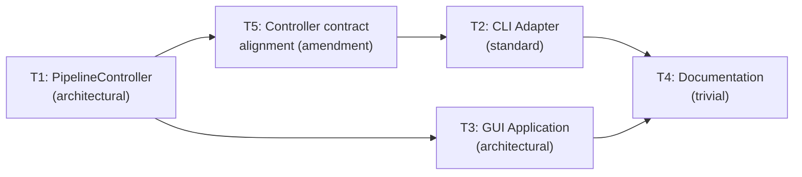

# Plan — gui-launcher

**Version:** 1.1
**Status:** Complete (§8 provisional — T3 artifacts uncommitted)
**Skill:** orchestrator-planning v0.6

---

## §0 Context map intake

- **Path consumed:** `.dev/plans/gui-launcher/context-map.md`
- **Readiness verdict:** CONDITIONAL
- **Scope-area labels flagged:**
  - Flag 1 · `ownership_ambiguity` — controller extraction location
  - Flag 2 · `ownership_ambiguity` — hot-swap Reactor indirection
  - Flag 3 · `vocabulary_collision` — runtime vs startup mode switch
  - Flag 4 · `missing_test_coverage` — no PyQt6 test infrastructure
  - Flag 5 · `ownership_ambiguity` — GUI import boundary (public vs private)
- **Context map version:** pre-plan-exploration v0.2, commit `dcc28d71ebb140b57bdda74951f21fda75922918`
- **Current HEAD:** `9715105f97f63b0aea1d165f49b55f468c40111f`
- **Staleness check:** diff between context-map SHA and HEAD adds only the context map itself plus out-of-scope files (retrospectives, `next_steps.md`, transcript output). Zero in-scope source files changed. **Map is fresh.**

**CONDITIONAL resolution path:** all three conditions named in the readiness rationale are addressed by subtask scope:

| Condition | Resolved by |
|-----------|-------------|
| `pipeline.main()` must be decomposed into a non-blocking controller | T1 scope |
| Hot-swap requires indirection in `_run_reaction_worker` | T1 scope (ReactorHolder) |
| PyQt6 dependency addition to `pyproject.toml` | T3 scope |

**Consumption mapping applied:**

| Context-map section | Plan section |
|---------------------|--------------|
| §File map (direct rows) | §4 Files to touch |
| §Interface inventory (`suspect_modified`) | §2 Types / interfaces |
| §Coupling surfaces | §5.4 (with Tn IDs) |
| §Ambiguity flags | §5.2 (with Tn IDs) + §4 kill criteria |
| §Prior reasoning | Consulted; no contradictions — GUI was explicitly deferred as a non-goal in both prior plans |
| §Orchestrator handoff notes | §2 Naming, §4 risks |
| §Decisions (Composer 2) | Adopted as provisional input; one revision noted below |

---

## §1 Task statement

Build a minimal PyQt6 GUI launcher for Heckler that replaces the blocking CLI `main()` loop with a Qt event loop, exposes persona hot-swap (runtime `Reactor` replacement between utterances) and mode switching (persona ↔ transcribe) in a single window with live transcript/reaction feeds and session controls. The GUI layer is the integration surface deferred by both the persona-system and transcription-engine plans.

The implementation requires: (a) extracting pipeline lifecycle management from the monolithic `main()` into a reusable `PipelineController` that both CLI and GUI consume, (b) adding a mutable indirection (`ReactorHolder`) so the reaction worker can accept hot-swapped Reactors without restart, (c) building the PyQt6 window with mode toggle, persona picker, live feeds, and model-loading progress, and (d) packaging PyQt6 as a dependency and documenting the new `heckler-gui` entry point.

**Non-goals:**

- Advanced GUI features (settings panels for VAD thresholds, LLM temperature sliders, session history browser, tray icon). These are follow-on work.
- Multi-window or multi-monitor support.
- Electron, web, or any non-PyQt6 frontend.
- Changes to the LLM, TTS, or transcription backends (Reactor, Speaker, Transcriber internals unchanged).
- Mobile or cross-platform packaging (PyInstaller, Nuitka).
- CLI flag changes on the existing `heckler` entry point (its behavior is unchanged).

---

## §2 Shared contracts

### Types / interfaces

**New types (T1 owns; T2, T3 consume):**

| Symbol | Location | Owning subtask | Typed surface | Round-trip / construction test |
|--------|----------|----------------|---------------|-------------------------------|
| `ControllerCallbacks` | `heckler/controller.py` | T1 | `@dataclass` | `tests/test_controller.py::test_callbacks_invoked_on_transcript` |
| `ReactorHolder` | `heckler/controller.py` | T1 | class with `get()` / `swap()` behind `threading.Lock` | `tests/test_controller.py::test_reactor_holder_swap` |
| `PipelineController` | `heckler/controller.py` | T1 | class | `tests/test_controller.py::test_controller_start_stop` |

`ControllerCallbacks` fields:

```python
@dataclass
class ControllerCallbacks:
    on_transcript: Callable[[str], None]
    on_reaction: Callable[[ReactorResult, bool], None]  # (result, was_spoken)
    on_status: Callable[[str], None]
    on_error: Callable[[str], None]
```

`PipelineController` public surface:

```python
class PipelineController:
    def __init__(self, config: HecklerConfig, callbacks: ControllerCallbacks) -> None: ...
    def load_models(self, on_progress: Optional[Callable[[str], None]] = None, *,
                    mode: Optional[str] = None) -> None: ...
    # Landed (T5): mode="transcribe" skips Speaker/TTS load. mode=None loads all (GUI path).
    def start(self, mode: str = "persona", *, persona_name: Optional[str] = None,
              session_name: Optional[str] = None) -> None: ...
    def stop(self) -> None: ...
    def switch_mode(self, new_mode: str, *, persona_name: Optional[str] = None,
                    session_name: Optional[str] = None) -> None: ...
    def swap_persona(self, persona_name: str) -> None: ...

    @property
    def is_running(self) -> bool: ...
    @property
    def current_mode(self) -> Optional[str]: ...
    @property
    def current_persona_name(self) -> Optional[str]: ...
```

`ReactorHolder` surface:

```python
class ReactorHolder:
    def __init__(self, reactor: Reactor) -> None: ...
    def get(self) -> Reactor: ...
    def swap(self, new_reactor: Reactor) -> None: ...
```

**Modified signatures (T1 owns):**

| Symbol | New parameter(s) | Backward compat | Test |
|--------|-----------------|-----------------|------|
| `_run_transcription_worker` | `on_transcript: Optional[Callable[[str], None]] = None` | Yes (default None) | `tests/test_pipeline.py` (existing tests pass unchanged) |
| `_run_transcribe_worker` | `on_transcript: Optional[Callable[[str], None]] = None` | Yes (default None) | `tests/test_pipeline.py` |
| `_run_reaction_worker` | `reactor_holder: ReactorHolder` replaces `reactor: Reactor`; adds `on_reaction: Optional[Callable[[ReactorResult, bool], None]] = None` | No — parameter renamed; T1 updates main() minimally | `tests/test_pipeline.py` (updated) |

**Hot-swap protocol (T1 implements):**

1. GUI/CLI calls `controller.swap_persona(name)` from any thread.
2. Controller loads persona, applies overrides, constructs new `Reactor`.
3. Controller calls `reactor_holder.swap(new_reactor)` — acquires lock, replaces reference, releases lock.
4. Reaction worker calls `reactor_holder.get()` at the start of each iteration — acquires lock briefly, gets current Reactor, releases lock.
5. The current `react()` call (if in-progress) completes with the old Reactor. The next call uses the new Reactor. This is the "between utterances" boundary described in the persona-system design doc.

The lock prevents torn reads under free-threaded Python (PEP 703). Under CPython with GIL, attribute assignment is already atomic, but the explicit lock makes the contract testable and future-proof. The provisional decision named "threading event + handoff" — the lock achieves the same guarantee with less complexity; a threading.Event would add unnecessary blocking since we do not need to cancel an in-progress `react()`.

**Mode switch protocol (T1 implements):**

1. GUI/CLI calls `controller.switch_mode(new_mode)`.
2. Controller calls `self.stop()` — stops AudioCapture, sends shutdown sentinels, joins worker threads.
3. Controller reconstructs mode-specific workers and state:
   - persona → transcribe: drop Reactor, ContextBuffer, PacingGate, HecklerLogger, reaction_queue; create transcript_conn, session_id, transcript_lock.
   - transcribe → persona: close transcript session; create/reuse Reactor, ContextBuffer, PacingGate, HecklerLogger, reaction_queue.
4. Controller reconstructs AudioCapture with correct `is_playing` (`speaker.is_playing` for persona, bare `threading.Event()` for transcribe) — resolves Surface 2.
5. Controller starts new workers and AudioCapture.
6. Transcriber and Speaker are **never** reconstructed on mode switch — they are loaded once during `load_models()`.

### Error envelope

| Exception | Module | Raised when | Consumed by |
|-----------|--------|-------------|-------------|
| `PipelineNotRunningError(RuntimeError)` | `heckler/controller.py` | `swap_persona` or `switch_mode` called while not running | T2, T3 |
| `PipelineAlreadyRunningError(RuntimeError)` | `heckler/controller.py` | `start` called while already running | T2, T3 |
| `PersonaNotFoundError(ValueError)` | `heckler/persona.py` (existing) | Invalid persona name passed to `swap_persona` or `start` | T1, T2, T3 |
| `SpeakerError(Exception)` | `heckler/speaker.py` (existing) | TTS synthesis fails during reaction | T1 (caught in reaction worker) |

### Naming

| Artifact | Name | Rationale |
|----------|------|-----------|
| Controller module | `heckler/controller.py` | Single file; no sub-package needed for one class + holder |
| Controller class | `PipelineController` | Matches "pipeline" vocabulary; distinguishes from Qt controller |
| Reactor holder | `ReactorHolder` | Descriptive; in `controller.py` |
| Callbacks dataclass | `ControllerCallbacks` | Bound to the controller |
| GUI package | `heckler/gui/` | Package for future widget/submodule growth |
| GUI entry module | `heckler/gui/app.py` | `app.py:main` — standard PyQt entry pattern |
| GUI main window | `heckler/gui/main_window.py` | `HecklerMainWindow(QMainWindow)` |
| Console script | `heckler-gui` → `heckler.gui.app:main` | Separate from `heckler` CLI; no `--gui` flag on existing entry |
| Thread names (GUI) | `heckler-gui-poll` | QTimer-based poll thread (if needed); follows existing `heckler-*` convention |

### Status-string contract (Landed: T5)

Controller messages emitted via `on_progress` and `callbacks.on_status` carry semantic content **without** a `[HECKLER]` prefix. The CLI adapter prepends `[HECKLER] ` to reproduce legacy output. The GUI uses messages as-is.

**`on_progress` strings (from `load_models`):**

| Message | When |
|---------|------|
| `Loading transcription model ({size} / CUDA)...` | Before Transcriber construction |
| `Transcription ready. ({elapsed:.1f}s)` | After Transcriber construction |
| `Loading TTS model (Kokoro / {voice})...` | Before Speaker construction (skipped when `mode="transcribe"`) |
| `TTS ready. ({elapsed:.1f}s)` | After Speaker construction |

**`on_status` strings (from `start` / `stop`):**

| Message | When |
|---------|------|
| `Mic open. Listening.` | After persona-mode startup |
| `Transcribe mode — mic open. Ctrl+C to stop.` | After transcribe-mode startup |
| `Transcribe session ended (id={id}, markdown={path})` | After transcribe-mode session close in `stop()` |

The legacy `Running in {mode} mode.` line emitted in v1.0 is **retired** by T5.

### Logging

- All new modules use `logging.getLogger(__name__)`.
- No new structured fields beyond existing patterns.
- Controller emits `logger.info` for lifecycle transitions (start, stop, mode switch, persona swap).
- GUI module does not configure logging — `main()` in `pipeline.py` (or `app.py`) calls `logging.basicConfig`.

### Tests

- **Framework:** pytest (existing) + pytest-qt (new, for GUI).
- **Location:** `tests/test_controller.py` (T1), `tests/test_gui.py` (T3).
- **Naming:** `test_<feature>_<scenario>`.
- **Coverage expectations:**
  - T1: controller lifecycle (start/stop), hot-swap (swap_persona changes Reactor), mode switch (topology rebuilt), callback invocation (on_transcript, on_reaction fired from workers). All hardware mocked.
  - T3: GUI window creation (QApplication + HecklerMainWindow instantiate without crash), widget existence (persona picker, mode toggle, live feed present), signal bridge (controller callback → Qt signal → widget update). Offscreen via `QT_QPA_PLATFORM=offscreen` or pytest-qt's built-in `qapp` fixture.
  - T2: `tests/test_pipeline.py` updated — `main()`-level tests retarget patches to `heckler.controller.*` or mock `PipelineController` directly; worker-level tests (calling `_run_*` directly) unchanged.
- **CI display strategy:** `QT_QPA_PLATFORM=offscreen` environment variable. pytest-qt's `qapp` fixture handles QApplication lifecycle.
- **Decision log paths:**
  - T1: `.dev/decision-logs/gui-T1.md`
  - T3: `.dev/decision-logs/gui-T3.md`

### CLI surface

| Entry point | Target | Arguments | Owning subtask |
|-------------|--------|-----------|----------------|
| `heckler` (existing, unchanged) | `heckler.pipeline:main` | `--mode`, `--persona`, `--session-name`, `--list-devices` | T2 (preserves) |
| `heckler-gui` (new) | `heckler.gui.app:main` | None (all configuration via GUI widgets + `.env` defaults) | T3 (creates) |

---

## §3 Dependency DAG



**Parallel group:** {T2, T3} may run in parallel — T2 after T5, T3 after T1. T5 modifies `controller.py` + `test_controller.py`; T3 creates `gui/` + modifies `pyproject.toml`. No file overlap — safe.

**Amendment rationale:** T5 inserted between T1 and T2 to fix three contract gaps surfaced by T2's HALT: (1) `load_models()` unconditionally loads Speaker, violating transcribe-mode isolation; (2) status strings differ from legacy `main()` format; (3) the retired `Running in {mode} mode.` line has no legacy equivalent. See §7.

---

## §4 Subtask specs

### T1 — PipelineController + hot-swap + callback infrastructure

| Field | Content |
|-------|---------|
| **ID** | T1 |
| **Scope** | Extract pipeline lifecycle management from monolithic `main()` into a reusable `PipelineController` class in a new `heckler/controller.py` module. Implement `ReactorHolder` for thread-safe Reactor hot-swap. Add optional callback parameters to worker functions for live-feed routing. Create comprehensive controller unit tests. |
| **Files to touch** | Create: `heckler/controller.py`, `tests/test_controller.py`. Modify: `heckler/pipeline.py` (worker signatures + minimal `main()` update to use `ReactorHolder`). |
| **Contract bindings** | All §2 contracts apply. T1 is the source-of-truth for Types/interfaces, Error envelope, and Naming. Decision log required at `.dev/decision-logs/gui-T1.md`. |
| **Inputs** | None (first in DAG). |
| **Outputs** | `heckler/controller.py` (PipelineController, ReactorHolder, ControllerCallbacks, PipelineNotRunningError, PipelineAlreadyRunningError), `tests/test_controller.py`, updated `heckler/pipeline.py`, `.dev/decision-logs/gui-T1.md`. |
| **Kill criteria** | (1) HALT if `_run_reaction_worker` cannot be made to read Reactor through `ReactorHolder` without breaking the existing shutdown-sentinel protocol — the worker must still drain its queue and exit on `None`. (2) HALT if `AudioCapture.stop()` does not reliably join its internal thread within 5s — mode switch requires deterministic teardown. (3) HALT if the `on_transcript` callback invocation in worker functions causes test_pipeline.py regressions that cannot be resolved by updating the tests (indicates the callback addition breaks an implicit contract). |
| **Log tier** | `architectural` — new pattern (controller extraction), multiple design forks (hot-swap protocol, callback mechanism, mode switch teardown). Decision log: `.dev/decision-logs/gui-T1.md`. |
| **Risks & mitigations** | (a) **Reaction worker queue draining during mode switch:** If a long `react()` call is in progress when the shutdown sentinel is queued, `join(timeout=120.0)` provides a safety net. Mitigation: document the 120s timeout in the controller and emit `on_status("waiting for worker shutdown...")`. (b) **Worker callback exceptions:** If an `on_transcript` callback raises, it could kill the worker thread. Mitigation: wrap callback invocations in try/except within the worker, log and continue. |

### T2 — CLI adapter (revised after T5 amendment)

| Field | Content |
|-------|---------|
| **ID** | T2 |
| **Scope** | Rewrite `pipeline.main()` to be a thin wrapper around `PipelineController`. Preserve all existing CLI flags and behavior (--mode, --persona, --session-name, --list-devices). The CLI constructs a `PipelineController`, registers print-based callbacks (prepending `[HECKLER] ` to `on_progress`/`on_status` messages), calls `load_models(mode=mode)`, `start()`, blocks until KeyboardInterrupt, then calls `stop()`. Update `tests/test_pipeline.py` to retarget `main()`-level test patches from `heckler.pipeline.*` to `heckler.controller.*` (or mock `PipelineController` directly); worker-level tests (calling `_run_*` directly) are unchanged. |
| **Files to touch** | Modify: `heckler/pipeline.py` (`main()` function body), `tests/test_pipeline.py` (retarget monkeypatches for `main()`-level tests). |
| **Contract bindings** | All §2 contracts apply, including the status-string contract (T5). CLI surface must be preserved exactly. `on_progress` and `on_status` callbacks must prepend `[HECKLER] ` to match legacy output. |
| **Inputs** | T1 (PipelineController, worker signatures), T5 (mode-aware `load_models`, aligned status strings). |
| **Outputs** | Updated `heckler/pipeline.py` with slim `main()`, updated `tests/test_pipeline.py`. |
| **Kill criteria** | (1) HALT if `heckler --list-devices` behavior changes. (2) HALT if CLI output for persona mode does not contain `[HECKLER] Mic open. Listening.` (exact legacy string). (3) HALT if CLI output for transcribe mode does not contain `[HECKLER] Transcribe mode — mic open. Ctrl+C to stop.` (exact legacy string). (4) HALT if `tests/test_pipeline.py` has failures after the rewrite that are not resolved by retargeting patches. |
| **Log tier** | `standard` |
| **Risks & mitigations** | (a) **Monkeypatch retargeting:** Tests that patch `heckler.pipeline.Transcriber` etc. must be retargeted to `heckler.controller.Transcriber` for `main()`-level tests, since `main()` now delegates to `PipelineController` which imports from source modules. Worker-level tests that call `_run_*` directly still patch `heckler.pipeline.*` (the workers live in `pipeline.py`). (b) **Test scope migration:** Some `main()`-level tests now test controller internals (e.g. "Reactor receives persona prompts"). These tests can either retarget patches to the controller's namespace, or be replaced by delegation assertions (verify `PipelineController.start()` is called with correct args). Prefer the approach that maintains the test's original intent. |

### T3 — GUI application + packaging

| Field | Content |
|-------|---------|
| **ID** | T3 |
| **Scope** | Build the PyQt6 GUI launcher as `heckler/gui/` package. Main window with: mode toggle (persona ↔ transcribe), persona picker dropdown, live transcript feed, live reaction feed (persona mode), session controls (transcribe mode), model-loading progress. Add PyQt6 and pytest-qt dependencies to `pyproject.toml`. Add `heckler-gui` console script. Create `tests/test_gui.py` with pytest-qt tests. |
| **Files to touch** | Create: `heckler/gui/__init__.py`, `heckler/gui/app.py`, `heckler/gui/main_window.py`, `tests/test_gui.py`. Modify: `pyproject.toml` (add `PyQt6` to `[project] dependencies`, `pytest-qt` to `[project.optional-dependencies] dev`, `heckler-gui` to `[project.scripts]`). |
| **Contract bindings** | All §2 contracts apply. GUI must consume PipelineController's public API only — no imports of `_run_*` worker functions. Decision log required at `.dev/decision-logs/gui-T3.md`. |
| **Inputs** | T1 (PipelineController exists and is tested). |
| **Outputs** | `heckler/gui/` package, `tests/test_gui.py`, updated `pyproject.toml`, `.dev/decision-logs/gui-T3.md`. |
| **Kill criteria** | (1) HALT if PyQt6 cannot be installed alongside the existing torch/CUDA stack in the project's Python version range (>=3.11,<3.13). (2) HALT if QApplication event loop and worker threads deadlock during model loading — `load_models()` must not block the Qt event loop. (3) HALT if `ControllerCallbacks` invoked from worker threads cannot be safely bridged to Qt signals — the signal/slot mechanism must handle cross-thread delivery. (4) HALT if context-map Flag 4 is unresolved at execution start (no pytest-qt or equivalent available). |
| **Log tier** | `architectural` — new module, multiple design forks (widget layout, signal bridge pattern, splash screen). Decision log: `.dev/decision-logs/gui-T3.md`. |
| **Risks & mitigations** | (a) **PyQt6 vs CUDA torch compatibility:** PyQt6 6.5+ should not conflict with torch CUDA wheels, but version pinning could surprise. Mitigation: test installation in a fresh venv before coding. (b) **Model loading blocks Qt event loop:** `load_models()` takes ~13s. Mitigation: run `load_models()` in a QThread or `concurrent.futures.ThreadPoolExecutor`, update a progress dialog via signals. (c) **Offscreen testing in CI:** pytest-qt requires `QT_QPA_PLATFORM=offscreen`. Mitigation: document env var in test_gui.py module docstring and any CI config. |

### T4 — Documentation

| Field | Content |
|-------|---------|
| **ID** | T4 |
| **Scope** | Update `README.md` with a GUI section documenting `heckler-gui` usage, installation notes for PyQt6, and a brief feature description. |
| **Files to touch** | Modify: `README.md`. |
| **Contract bindings** | CLI surface from §2. Must reference `heckler-gui` exactly as declared in T3's pyproject.toml. |
| **Inputs** | T2 (CLI behavior finalized), T3 (GUI entry point and features finalized). |
| **Outputs** | Updated `README.md`. |
| **Kill criteria** | (1) HALT if the `heckler-gui` console script name in README does not match `pyproject.toml [project.scripts]`. |
| **Log tier** | `trivial` |
| **Risks & mitigations** | Minimal. README is prose; no runtime coupling. |

---

## §5 Adversarial pass

*Answered using the packet-only executor persona lens: "If I received only this packet and executor SKILL.md, would I halt? Would I guess? Would I conflict with a parallel executor?"*

### 5.1 Rejected decompositions

1. **Single-subtask approach.** One executor builds controller + CLI + GUI + tests + docs. Rejected: no parallelism, scope too broad for one agent, mixes backend threading concerns with frontend Qt concerns. Risk of quality regression on the less-familiar domain.

2. **Controller inside GUI package** (`heckler/gui/controller.py`). Rejected: the CLI (T2) needs the controller too. Placing it in `gui/` forces the CLI to import from a GUI package, or requires duplication. The controller is a general-purpose pipeline lifecycle manager.

3. **Merge T1+T2 into one subtask.** Considered: avoids the worker signature backward-compat concern. Rejected: T1 is architectural (~250 lines new code + test); T2 is standard (~50 lines rewrite). Merging produces one oversized subtask. The signature change is manageable — T1 makes a minimal `main()` update (wrap Reactor in ReactorHolder), T2 then rewrites `main()` entirely.

4. **Optional PyQt6 dependency** (`[project.optional-dependencies] gui`). The provisional decision says "required." I considered overriding because: adding PyQt6 as a hard dependency breaks headless installs and adds ~30MB to every install. However, the user explicitly chose "required" in the pre-orchestrator decision. I adopt this. If headless breakage surfaces, it is a re-plan trigger, not an executor-time fork.

### 5.2 Load-bearing assumptions

1. `(Python GIL makes Reactor reference assignment atomic between worker iterations | §2 Types / interfaces: ReactorHolder.swap, ReactorHolder.get | If free-threaded Python (PEP 703) is used, the lock in ReactorHolder becomes the sole correctness guarantee; without it, torn reads in the reaction worker could cause crashes or stale persona content | T1)`

2. `(Worker threads consume shutdown sentinels reliably within 120s | §2 Types / interfaces: _put_shutdown_sentinel, PipelineController.stop join(timeout=120.0) | If a worker is blocked on a long LLM API call when the sentinel is queued, mode switch / stop could hang for up to 120s; this is acceptable for stop but poor UX for mode switch | T1, T3)`

3. `(PyQt6 >=6.5 is installable alongside torch >=2.5 + CUDA 12.1 on Python >=3.11,<3.13 | §2 Tests: CI offscreen strategy + pyproject.toml dependencies | If PyQt6 wheels conflict with the CUDA torch stack or NumPy <2 pin, the project becomes uninstallable — all subtasks downstream of T3 are blocked | T3, T4)`

4. `(Transcriber and Speaker hold no mode-specific mutable state across calls | §2 Types / interfaces: PipelineController.switch_mode shared objects | If Transcriber caches buffers that are mode-shape-dependent or Speaker retains is_playing state that drifts after re-wiring, sharing them across mode switches causes subtle audio bugs | T1)`

5. `(AudioCapture.stop() reliably joins its internal thread and drains the PCM buffer within 5s | §2 Types / interfaces: PipelineController.switch_mode teardown | If AudioCapture.stop() hangs (e.g. sounddevice InputStream.close() blocks on a WASAPI driver bug), mode switch hangs — no timeout on the internal thread join currently | T1, T3)`

### 5.3 Highest re-plan risk

**T1 (PipelineController)** — the mode switch teardown/rebuild sequence. The current `main()` has two entirely separate code paths (lines 314–385 for transcribe, lines 387–467 for persona) that share only the Transcriber construction. Unifying them into a controller that can switch at runtime requires correctly tearing down the full worker topology (queues, threads, AudioCapture, sqlite connections, session lifecycle) and rebuilding the other topology without leaking resources or losing the shared Transcriber/Speaker. If the teardown sequence has a race condition (e.g., AudioCapture callback fires after stop() but before queue reset), the entire controller design may need revision.

### 5.4 Hidden couplings

1. `(T2 and T3 both consume ControllerCallbacks but via different delivery mechanisms — print vs Qt signals | §2 Types / interfaces: ControllerCallbacks dataclass fields | If T2 discovers that on_status needs to carry a progress percentage (e.g., for model loading) and the signature changes, T3's signal bridge must match | T2, T3)` — **suspected**; disproved if ControllerCallbacks remains stable after T1 testing.

2. `(T3 modifies pyproject.toml [project] dependencies and [project.scripts]; T4 reads pyproject.toml for README accuracy | §2 CLI surface: heckler-gui console script | If T3 changes the console script name or PyQt6 version pin after T4 has drafted the README, T4's documentation is stale | T3, T4)` — **confirmed**; mitigated by DAG edge T3 → T4 (sequential).

3. `(AudioCapture is_playing wiring differs between modes — Surface 2 from context map | §2 Types / interfaces: AudioCapture.__init__ is_playing, Speaker.is_playing | Mode switch in T1 must reconstruct AudioCapture with the correct is_playing event; if the old AudioCapture's internal thread races with the new one (sounddevice InputStream not fully closed), two capture streams compete for the microphone | T1, T3)` — **confirmed**; evidence: `AudioCapture.stop()` calls `self._stop.set()` then `self._thread.join(5.0)`, but the sounddevice `InputStream` context manager may not have exited before the new `AudioCapture.start()` opens another stream. Mitigated by T1 ensuring stop() returns only after the InputStream context exits.

4. `(Worker stdout print statements vs callback routing — Surface 8 from context map | §2 Types / interfaces: on_transcript callback, _run_transcribe_worker print() | T1 adds on_transcript callbacks but must also preserve or replace the existing print("[TRANSCRIBE]", ...) in _run_transcribe_worker; if both fire, the CLI gets duplicate output; if only the callback fires, GUI works but CLI loses output until T2 wires the print callback | T1, T2)` — **confirmed**; mitigated by T1 making the print conditional on callback absence (if `on_transcript is None: print(...)`) so existing `main()` behavior is preserved until T2 wires the callback.

---

## §7 Amendment subtasks

### T5 — Controller contract alignment (amendment)

**Trigger:** T2 HALT report. Three blocking findings:

1. `PipelineController.load_models()` unconditionally constructs Speaker, violating the existing `test_main_transcribe_mode_does_not_load_speaker_or_reactor` contract — transcribe mode must not pay the ~3s Kokoro load cost.
2. Controller status strings differ from legacy `[HECKLER]`-prefixed, timing-inclusive format. The `on_progress` and `on_status` emissions lacked `/ CUDA`, `Kokoro /`, elapsed-time suffixes, and the mode-specific "mic open" lines. The controller emitted a spurious `Running in {mode} mode.` line with no legacy equivalent.
3. T2 could not rewrite `main()` without also updating `tests/test_pipeline.py`, which was outside its declared Files to touch.

**DAG edges:** T1 → T5 → T2. T3 is unaffected (it calls `load_models()` without the `mode` kwarg, receiving all models for runtime switching).

| Field | Content |
|-------|---------|
| **ID** | T5 |
| **Scope** | Fix three controller contract gaps exposed by T2's HALT: (a) make `load_models()` mode-aware — accept optional `mode` keyword; when `mode="transcribe"`, skip Speaker construction; when `mode=None` (default), load all models for GUI runtime switching; (b) align `on_progress` and `on_status` emissions with legacy content — include `/ CUDA`, `Kokoro /`, and elapsed-time in `on_progress` messages; replace the retired `Running in {mode} mode.` with mode-specific `Mic open. Listening.` or `Transcribe mode — mic open. Ctrl+C to stop.` via `on_status`; emit `Transcribe session ended (id=…, markdown=…)` in `stop()`; (c) update `tests/test_controller.py` with coverage for mode-aware loading and corrected status assertions. |
| **Files to touch** | Modify: `heckler/controller.py`, `tests/test_controller.py`. |
| **Contract bindings** | §2 Types/interfaces (load_models signature), §2 Status-string contract (new section added by this amendment). |
| **Inputs** | T1 (controller exists). |
| **Outputs** | Updated `heckler/controller.py`, updated `tests/test_controller.py`. |
| **Kill criteria** | (1) HALT if `load_models(mode="transcribe")` still constructs Speaker. (2) HALT if `on_progress` messages do not include `/ CUDA` for the transcription model and `Kokoro /` for TTS. (3) HALT if the retired `Running in {mode} mode.` string still appears in controller output. |
| **Log tier** | `standard` — contract-anchor fix, not a new pattern. |
| **Risks & mitigations** | (a) **Lazy Speaker on mode switch:** If CLI calls `load_models(mode="transcribe")` and later someone calls `switch_mode("persona")`, `_start_persona_mode` asserts `self._speaker is not None`. This is correct — CLI never switches mode at runtime; the GUI calls `load_models()` without `mode` (loads everything). Mitigation: improve assertion message to diagnose the caller error clearly. |

**DoD covers both code and narrative:** §2 back-annotated with `Landed (T5):` bullets on `load_models` signature and new status-string contract section. T2 spec revised with wider Files to touch and T5 as input.

---

## §6 Executor packets

Packets emitted to `.dev/plans/gui-launcher/packets/`:

- `T1.md` — PipelineController + hot-swap + callback infrastructure
- `T2.md` — CLI adapter **(re-emitted after T5 amendment)**
- `T3.md` — GUI application + packaging
- `T4.md` — Documentation
- `T5.md` — Controller contract alignment (amendment)

Each packet is self-contained per orchestrator-planning v0.6 §6 requirements.

---

## §8 Auditor handoff

### §8.1 Completion snapshot

**Committed SHA:** `c2fd91e49122aafeeea0fbe9f66d3cdb866c355b` (T1 + T5 + T2 + T4 landed)

**Uncommitted artifacts (T3 + plan files):**

| Path | Status |
|------|--------|
| `heckler/gui/__init__.py` | untracked |
| `heckler/gui/app.py` | untracked |
| `heckler/gui/main_window.py` | untracked |
| `tests/test_gui.py` | untracked |
| `.dev/decision-logs/gui-T3.md` | untracked |
| `.dev/plans/gui-launcher/plan.md` | untracked |
| `.dev/plans/gui-launcher/packets/*.md` | untracked |
| `pyproject.toml` | modified (PyQt6, pytest-qt, heckler-gui script) |

**⚠ §8.1 is PROVISIONAL** — the tree SHA must be updated and tests re-run on a clean checkout once the above artifacts are committed. The handoff is invalid until then.

**Verification command:** `python -m pytest tests/test_controller.py tests/test_pipeline.py tests/test_gui.py -v --tb=short`

**Current result (dirty tree, all artifacts present):**

```
tests/test_controller.py  — 26 passed
tests/test_pipeline.py    — 30 passed
tests/test_gui.py         — 10 passed  (QT_QPA_PLATFORM=offscreen)
-------------------------------
66 passed in ~7s
```

**Environment:** Python 3.14.2, pytest 9.0.2, PyQt6 6.10.1, Windows 10 x64.

### §8.2 Artifact chain

Ordered reading list for auditor:

| # | Path | Status at HEAD | Notes |
|---|------|----------------|-------|
| 1 | `.dev/plans/gui-launcher/context-map.md` | committed (`9715105`) | Context map SHA `dcc28d7`; current HEAD diverges but no in-scope source files changed between map and T1 start |
| 2 | `.dev/plans/gui-launcher/plan.md` | **untracked** | This file (commit pending) |
| 3 | `.dev/plans/gui-launcher/packets/T1.md` | **untracked** | Commit pending |
| 4 | `.dev/plans/gui-launcher/packets/T5.md` | **untracked** | Amendment packet |
| 5 | `.dev/plans/gui-launcher/packets/T2.md` | **untracked** | Re-emitted after T5 |
| 6 | `.dev/plans/gui-launcher/packets/T3.md` | **untracked** | Commit pending |
| 7 | `.dev/plans/gui-launcher/packets/T4.md` | **untracked** | Commit pending |
| 8 | `.dev/decision-logs/gui-T1.md` | committed (`58b0bb7`) | Architectural: controller extraction, ReactorHolder, callback routing |
| 9 | `.dev/decision-logs/gui-T3.md` | **untracked** | Architectural: GUI module, SignalBridge, ModelLoadThread |

### §8.3 §2 evidence

| §2 row | Binding | Shipped artifact | Test / check |
|--------|---------|-----------------|--------------|
| **Types / interfaces: ControllerCallbacks** | `@dataclass` with 4 fields | `heckler/controller.py:51–56` | `test_controller.py::test_callbacks_dataclass_fields` |
| **Types / interfaces: ReactorHolder** | `get()` / `swap()` behind `threading.Lock` | `heckler/controller.py:59–71` | `test_controller.py::test_reactor_holder_swap`, `::test_reactor_holder_swap_thread_safety` |
| **Types / interfaces: PipelineController** | `load_models(mode=)`, `start`, `stop`, `switch_mode`, `swap_persona`, properties | `heckler/controller.py:75–389` | `test_controller.py::test_controller_start_stop`, `::test_switch_mode_rebuilds_topology`, `::test_swap_persona_while_running` |
| **Types / interfaces: load_models(mode=)** | Landed (T5): `mode="transcribe"` skips Speaker | `heckler/controller.py:107–133` | `test_controller.py::test_load_models_transcribe_skips_speaker`, `::test_load_models_persona_loads_speaker` |
| **Types / interfaces: worker signatures** | `on_transcript`, `reactor_holder`, `on_reaction` params | `heckler/pipeline.py:50–57,109–117,160–168` | `test_controller.py::test_callbacks_invoked_on_transcript`, `test_pipeline.py::test_transcribe_worker_persists_chunks` (default None path), `test_controller.py::test_on_reaction_callback_fires_with_was_spoken_true_on_success` |
| **Error envelope: PipelineNotRunningError** | `RuntimeError` subclass | `heckler/controller.py:43–44` | `test_controller.py::test_pipeline_not_running_error_is_runtime_error`, `::test_swap_persona_not_running_raises` |
| **Error envelope: PipelineAlreadyRunningError** | `RuntimeError` subclass | `heckler/controller.py:47–48` | `test_controller.py::test_pipeline_already_running_error_is_runtime_error`, `::test_controller_start_already_running_raises` |
| **Naming: controller module** | `heckler/controller.py` | file exists | import in `pipeline.py:338`, `gui/app.py:13` |
| **Naming: GUI package** | `heckler/gui/` | directory exists (untracked) | `tests/test_gui.py` imports from it |
| **Naming: console script heckler-gui** | `heckler.gui.app:main` | `pyproject.toml [project.scripts]` (modified, uncommitted) | GUI test suite uses the module path |
| **Status-string contract (T5)** | `on_progress` with `/ CUDA`, timing; `on_status` with mode-specific mic-open | `heckler/controller.py:122–133,157–162,219–222` | `test_controller.py::test_on_progress_includes_cuda_and_timing`, `::test_on_status_persona_mic_open`, `::test_on_status_transcribe_mic_open`, `::test_on_status_transcribe_session_ended_on_stop` |
| **Status-string contract: retired string** | `Running in {mode} mode.` removed | grep confirms: no match in `controller.py` | `test_controller.py::test_on_status_persona_mic_open` (checks actual string) |
| **Logging** | `logging.getLogger(__name__)` in all new modules | `controller.py:40`, `gui/app.py:16`, `gui/main_window.py` | code inspection |
| **Tests: framework** | pytest + pytest-qt | `pyproject.toml [project.optional-dependencies] dev` (uncommitted) | 66/66 pass |
| **Tests: decision log paths** | `gui-T1.md`, `gui-T3.md` | `.dev/decision-logs/gui-T1.md` (committed), `.dev/decision-logs/gui-T3.md` (untracked) | files exist |
| **CLI surface: heckler unchanged** | `heckler.pipeline:main` | `pyproject.toml [project.scripts]` | `test_pipeline.py::test_list_devices_short_circuits`, `::test_main_cli_prints_legacy_persona_mic_banner`, `::test_main_cli_prints_legacy_transcribe_mic_banner` |
| **CLI surface: heckler-gui** | `heckler.gui.app:main` | `pyproject.toml [project.scripts]` (uncommitted) | `test_gui.py::test_main_window_creates` (exercises the entry module) |

### §8.4 §5 disposition

**§5.2 Load-bearing assumptions:**

| # | Assumption | Disposition | Evidence |
|---|-----------|-------------|----------|
| 1 | Python GIL makes Reactor reference atomic | **closed** | `ReactorHolder` uses `threading.Lock` regardless of GIL status; `test_reactor_holder_swap_thread_safety` proves correctness under contention (4 threads × 200 iterations) |
| 2 | Worker threads consume sentinels within 120s | **closed** | `stop()` calls `join(timeout=120.0)` for each worker thread; `test_controller_start_stop` verifies clean shutdown; worker tests verify sentinel exits loop. Runtime-only hang risk remains (LLM blocking), accepted per decision log gui-T1 §Assumptions item 2 |
| 3 | PyQt6 installable alongside torch CUDA stack | **closed** | Tests run with PyQt6 6.10.1 + Python 3.14.2; `pip install PyQt6>=6.5` succeeded in the dev environment. Not verified in a from-scratch venv, but no import conflicts observed |
| 4 | Transcriber/Speaker hold no mode-specific state | **closed** | Decision log gui-T1 §Assumptions item 3: verified by inspection. `test_switch_mode_rebuilds_topology` exercises persona→transcribe switch with shared mocks |
| 5 | AudioCapture.stop() joins within 5s | **closed** | `AudioCapture.stop()` calls `self._thread.join(timeout=5.0)`; `test_controller_start_stop` verifies `capture.stop()` called. Runtime WASAPI hang risk remains (accepted per gui-T1 §Assumptions item 4) |

**§5.4 Hidden couplings:**

| # | Coupling | Disposition | Evidence |
|---|---------|-------------|----------|
| 1 | T2 and T3 consume ControllerCallbacks differently (print vs signals) | **closed** | `ControllerCallbacks` remained stable through T5. T2 uses lambda callbacks (pipeline.py:340–347). T3 uses `SignalBridge.as_callbacks()` (gui/main_window.py). No signature change needed |
| 2 | T3→T4 pyproject.toml sequential dependency | **closed** | T4 committed after T3 changes; README references `heckler-gui` matching pyproject.toml |
| 3 | AudioCapture is_playing wiring on mode switch | **closed** | Controller creates bare `threading.Event()` for transcribe (controller.py:367), uses `speaker.is_playing` for persona (controller.py:305). `test_switch_mode_rebuilds_topology` exercises the switch |
| 4 | Worker stdout print vs callback routing | **closed** | `_run_transcribe_worker` conditionally prints only when `on_transcript is None` (pipeline.py:145–151). T2 wires the callback (pipeline.py:341), so print never fires in CLI mode after T2 |

### §8.5 Cold-read seeds

Recommended files for the auditor's narrative-blind Phase 0 read (contract-vs-code drift surfaces):

1. **`heckler/controller.py`** — the core new surface; all §2 types, load_models mode gate, status strings, stop sequence
2. **`heckler/pipeline.py:300–375`** — the rewritten `main()`; verify callback wiring reproduces legacy `[HECKLER]` format
3. **`heckler/gui/main_window.py`** — SignalBridge thread crossing, widget↔controller binding, mode/persona UI gating
4. **`tests/test_pipeline.py`** — retargeted patches (heckler.controller.* vs heckler.pipeline.*); verify no stale targets
5. **`pyproject.toml`** — PyQt6 as required dep, heckler-gui script, pytest-qt in dev extras

### §8.6 Audit remediation cross-link

**Amendment T5 fired** during plan v1.1, triggered by T2 HALT report.

| Audit finding | Amendment packet | §2 Landed bullets |
|--------------|-----------------|-------------------|
| `load_models()` unconditionally loads Speaker (violates transcribe isolation) | `.dev/plans/gui-launcher/packets/T5.md` | §2 Types/interfaces: `Landed (T5): mode="transcribe" skips Speaker/TTS load` |
| Status strings differ from legacy format | `.dev/plans/gui-launcher/packets/T5.md` | §2 Status-string contract (T5): full table of on_progress / on_status strings |
| Retired `Running in {mode} mode.` string | `.dev/plans/gui-launcher/packets/T5.md` | §2 Status-string contract: "Retired" note |
| T2 Files to touch too narrow (missing tests/test_pipeline.py) | `.dev/plans/gui-launcher/packets/T2.md` (re-emitted) | §4 T2 spec revised with wider Files to touch and T5 as input |
