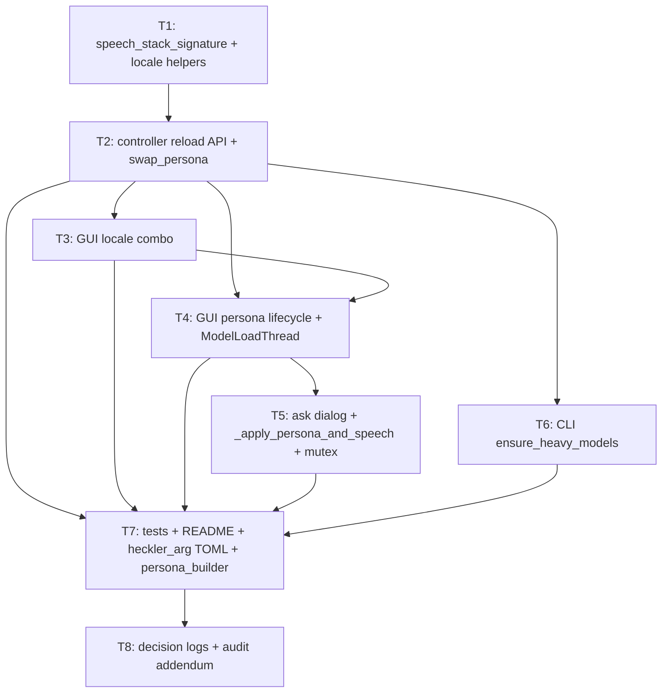

# Plan — persona-speech-reload

**Version:** 1.1.0  
**Status:** Complete — §8 auditor handoff emitted (cold audit pending)  
**Plan name:** `persona-speech-reload`  
**Produced by:** orchestrator-planning v0.6  
**Date:** 2026-05-22  
**Spec source (binding):** `PERSONA_SPEECH_RELOAD.md` (untracked at plan time — see §0 binding note)  
**Packets:** `.dev/plans/persona-speech-reload/packets/T1.md` through `T8.md`

---

## §0. Context map intake

**Path consumed:** `.dev/plans/persona-speech-reload/context-map.md`  
**Readiness verdict:** CONDITIONAL  
**Skill version + commit SHA recorded in map:** pre-plan-exploration v0.2 / `80c60a0ea5d1008d2c9f57d17520ada7ea9f6aac`  
**Staleness check:** HEAD at plan time is the same dirty tree (untracked `PERSONA_SPEECH_RELOAD.md`, `GUI_DARK_THEME.md`); touched source files have not changed since the map was generated — map is current.

**Ambiguity flags consumed and resolved:**

| Flag | Category | Orchestrator resolution |
|------|----------|------------------------|
| Flag 1 | ownership | `ModelLoadThread` receives callable snapshots `persona_name_fn: Callable[[], str]` and `locale_override_fn: Callable[[], str \| None]` at init; reads them at `run()` time. No circular import. Stale-startup race covered by D7 (Start correction). Owner: T4. |
| Flag 2 | vocabulary_collision | `swap_persona` = same-sig Reactor hot-swap only (pure, no reload). Cross-locale dispatch lives in `HecklerMainWindow._apply_persona_and_speech` (T5). `reload_speech_stack_for_persona` is the controller-level reload primitive (T2). No logic duplication; no double-stop risk. |
| Flag 3 | missing_test_coverage | T7 delivers full scenario matrix (S1–S14) + G1–G13 unit coverage. Subtask kill criterion: `test_swap_persona_does_not_change_transcriber_whisper_language` must be deleted/replaced. |
| Flag 4 | coexisting_model_versions | D12 defers artifact tree unless requested; user has now requested orchestrator planning. This plan.md IS the primary artifact. T8 covers decision logs + audit addendum. No parallel `.dev/plans/` subtree collision. |
| Flag 5 | vocabulary_collision | `selected_locale_override()` returns `None` (Python `None`) for "From persona"; never returns the string `"From persona"`. `target_speech_config` accepts `None` as "no override". `resolve_locale` is never called with `None` or `"From persona"`. Guard is in T4. |

**Binding-artifact note:** `PERSONA_SPEECH_RELOAD.md` is untracked at plan time. Per §0 binding rule, T1's first action is `git add PERSONA_SPEECH_RELOAD.md` to promote it to a tracked path, after which it satisfies `git ls-files`. All §4 subtask specs reference it as binding only after T1 commits it. Auditors: verify `git show HEAD:PERSONA_SPEECH_RELOAD.md` succeeds at §8.1 SHA.

**Prior reasoning consumed (from context map §Prior reasoning):**

| Decision log | Supersession status |
|---|---|
| `.dev/decision-logs/locale-lang-propagation-T4.md` | **Superseded** — "swap never rebuilds" replaced by conditional rebuild. T2 Outputs must add supersession banner to that log. |
| `.dev/decision-logs/locale-lang-propagation-T7.md` | **Superseded** — `ModelLoadThread` uses config.persona_name fixed at init; replaced by callable snapshot pattern. T4 Outputs must add supersession banner to that log. |
| `.dev/decision-logs/locale-lang-propagation-T1.md` | **Unchanged** — `SUPPORTED_LOCALES`/`resolve_locale` ownership unchanged; T1 extends (does not contradict) locale.py. |

**Coupling surfaces consumed:**

| Surface | Subtask IDs |
|---|---|
| Surface 1 (STT/TTS tuple mismatch on load vs start) | T2, T3, T4 |
| Surface 2 (GUI startup F1) | T4 |
| Surface 3 (swap_persona Reactor-only) | T2, T5 |
| Surface 4 (persona combo enabled only while running F2) | T4 |
| Surface 5 (TOML locale merge path) | T2, T3 |
| Surface 6 (worker cfg staleness, suspected) | T2 — confirmed disproven by `target_speech_config` shared path |
| Surface 7 (README contract) | T7 |
| Surface 8 (old test encodes wrong contract) | T7 |
| Surface 9 (voice/lang_code prefix mismatch, suspected) | T5 — non-blocking warning |

---

## §1. Task statement

**What is being built and why:**

Heckler's GUI and CLI fail to propagate locale into the Whisper and Kokoro heavy models when the operator selects a persona with a non-English locale (e.g. `heckler_arg` with `locale = "es"`). The root causes are: (a) `ModelLoadThread` reads `config.persona_name` at init instead of the live combo selection at thread start; (b) `swap_persona` never rebuilds heavy models regardless of locale change; (c) the persona combo is disabled until the pipeline is running, blocking pre-Start selection. This plan delivers the third and intended final fix: a reload-predicate API based on `(whisper_language, kokoro_lang_code)` signature comparison, a GUI locale override combo, a unified `_apply_persona_and_speech` orchestration entry point, a reload policy (auto on Start, ask while running), and CLI parity — so that picking `heckler_arg` in the GUI produces Spanish STT + Spanish TTS without any `.env` configuration.

**Non-goals (v1):**
- Speaker-only reload when only `kokoro_voice` changes (same locale).
- Persisting GUI locale override to disk / `.env`.
- LLM locale / Reactor template injection.
- Locale control in Transcribe mode.
- New `SUPPORTED_LOCALES` beyond the existing four (`en`, `en-us`, `en-gb`, `es`).
- In-place Transcriber/Speaker swap without stop/start.
- GUI theme / log viewer changes.
- QSettings "don't ask again" (D3, deferred).
- `WHISPER_LANGUAGE` or Kokoro `lang_code` env vars (single `locale` knob only).

---

## §2. Shared contracts

### Types / interfaces

All new symbols must land in the named typed surfaces. `getattr`-papered defaults and prose-only keys are not acceptable.

| Symbol | Typed surface | Signature | Owner subtask | Round-trip / construction test |
|---|---|---|---|---|
| `speech_stack_signature` | `heckler/locale.py` (module-level function) | `(cfg: HecklerConfig) -> tuple[str, str]` | T1 | `tests/test_locale.py::test_speech_stack_signature_*` |
| `supported_locale_labels` | `heckler/locale.py` (module-level function) | `() -> list[str]` | T1 | `tests/test_locale.py::test_supported_locale_labels` |
| `SpeechReloadPolicy` | `heckler/controller.py` (`enum.Enum` or `Literal`) | values: `"auto"`, `"ask"`, `"never"` | T2 | `tests/test_controller.py::test_speech_reload_policy_values` |
| `PipelineController.loaded_speech_stack` | `heckler/controller.py` method | `(self) -> tuple[str, str] \| None` | T2 | `tests/test_controller.py::test_loaded_speech_stack_*` |
| `PipelineController.target_speech_config` | `heckler/controller.py` method | `(self, *, persona_name: str \| None, locale_override: str \| None = None) -> HecklerConfig` | T2 | `tests/test_controller.py::test_target_speech_config_*` |
| `PipelineController.heavy_models_need_reload` | `heckler/controller.py` method | `(self, *, persona_name: str \| None, locale_override: str \| None = None) -> bool` | T2 | `tests/test_controller.py::test_heavy_models_need_reload_*` |
| `PipelineController.ensure_heavy_models` | `heckler/controller.py` method | `(self, *, persona_name: str \| None, locale_override: str \| None = None, on_progress: Callable[[str], None] \| None = None, mode: str = "persona") -> bool` | T2 | `tests/test_controller.py::test_ensure_heavy_models_*` |
| `PipelineController.reload_speech_stack_for_persona` | `heckler/controller.py` method | `(self, *, persona_name: str \| None, locale_override: str \| None = None, on_progress: Callable[[str], None] \| None = None) -> None` | T2 | `tests/test_controller.py::test_reload_speech_stack_*` |
| `PipelineController.load_models` (extended) | `heckler/controller.py` method | adds `locale_override: str \| None = None` parameter | T2 | `tests/test_controller.py::test_load_models_locale_override` |
| `HecklerMainWindow.selected_persona_name` | `heckler/gui/main_window.py` method | `(self) -> str` | T4 | `tests/test_gui.py::test_selected_persona_name` |
| `HecklerMainWindow.selected_locale_override` | `heckler/gui/main_window.py` method | `(self) -> str \| None` (None = "From persona") | T4 | `tests/test_gui.py::test_selected_locale_override_*` |
| `HecklerMainWindow._apply_persona_and_speech` | `heckler/gui/main_window.py` method | `(self, persona_name: str, locale_override: str \| None, *, running: bool, reload_policy: SpeechReloadPolicy, on_progress: Callable[[str], None]) -> None` | T5 | `tests/test_gui.py::test_apply_persona_and_speech_*` |
| `ModelLoadThread` (refactored) | `heckler/gui/app.py` class | constructor changes to `(controller, mode: str, persona_name_fn: Callable[[], str], locale_override_fn: Callable[[], str \| None])` | T4 | `tests/test_gui.py::test_model_load_thread_reads_combo_at_run_time` |

**`locale_override` sentinel rule (binding for T2, T4, T5):** `None` means "From persona / use config default". The string `"From persona"` is a GUI display label only — it must never appear as a value passed to `resolve_locale`, `target_speech_config`, or `load_models`. Every call site must convert before passing.

**`swap_persona` updated contract (binding for T2, T5):** After T2, `swap_persona` is a same-signature Reactor hot-swap only. Callers must pre-verify same signature. Cross-locale dispatch is handled by `HecklerMainWindow._apply_persona_and_speech`, not by `swap_persona`. The old docstring claim "STT/TTS language remains whatever was fixed at the last `load_models` call" is replaced with "Caller guarantees speech-stack signature is unchanged; raises `PipelineNotRunningError` if not running."

### Error envelope

| Error | Where raised | Consumer | Binding behavior |
|---|---|---|---|
| `UnsupportedLocaleError(ValueError)` | `heckler/locale.py:resolve_locale` | T2 `target_speech_config`, T4 guard | Never called with `None` or display strings; guard in callers |
| `PipelineNotRunningError(RuntimeError)` | `heckler/controller.py:swap_persona`, `switch_mode` | GUI handlers | Unchanged from today |
| `PipelineAlreadyRunningError(RuntimeError)` | `heckler/controller.py:start` | GUI handlers | Unchanged from today |
| `Exception` (model load failure) | `controller.load_models`, `ensure_heavy_models` | T5 `_apply_persona_and_speech` | Must be caught in GUI reload path; show error dialog, revert combos, clear `_reloading` flag (G9) |

### Naming

| Symbol | Canonical name | File |
|---|---|---|
| Reload predicate enum | `SpeechReloadPolicy` | `heckler/controller.py` |
| GUI locale combo widget | `self._locale_combo` | `heckler/gui/main_window.py` |
| GUI reload button widget | `self._reload_speech_btn` | `heckler/gui/main_window.py` |
| GUI reload mutex flag | `self._reloading: bool` | `heckler/gui/main_window.py` |
| Decision log (T2 controller) | `persona-speech-reload-T2` | `.dev/decision-logs/persona-speech-reload-T2.md` |
| Decision log (T4 GUI startup) | `persona-speech-reload-T4` | `.dev/decision-logs/persona-speech-reload-T4.md` |

### Logging

| Level | Message pattern | When | Owner |
|---|---|---|---|
| `INFO` | `"Speech stack loaded for %r (%s/%s)"` — persona_name, whisper_language, kokoro_lang_code | After successful `load_models` in reload path | T2 |
| `INFO` | `"Same-locale swap: %r → %r (no reload)"` | `_apply_persona_and_speech` same-sig path | T5 |
| `INFO` | `"Cross-locale reload triggered: %s → %s"` | `_apply_persona_and_speech` reload path | T5 |
| `WARNING` | `"Voice %r may not be compatible with locale %r (lang_code %r)"` | Voice/locale prefix mismatch heuristic | T5 |
| `WARNING` | `"Reload failed: %s"` | Load failure in reload path | T5 |

### Tests

- **Framework:** `pytest` (existing)
- **Test files:** `tests/test_locale.py`, `tests/test_controller.py`, `tests/test_gui.py`, `tests/test_pipeline.py`, `tests/test_speaker.py`
- **Scenario matrix:** S1–S14 from spec §19 must be covered in T7 (unit/mock level)
- **Mandatory replacement:** `test_swap_persona_does_not_change_transcriber_whisper_language` must be deleted and replaced with a same-sig / cross-sig matrix (see G6). CI must not contain both old and new tests for this surface simultaneously.
- **Coverage expectations:** All new public symbols in T1 and T2 have at least one positive and one negative test. T5 dialog path: at least mock-level tests for cancel revert and auto-reload.

### CLI surface

No new CLI flags in v1. `pipeline.main()` is extended internally to call `ensure_heavy_models` before `start()` — the `--persona` and `--mode` flags are unchanged.

### Decision log paths (architectural tiers — binding)

| Subtask | Decision log path |
|---|---|
| T2 | `.dev/decision-logs/persona-speech-reload-T2.md` |
| T4 | `.dev/decision-logs/persona-speech-reload-T4.md` |

---

## §3. Dependency DAG

**Parallel groups:**
- `{T3, T6}` may run in parallel after T2 completes (T3 is GUI-only, T6 is CLI-only, no shared surfaces).
- `{T4, T6}` — T4 depends on T3; T6 only depends on T2. T6 may start as soon as T2 is done, concurrent with T3.
- T5 must wait for both T3 and T4.
- T7 must wait for T2, T3, T4, T5, T6 (it writes the test matrix and docs for all of them).
- T8 must wait for T7.

**Soft dependency:** T4 and T3 both touch `heckler/gui/main_window.py`. If parallelized, merge conflict risk is high. **Sequence T3 → T4** (T4 is already blocked on T3 in the DAG).

---

## §4. Subtask specs

---

### T1 — `speech_stack_signature` + locale helpers

| Field | Content |
|---|---|
| **ID** | T1 |
| **Scope** | Add `speech_stack_signature(cfg)` and `supported_locale_labels()` to `heckler/locale.py`. Commit `PERSONA_SPEECH_RELOAD.md` to satisfy binding-artifact rule. Extend `tests/test_locale.py`. |
| **Files to touch** | `heckler/locale.py`, `tests/test_locale.py`, `PERSONA_SPEECH_RELOAD.md` (git add only) |
| **Contract bindings** | §2 Types: `speech_stack_signature`, `supported_locale_labels`. §2 Naming. §2 Tests (positive + negative for each). |
| **Inputs** | None. |
| **Outputs** | `heckler/locale.py` with two new functions. `tests/test_locale.py` extended. `PERSONA_SPEECH_RELOAD.md` tracked in git. |
| **Kill criteria** | (1) If `speech_stack_signature` requires importing `HecklerConfig` and doing so creates a circular import — halt and report the import chain. (2) If `PERSONA_SPEECH_RELOAD.md` is not present in the working tree — halt; spec file is required. (3) If `supported_locale_labels()` returns keys that duplicate GUI-hardcoded strings — halt and flag the collision. |
| **Log tier** | `standard` |
| **Risks & mitigations** | `HecklerConfig` is in `heckler/config.py`; `heckler/locale.py` currently has no imports from `heckler/`. A `TYPE_CHECKING` guard resolves circular import risk if needed. `supported_locale_labels()` should return `list(SUPPORTED_LOCALES.keys())` — already defined in this file, no import needed. |

---

### T2 — Controller reload API + `swap_persona` update + `switch_mode`

| Field | Content |
|---|---|
| **ID** | T2 |
| **Scope** | Add `SpeechReloadPolicy`, `loaded_speech_stack`, `target_speech_config`, `heavy_models_need_reload`, `ensure_heavy_models`, `reload_speech_stack_for_persona` to `PipelineController`. Extend `load_models` with `locale_override` parameter (replaces internal `_heavy_model_config` call with `target_speech_config`). Update `swap_persona` docstring/contract to same-sig-only. Update `switch_mode` to call `ensure_heavy_models` when switching to persona. Supersede `locale-lang-propagation-T4.md`. Write decision log. |
| **Files to touch** | `heckler/controller.py`, `tests/test_controller.py`, `.dev/decision-logs/locale-lang-propagation-T4.md` (supersession banner), `.dev/decision-logs/persona-speech-reload-T2.md` (new) |
| **Contract bindings** | All §2 rows owned by T2. §2 Error envelope. §2 Logging (`"Speech stack loaded for %r (%s/%s)"`). §2 Decision log path: `.dev/decision-logs/persona-speech-reload-T2.md`. |
| **Inputs** | T1 (imports `speech_stack_signature` from `heckler.locale`). |
| **Outputs** | `heckler/controller.py` with six new methods + enum + extended `load_models`. `tests/test_controller.py` with `loaded_speech_stack`, `target_speech_config`, `heavy_models_need_reload`, `ensure_heavy_models`, `reload_speech_stack_for_persona` tests + `switch_mode` → persona ensure test. Supersession banner in `locale-lang-propagation-T4.md`. New decision log at `.dev/decision-logs/persona-speech-reload-T2.md`. |
| **Kill criteria** | (1) If `target_speech_config` ever calls `resolve_locale` with `None` or a display string — halt; sentinel rule violation. (2) If `reload_speech_stack_for_persona` calls `start()` when `_running` was `False` before the reload — halt; must only restart if was_running. (3) If `load_models` with `locale_override` + `persona_name` produces a config that disagrees with `target_speech_config(persona_name=..., locale_override=...)` — halt; single source of truth violated. (4) If `switch_mode` to persona no longer ensures Speaker is loaded — halt; G2 unresolved. (5) Decision log not written at `.dev/decision-logs/persona-speech-reload-T2.md` — halt; architectural tier requires it. |
| **Log tier** | `architectural` — new public API, supersedes landed decision log, multiple real design options existed (see spec §16). |
| **Risks & mitigations** | `reload_speech_stack_for_persona` must track `was_running = self._running` before `stop()`. `switch_mode` currently calls `stop()` then `start()`; the new path inserts `ensure_heavy_models` between them. The `_heavy_model_config` method becomes a private alias or is removed — verify no other callers exist before removing (`grep heckler/ tests/ -r _heavy_model_config`). |

---

### T3 — GUI locale combo

| Field | Content |
|---|---|
| **ID** | T3 |
| **Scope** | Add `_locale_combo` (`QComboBox`) to `HecklerMainWindow`. Populate with `"From persona"` + `supported_locale_labels()`. Implement `selected_locale_override() -> str \| None`. Wire locale combo to sync from persona TOML on persona change (not-running path). Wire disabled states (Transcribe mode, `_reloading`). |
| **Files to touch** | `heckler/gui/main_window.py` |
| **Contract bindings** | §2 Types: `selected_locale_override`. §2 Naming: `self._locale_combo`. §2 sentinel rule (`None` not `"From persona"`). |
| **Inputs** | T2 (imports `supported_locale_labels` from T1 via T2's `load_models` — actually T3 imports `supported_locale_labels` directly from `heckler.locale`; T1 must have landed). |
| **Outputs** | `heckler/gui/main_window.py` with locale combo widget, `selected_locale_override()` method, persona→locale sync logic in `_on_persona_changed` (not-running path only — running path deferred to T5). |
| **Kill criteria** | (1) If `selected_locale_override()` returns the string `"From persona"` — halt; sentinel rule violation. (2) If locale combo is populated by hardcoding locale slugs rather than calling `supported_locale_labels()` — halt; duplication risk. (3) If `currentTextChanged` signal fires during `_populate_personas` or `_populate_locale_combo` before `blockSignals` is restored — halt; G7 init-guard missing. (4) If locale combo visible in Transcribe mode — halt; §7.4 violated. |
| **Log tier** | `standard` |
| **Risks & mitigations** | Persona TOML read in `_on_persona_changed` (not-running path) requires `load_persona(_prompts_root() / name)`. If the persona directory is missing, `PersonaNotFoundError` may be raised — catch and default to "From persona" silently. The `blockSignals` pattern already used for `_persona_combo` should be replicated for `_locale_combo`. |

---

### T4 — GUI persona lifecycle + `ModelLoadThread`

| Field | Content |
|---|---|
| **ID** | T4 |
| **Scope** | Fix F1: refactor `ModelLoadThread` to accept callable snapshots. Fix F2: persona combo enabled when `_models_ready and persona_mode` (remove `is_running` requirement). Add `selected_persona_name() -> str`. Update `HecklerMainWindow._apply_models_ready` gating. Update `app.main()` to pass callables. Update Start button handler to call `ensure_heavy_models` before `start()` (D7 correction). Supersede `locale-lang-propagation-T7.md`. Write decision log. |
| **Files to touch** | `heckler/gui/main_window.py`, `heckler/gui/app.py`, `tests/test_gui.py`, `.dev/decision-logs/locale-lang-propagation-T7.md` (supersession banner), `.dev/decision-logs/persona-speech-reload-T4.md` (new) |
| **Contract bindings** | §2 Types: `selected_persona_name`, `ModelLoadThread` refactored constructor, `selected_locale_override` (from T3). §2 Naming: `self._reload_speech_btn` placeholder (button wired in T5). §2 Decision log path: `.dev/decision-logs/persona-speech-reload-T4.md`. |
| **Inputs** | T2 (`ensure_heavy_models`, `heavy_models_need_reload`), T3 (`selected_locale_override`, `_locale_combo` gating). |
| **Outputs** | `heckler/gui/app.py` with refactored `ModelLoadThread.__init__` (callables) and `run()`. `heckler/gui/main_window.py` with `selected_persona_name()`, fixed `_apply_models_ready`, Start handler calls `ensure_heavy_models`. `tests/test_gui.py` with F1 and F2 tests. Supersession banners in both prior logs. New decision log `.dev/decision-logs/persona-speech-reload-T4.md`. |
| **Kill criteria** | (1) If `ModelLoadThread.run()` reads `self._config.persona_name` instead of calling `self._persona_name_fn()` — halt; F1 not fixed. (2) If `_apply_models_ready` still gates persona combo on `is_running` — halt; F2 not fixed. (3) If Start button calls `controller.start()` without preceding `ensure_heavy_models` check — halt; D7 Start correction violated. (4) If `persona_name_fn` or `locale_override_fn` are called outside `run()` (e.g. at init time) — halt; defeats the at-run-time read requirement. (5) Decision log not written at `.dev/decision-logs/persona-speech-reload-T4.md` — halt. (6) If `ModelLoadThread` now imports `HecklerMainWindow` directly — halt if it creates circular import. |
| **Log tier** | `architectural` — `ModelLoadThread` ownership model changes, F1 fix involves a threading contract, two design options existed (direct window reference vs callable). |
| **Risks & mitigations** | `ModelLoadThread` currently receives `config: HecklerConfig`; after T4 it receives `mode: str, persona_name_fn, locale_override_fn`. Callers in `app.main()` must be updated. No other callers of `ModelLoadThread` exist in repo (verify with grep before proceeding). The Start button currently calls `controller.start()` directly; the `ensure_heavy_models` call before it is auto-mode (no dialog) — dialog is wired in T5. For T4, the Start path calls `ensure_heavy_models(auto, on_progress=status_bar.showMessage)` then `controller.start()`. T5 will wrap this in `_apply_persona_and_speech`. |

---

### T5 — Ask dialog + `_apply_persona_and_speech` + reload mutex

| Field | Content |
|---|---|
| **ID** | T5 |
| **Scope** | Implement `HecklerMainWindow._apply_persona_and_speech`. Implement ask dialog (title, body, Reload/Cancel buttons per spec §6.3). Implement `_reloading` mutex (disable controls during reload). Implement voice/locale prefix mismatch warning (G5, non-blocking). Implement failure revert (G9). Wire `_on_persona_changed` (running path) to call `_apply_persona_and_speech`. Wire Start button (replace T4's inline `ensure_heavy_models` call with `_apply_persona_and_speech`). Add `_reload_speech_btn` ("Reload speech models"). Implement double-Start debounce during reload (D10). |
| **Files to touch** | `heckler/gui/main_window.py`, `tests/test_gui.py` |
| **Contract bindings** | §2 Types: `_apply_persona_and_speech` full signature. §2 Error envelope (Exception catch, revert, error dialog). §2 Naming: `_reloading`, `_reload_speech_btn`. §2 Logging (cross-locale reload, same-locale swap, voice warning). Spec §6.3 dialog copy (binding for cancel behavior D13). |
| **Inputs** | T2 (`heavy_models_need_reload`, `reload_speech_stack_for_persona`, `swap_persona`, `SpeechReloadPolicy`), T3 (`selected_locale_override`, locale combo revert on cancel), T4 (`selected_persona_name`, Start button handler integration). |
| **Outputs** | `heckler/gui/main_window.py` with `_apply_persona_and_speech`, ask dialog, mutex, voice warning, failure revert, Reload speech button. `tests/test_gui.py` with dialog/cancel/mutex/warning tests. |
| **Kill criteria** | (1) If cancel path swaps the Reactor before checking reload need — halt; reload-before-Reactor ordering (§18.1) violated. (2) If cancel does not revert both persona and locale combos — halt; D13 violated. (3) If `_reloading` is not set to `False` in all exit paths (success, cancel, exception) — halt; G8 mutex leak. (4) If voice/locale prefix check calls `resolve_locale` on the voice name — halt; misuse of resolver. (5) If `_reload_speech_btn` is not disabled during `_reloading` — halt; G13 violated. (6) If ask dialog is shown when pipeline is not running — halt; D6 says defer to Start (no dialog when not running). |
| **Log tier** | `standard` — behavior follows spec precisely; no new design forks. |
| **Risks & mitigations** | Ask dialog must be shown on the GUI thread; `_apply_persona_and_speech` is always called from GUI thread. `reload_speech_stack_for_persona` is a blocking controller call that will block the GUI thread for 30–60 s — must be offloaded to a `QThread` or similar; the `_reloading` flag and status bar messages keep the UI responsive during the wait. Voice prefix heuristic: check `kokoro_voice` prefix (`af_`, `am_`, `bf_`, `bm_`, `ef_`, `em_`) against `kokoro_lang_code` (`a`, `b`, `e`) — English voice under Spanish lang_code is `af_*` or `am_*` with `e`. |

---

### T6 — CLI `ensure_heavy_models` before start

| Field | Content |
|---|---|
| **ID** | T6 |
| **Scope** | Update `pipeline.main()` to call `controller.ensure_heavy_models(persona_name=..., locale_override=None, mode=mode)` after `load_models` succeeds and before `start()`. Document `voice-only change, same locale = no reload` in inline comment. |
| **Files to touch** | `heckler/pipeline.py`, `tests/test_pipeline.py` |
| **Contract bindings** | §2 CLI surface (no new flags). §2 Types: `ensure_heavy_models` signature (from T2). §2 Tests. |
| **Inputs** | T2 (`ensure_heavy_models` available). |
| **Outputs** | `heckler/pipeline.py` with `ensure_heavy_models` call. `tests/test_pipeline.py` with S12 (`--persona heckler_arg` produces es at load) and parity test. |
| **Kill criteria** | (1) If `ensure_heavy_models` is called before `load_models` returns — halt; order matters (models must exist before predicate runs, though on startup `loaded_speech_stack()` is `None` so it always reloads, this is still wrong ordering). (2) If new CLI flags are introduced — halt; non-goal. (3) If `pipeline.main()` now fails for `mode="transcribe"` (no Speaker) — halt; ensure mode is passed through. |
| **Log tier** | `standard` |
| **Risks & mitigations** | `pipeline.main()` already calls `load_models(persona_name=..., mode=mode)`; the `ensure_heavy_models` call is effectively a no-op on startup (signature matches what was just loaded), but ensures parity if someone adds hot-restart logic later. On startup, `loaded_speech_stack()` is `None`, so `heavy_models_need_reload` returns `True`, and `ensure_heavy_models` would call `load_models` again — this is wasteful. Solution: call `ensure_heavy_models` only, skipping the explicit `load_models` call (since `ensure_heavy_models` calls `load_models` internally). Or: keep explicit `load_models` and add a note that `ensure_heavy_models` is a no-op after it on startup. **Choose option 1** (use `ensure_heavy_models` as the single call, skip explicit `load_models`): simpler, no double-load. Kill criterion: if both `load_models` and `ensure_heavy_models` are called on startup (double load), halt and flag redundancy. |

---

### T7 — Tests + README + `heckler_arg` TOML + `persona_builder` SKILL

| Field | Content |
|---|---|
| **ID** | T7 |
| **Scope** | Add scenario matrix tests S1–S14 (mock level). Replace `test_swap_persona_does_not_change_transcriber_whisper_language` with same-sig / cross-sig matrix. Verify `heckler_arg/persona.toml` has `kokoro_voice = "ef_dora"` (D15 — already present per context map; verify and update if needed). Update `README.md` to supersede "swap never rebuilds" language. Update `.cursor/skills/persona_builder/SKILL.md` with per-locale voice table. Add `tests/test_speaker.py` assertion for `lang_code=es` after reload path (G1). |
| **Files to touch** | `tests/test_controller.py`, `tests/test_gui.py`, `tests/test_locale.py`, `tests/test_speaker.py`, `prompts/heckler_arg/persona.toml`, `README.md`, `.cursor/skills/persona_builder/SKILL.md` |
| **Contract bindings** | §2 Tests (S1–S14, G1–G13). §2 mandatory replacement of old swap test. Spec §19 scenario matrix (binding). Spec §20 exit criteria 4 (automated). |
| **Inputs** | T2 (controller API finalized), T3 (locale combo), T4 (ModelLoadThread, Start path), T5 (`_apply_persona_and_speech`, dialog), T6 (CLI path). |
| **Outputs** | Extended test files with scenario matrix. Verified/updated `heckler_arg/persona.toml`. Updated `README.md`. Updated `persona_builder/SKILL.md`. |
| **Kill criteria** | (1) If `test_swap_persona_does_not_change_transcriber_whisper_language` still exists after T7 — halt; CI encodes old contract. (2) If S2 (running `heckler` → `heckler_arg`, Reload) is not covered — halt; P0 gap G6. (3) If G1 (KPipeline lang_code=es after reload) test is missing — halt; P0 gap. (4) If `heckler_arg/persona.toml` has `kokoro_voice = "af_sarah"` — halt; D15 violated. (5) If README still contains "swap never rebuilds" language — halt; Surface 7 still open. |
| **Log tier** | `standard` |
| **Risks & mitigations** | S8 (persona change during initial load) is a GUI-thread race — test with mock `ModelLoadThread` and simulated combo change before `finished_ok` signal. S10 (reload failure) requires mocking `reload_speech_stack_for_persona` to raise; check combo revert and error dialog shown. |

---

### T8 — Decision logs + audit addendum

| Field | Content |
|---|---|
| **ID** | T8 |
| **Scope** | Write decision log `persona-speech-reload-T2.md` (architectural controller API choices). Write decision log `persona-speech-reload-T4.md` (ModelLoadThread callable vs direct-window vs snapshot approaches). Append audit addendum to `.dev/audits/2026-05-22-locale-lang-propagation.md` closing FIND-A6 per spec §18.9. |
| **Files to touch** | `.dev/decision-logs/persona-speech-reload-T2.md`, `.dev/decision-logs/persona-speech-reload-T4.md`, `.dev/audits/2026-05-22-locale-lang-propagation.md` |
| **Contract bindings** | §2 Naming (decision log paths). §2 amendment-DoD requirement: supersession banners in T2/T4 Outputs must be consistent with these logs. Spec §18.8–18.9. |
| **Inputs** | T7 (all code landed and verified). |
| **Outputs** | Two new decision log files. Audit addendum. |
| **Kill criteria** | (1) If decision logs describe pre-T2/T4 behavior without a supersession note linking to the landed behavior — halt; stale preamble. (2) If audit addendum claims FIND-A6 closed without citing the specific test that closes it — halt; evidence must be named. |
| **Log tier** | `trivial` |
| **Risks & mitigations** | The `.dev/audits/` file may not yet exist for this audit session; create it if absent, append if present. |

---

## §5. Adversarial pass

*Answered using the packet-only executor persona lens: for each item, framing is "if I only had this packet, I would halt because..."*

### 5.1 Rejected decompositions

**Alternative A: Put cross-locale dispatch logic inside `PipelineController.swap_persona`.**

The spec §5.7 pseudo-code appears to place the full dispatch (including ask dialog and GUI revert) inside `swap_persona`. Rejected because: (a) the controller has no GUI callback for showing a dialog or reverting combos; (b) threading — the ask dialog must run on the GUI thread, `swap_persona` is called from GUI but the reload path blocks the GUI thread requiring a separate QThread; (c) `SpeechReloadPolicy` as a controller enum is fine, but the policy check and GUI side-effects belong in the view layer. Chosen decomposition: controller provides pure primitives (`swap_persona` = same-sig hot-swap, `reload_speech_stack_for_persona` = stop/load/start), GUI provides the dispatch (`_apply_persona_and_speech`).

**Alternative B: Merge T3 and T4 into a single GUI subtask.**

Rejected because: T3 (locale combo) and T4 (ModelLoadThread + persona lifecycle + Start button) touch overlapping lines of `main_window.py`, but T3 adds a new widget and T4 modifies existing widget behavior. Sequencing them reduces merge complexity and clarifies responsibility. If parallelized, both would need to edit `_apply_models_ready`, `_on_persona_changed`, and the constructor — near-certain conflict.

**Alternative C: Use a single `ensure_heavy_models` call in CLI and skip the explicit `load_models` call entirely.**

Chosen (see T6 kill criteria). This is not a rejection but a selection — noted here for executor clarity. The alternative (explicit `load_models` + redundant `ensure_heavy_models`) causes a double-load on startup and was rejected.

### 5.2 Load-bearing assumptions

`(claim | contract surface referenced | failure mode | subtask IDs)`

1. `(HecklerConfig is a frozen/immutable-enough dataclass that calling dataclasses.replace() on it is safe at any call site | §2 Types: target_speech_config returns HecklerConfig | If HecklerConfig has mutable default fields (e.g. list), replace() could share state; target_speech_config would return a cfg that mutates the base | T2)`

2. `(speech_stack_signature import from heckler.locale into heckler.controller does not create a circular import | §2 Types: speech_stack_signature in heckler/locale.py | locale.py importing from config.py for the HecklerConfig type annotation would cause circular import if config.py imports from locale.py | T1, T2)` — mitigated: `TYPE_CHECKING` guard or inline import.

3. (`load_persona` for a persona name that exists in the combo is always callable without a running pipeline (i.e. the prompts dir is available) | §2 Types: target_speech_config calls load_persona | If prompts/ dir is missing or persona.toml malformed, target_speech_config raises; caller must catch | T2, T3)

4. (`reload_speech_stack_for_persona` is called on the GUI thread and blocks it for 30–60 s | §2 Types: reload_speech_stack_for_persona signature; §2 Logging | If called synchronously on the GUI thread, the window freezes; QApplication processes no events; status messages do not render | T5)` — mitigation: T5 must offload to a `QThread` for the reload path.

5. (`test_swap_persona_does_not_change_transcriber_whisper_language` is the only test that asserts the old "no rebuild" behavior | §2 Tests: mandatory replacement | If another test also asserts the old contract, T7 may green incorrectly | T7)`

6. (`heckler_arg/persona.toml` already contains kokoro_voice = "ef_dora" (D15, context map §Orchestrator handoff notes) | §2 Tests: heckler_arg TOML | If the file has af_sarah or is missing the key, T7's S1/S9 tests will fail | T7)`

7. (`SpeechReloadPolicy` values as strings ("auto", "ask", "never") are not referenced by string literals elsewhere in the codebase | §2 Naming: SpeechReloadPolicy enum | If any caller passes the string "auto" instead of SpeechReloadPolicy.auto after T2, mypy/runtime mismatches | T2, T5)`

### 5.3 Highest re-plan risk

**T5** (ask dialog + `_apply_persona_and_speech` + mutex). Reason: T5 introduces the reload-on-GUI-thread blocking problem (assumption 4 above). If `reload_speech_stack_for_persona` cannot be trivially offloaded to a QThread without introducing additional signal/slot boilerplate that conflicts with the existing `ModelLoadThread` pattern, T5 will expand significantly. The `_reloading` mutex and progress reporting further complicate this. If the QThread approach for the reload path proves architecturally incompatible with the existing `PipelineController.stop()` / `load_models()` / `start()` sequence (which is not thread-safe from Qt's perspective), this is a re-plan trigger.

Process risk: T3, T4, T5 all touch `main_window.py`. Although sequenced, each executor will produce a diff that the next must cleanly apply. Any rebase conflict in the widget layout (constructor, `_apply_models_ready`, `_on_persona_changed`) could delay T5.

### 5.4 Hidden couplings

`(claim | contract surface referenced | failure mode | suspected/confirmed | subtask IDs)`

1. **confirmed** `(reload_speech_stack_for_persona stop/load/start sequence vs _start_persona_mode Speaker assertion | §2 Types: reload_speech_stack_for_persona; controller.py:_start_persona_mode line "assert self._speaker is not None" | If load_models is called with mode="transcribe" during reload, Speaker is None; subsequent start("persona") hits the assertion | T2)`

2. **confirmed** `(persona combo blockSignals during _populate_personas vs new locale combo sync in T3 | §2 Naming: _locale_combo; main_window.py:_populate_personas | T3 adds locale sync in _on_persona_changed; if blockSignals for persona_combo does not also suppress the T3 sync, a redundant persona→locale update fires on init | T3, T4)`

3. **confirmed** `(ModelLoadThread callable pattern vs QThread ownership model | §2 Types: ModelLoadThread refactored constructor | QThread methods (start, wait) may interact with the stored callables if the window is destroyed before run() executes; caller must ensure window outlives thread | T4)`

4. **suspected** `(ensure_heavy_models in switch_mode vs _start_persona_mode assertion order | §2 Types: ensure_heavy_models, switch_mode; controller.py:switch_mode calls stop() then start() | If ensure_heavy_models is inserted between stop() and start(), it calls load_models which creates new Transcriber/Speaker — then start() calls _start_persona_mode which asserts speaker is not None: fine. But if mode is not passed correctly to ensure_heavy_models (e.g. transcribe mode passes None speaker), assertion fires | T2)` — disproven by: ensure_heavy_models receiving mode parameter and passing to load_models.

5. **confirmed** `(Start button T4 inline ensure_heavy_models vs T5 _apply_persona_and_speech replacement | §2 Types: _apply_persona_and_speech; Start button handler in main_window.py | T4 adds bare ensure_heavy_models call; T5 wraps it in _apply_persona_and_speech; if T5 changes the call site again without seeing T4's exact implementation, double-ensure or missed-path risk | T4, T5)`

6. **suspected** `(locale_override=None vs locale_override="" edge case in target_speech_config | §2 sentinel rule; controller.py:target_speech_config | If any caller passes "" instead of None, the "if locale_override:" guard passes but resolve_locale("") raises UnsupportedLocaleError | T2, T3, T4)` — disproven by: explicit isinstance/truthiness check in target_speech_config treating empty string same as None.

---

## §6. Executor packets

Packets are saved to `.dev/plans/persona-speech-reload/packets/`:

| Subtask | Packet path |
|---|---|
| T1 | `.dev/plans/persona-speech-reload/packets/T1.md` |
| T2 | `.dev/plans/persona-speech-reload/packets/T2.md` |
| T3 | `.dev/plans/persona-speech-reload/packets/T3.md` |
| T4 | `.dev/plans/persona-speech-reload/packets/T4.md` |
| T5 | `.dev/plans/persona-speech-reload/packets/T5.md` |
| T6 | `.dev/plans/persona-speech-reload/packets/T6.md` |
| T7 | `.dev/plans/persona-speech-reload/packets/T7.md` |
| T8 | `.dev/plans/persona-speech-reload/packets/T8.md` |

Each packet is a self-contained document containing §1 (verbatim), §2 (verbatim), the subtask's own §4 block, filtered §5.2 assumptions, filtered §5.4 couplings, and resolved inputs.

---

## §8. Auditor handoff

*Produced after T1–T8 execution landed @ `31228054`. Cold adversarial audit is out of scope for this edit — auditor consumes §8 only.*

### §8.1 Completion snapshot

| Field | Value |
|-------|-------|
| **Handoff tree SHA** | `3122805444a99b8b555a3e65a1b500fc4480d5e4` (T8 closure) |
| **Implementation chain** | `ae491c43` T1 → `87549218` T2 → `4b149019` T3 → `c1861894` T4 → `964f020c` T5 → `78c945bf` T6 → `2d924cdc` T7 → `31228054` T8 |
| **Verification command** | `python -m pytest tests/ -m "not heavy" -q` |
| **Checkout** | Clean `git checkout 3122805444a99b8b555a3e65a1b500fc4480d5e4` for contract audit. Local untracked `transcripts/*.md` and this plan bundle (`plan.md`, `packets/`) do not affect pytest; they are not in HEAD (see §8.2). |
| **Result** | **349 passed** in 9.07s, exit code **0** (orchestrator re-run 2026-05-22, Windows, project venv) |
| **Environment** | Windows 10, Python pytest suite excluding `heavy` marker |

### §8.2 Artifact chain

| Artifact | Path | `git show 31228054:<path>` |
|----------|------|----------------------------|
| Context map | `.dev/plans/persona-speech-reload/context-map.md` | OK — scout SHA `80c60a0` (stale vs handoff; coupling labels still valid) |
| Plan | `.dev/plans/persona-speech-reload/plan.md` | **absent-from-HEAD** — v1.1.0 §8 on disk only until `git add` |
| Packets T1–T8 | `.dev/plans/persona-speech-reload/packets/T1.md` … `T8.md` | **absent-from-HEAD** — on disk only |
| Binding spec | `PERSONA_SPEECH_RELOAD.md` | OK (T1) |
| Decision log T2 | `.dev/decision-logs/persona-speech-reload-T2.md` | OK |
| Decision log T4 | `.dev/decision-logs/persona-speech-reload-T4.md` | OK |
| Superseded logs | `.dev/decision-logs/locale-lang-propagation-T4.md`, `locale-lang-propagation-T7.md` | OK — supersession banners present |
| Changelog | `CHANGELOG.MD` (persona-speech-reload section, lines 3–19) | OK — T1–T5, T7–T8 (**T6 CLI line omitted** from section; land evidence @ `78c945bf`) |
| Cross-plan audit addendum | `.dev/audits/2026-05-22-locale-lang-propagation.md` (FIND-A6 closure) | OK |

**Hygiene (non-blocking for cold read):** `git add .dev/plans/persona-speech-reload/` so `git show HEAD:plan.md` and packets resolve for archaeology parity with `locale-lang-propagation` T8 practice.

### §8.3 §2 evidence (landed)

| §2 row | Shipped artifact | Proof |
|--------|------------------|-------|
| **Types — `speech_stack_signature`** | `heckler/locale.py:41-47` | `tests/test_locale.py::test_speech_stack_signature_*` |
| **Types — `supported_locale_labels`** | `heckler/locale.py:49-51` | `tests/test_locale.py::test_supported_locale_labels` |
| **Types — `SpeechReloadPolicy`** | `heckler/controller.py:52-55` | `tests/test_controller.py::test_speech_reload_policy_values` |
| **Types — `loaded_speech_stack`** | `heckler/controller.py:160-165` | `test_loaded_speech_stack_none_without_models`, `test_loaded_speech_stack_returns_signature_after_load` |
| **Types — `target_speech_config`** | `heckler/controller.py:167-182` | `test_target_speech_config_*`, `test_target_speech_config_empty_locale_override_ignored` |
| **Types — `heavy_models_need_reload`** | `heckler/controller.py:184-196` | `test_heavy_models_need_reload_*`, `test_heavy_models_need_reload_en_gb_persona_s5` |
| **Types — `ensure_heavy_models`** | `heckler/controller.py:198-216` | `test_ensure_heavy_models_*` (controller + pipeline) |
| **Types — `reload_speech_stack_for_persona`** | `heckler/controller.py:218-235` | `test_reload_speech_stack_*`, `test_speech_stack_cross_locale_reload_s2` |
| **Types — `load_models` + `locale_override`** | `heckler/controller.py:114-158` | `test_load_models_locale_override`, INFO log via caplog in reload tests |
| **Types — `swap_persona` (same-sig only)** | `heckler/controller.py:350+` docstring | `test_speech_stack_swap_matrix_same_sig`; old `test_swap_persona_does_not_change_transcriber_whisper_language` **removed** |
| **Types — `selected_persona_name` / `selected_locale_override`** | `heckler/gui/main_window.py` | `tests/test_gui.py::test_selected_persona_name`, `test_selected_locale_override_*` |
| **Types — `ModelLoadThread` callables** | `heckler/gui/app.py`, `main_window.py` | `test_model_load_thread_reads_combo_at_run_time` |
| **Types — `_apply_persona_and_speech`** | `heckler/gui/main_window.py:380+` | `test_apply_persona_and_speech_*`, `_ReloadThread` off-thread reload |
| **Naming — `_locale_combo`, `_reload_speech_btn`, `_reloading`** | `heckler/gui/main_window.py` | GUI tests + `test_reload_speech_btn_present` |
| **Error envelope** | `UnsupportedLocaleError`, pipeline/GUI exception paths | locale + `test_apply_persona_and_speech_reload_failure_reverts` |
| **Logging** | `controller.py:153-158`, apply-path loggers | Reload/swap tests with caplog where asserted |
| **Tests — S1–S14 matrix** | `tests/test_*.py` | T7 commit `2d924cdc`; grep shows scenario-named tests (mock-level) |
| **Tests — mandatory replacement** | — | `test_swap_persona_does_not_change_transcriber_whisper_language` absent from `tests/` |
| **CLI surface** | No new flags | `heckler/pipeline.py:374-377` `ensure_heavy_models`; `test_cli_persona_heckler_arg_*`, `test_main_*ensure_heavy_models*` |
| **Decision logs** | `.dev/decision-logs/persona-speech-reload-T2.md`, `T4.md` | T8 finalized; supersession on locale-lang T4/T7 |

**Deferred (non-blocking, per CHANGELOG adversarial notes):** full GUI boot with real Whisper/Kokoro (S1–S3 manual per spec §20); some signal-spy / Exception-propagation paths noted in CHANGELOG T2–T5 deferrals.

### §8.4 §5 disposition

| §5.2 / §5.4 item (summary) | Status | Evidence |
|----------------------------|--------|----------|
| §5.2 #1 `HecklerConfig` safe for `replace()` | **closed** | `target_speech_config` tests + no mutable-default failures in CI |
| §5.2 #2 `locale` ↔ `controller` circular import | **closed** | `TYPE_CHECKING` / runtime import pattern; full pytest green |
| §5.2 #3 `load_persona` always callable | **treat-as-prediction** | Missing/malformed persona dirs handled in GUI (T3); not exhaustively integration-tested |
| §5.2 #4 reload blocks GUI thread | **closed** | `_ReloadThread` in `main_window.py`; T5 tests |
| §5.2 #5 old swap test sole encoders of old contract | **closed** | Test deleted; matrix `test_speech_stack_swap_matrix_same_sig` |
| §5.2 #6 `heckler_arg` `ef_dora` | **closed** | `prompts/heckler_arg/persona.toml`; S1/S9 tests |
| §5.2 #7 `SpeechReloadPolicy` enum vs string literals | **closed** | `SpeechReloadPolicy(str, enum.Enum)` + policy value test |
| §5.4 #1 reload + transcribe / Speaker assertion | **closed** | `reload_speech_stack` tests pass `mode="persona"`; transcribe CLI omits persona |
| §5.4 #2 persona/locale `blockSignals` on init | **closed** | `_populate_locale_combo` mirrors persona pattern; GUI tests green |
| §5.4 #3 `ModelLoadThread` callable lifetime | **closed** | Callable pattern landed; F1 test |
| §5.4 #4 `switch_mode` + `ensure_heavy_models` order | **closed** | Disproven at plan time; `switch_mode` tests in controller suite |
| §5.4 #5 T4 Start inline vs T5 `_apply_persona_and_speech` | **closed** | Start routes through apply; `test_apply_persona_and_speech_cross_sig_auto_reloads` |
| §5.4 #6 `locale_override=""` edge | **closed** | `test_target_speech_config_empty_locale_override_ignored` |

### §8.5 Cold-read seeds

1. `heckler/locale.py` — `speech_stack_signature`, `supported_locale_labels`
2. `heckler/controller.py` — reload API, `swap_persona`, `reload_speech_stack_for_persona`
3. `heckler/gui/main_window.py` — `_apply_persona_and_speech`, `_ReloadThread`, locale combo sentinel
4. `heckler/pipeline.py` — CLI `ensure_heavy_models` sole startup load (T6)
5. `tests/test_controller.py` — `test_speech_stack_cross_locale_reload_s2`, swap matrix
6. `tests/test_gui.py` — apply-path ask/cancel/reload failure tests

### §8.6 Cross-plan audit closure (FIND-A6)

| Audit | Finding | Remediation | Evidence | Disposition |
|-------|---------|-------------|----------|-------------|
| `.dev/audits/2026-05-22-locale-lang-propagation.md` | **FIND-A6** — `swap_persona` did not rebuild STT/TTS on cross-locale change | persona-speech-reload T2 + T5 | `test_speech_stack_cross_locale_reload_s2`; `test_apply_persona_and_speech_cross_sig_auto_reloads`; `test_apply_persona_and_speech_ask_cancel_reverts` | **closed** (addendum @ `31228054`) |

Auditor: re-run adversarial scenario **A6** from locale-lang audit rev 1 against `31228054` — expect **fail** on old test (removed) and **pass** on new conditional-reload contract.

---

## Validation checklist

- [x] All subtasks have required fields; no TBD in kill criteria.
- [x] DAG has no cycles; no orphan nodes.
- [x] Parallel safety: T3 and T4 both touch `main_window.py`; sequenced (T3 → T4). T5.4 coupling 5 documented.
- [x] Adversarial pass: one rejected decomposition (three alternatives listed), one load-bearing assumption.
- [x] Log tiers assigned: T2, T4 architectural; T1, T3, T5, T6, T7 standard; T8 trivial.
- [x] Packets emitted; self-contained verification in each packet.
- [x] Typed-surface binding: every §2 type has owning subtask + typed parse path + test, or deferred marker.
- [x] CLI strings frozen: no new CLI flags; `--persona` / `--mode` unchanged.
- [x] Amendment DoD: T2 and T4 include supersession of prior decision logs in Outputs.
- [x] Wire contract: no HTTP/auth fields. Error envelope matches shipped behavior (no illustrative-as-binding).
- [x] Decision log paths frozen in §2: `persona-speech-reload-T2.md`, `persona-speech-reload-T4.md`.
- [x] §5.2 and §5.4 entries use tuple shape with explicit Tn IDs.
- [x] §5 answered using packet-only executor persona lens.
- [x] Context map present; no "unknown — discovery required" Files to touch.
- [x] PERSONA_SPEECH_RELOAD.md binding-artifact issue noted in §0; T1 resolves via git add.
- [x] §8.1 completion snapshot: SHA `31228054`, pytest **349 passed**, exit **0**.
- [x] §8.2 artifact chain documented; plan + packets flagged **absent-from-HEAD** until committed.
- [x] §8.3 §2 evidence table with file:symbol + test anchors.
- [x] §8.4 §5 disposition: all §5.2 / §5.4 tuples marked.
- [x] §8.5 cold-read seeds listed.
- [x] §8.6 FIND-A6 cross-link to locale-lang audit addendum.
