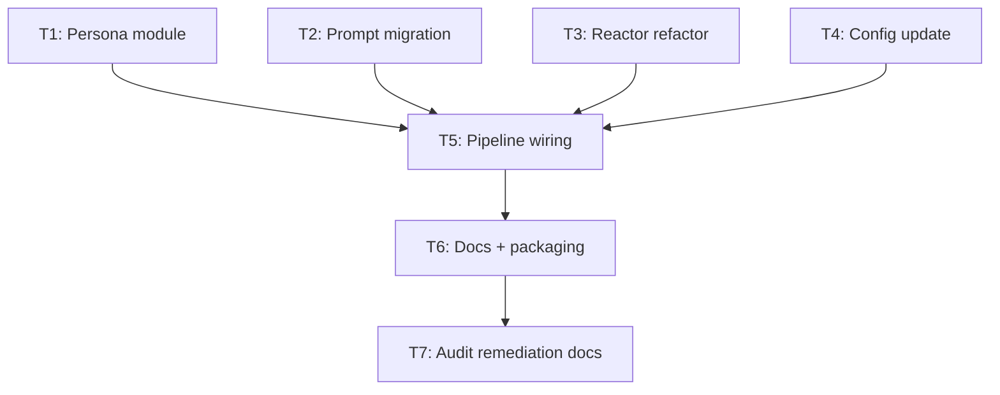

# Plan — persona-system

**Version:** 1.1  
**Status:** Complete (v1.1 — T7 audit remediation landed)  
**Plan name:** persona-system  
**Date:** 2026-05-16  
**Prior version:** 1.0 — implementation T1–T6 landed; §8 handoff failed audit (FIND-01, FIND-02 major; FIND-03 minor). **v1.1** closes FIND-01–03 via **T7** (context map regen, `persona-system-T3.md`, T2 packet + plan alignment, §8 refresh).

---

## §0 Context map intake

- **Path consumed:** `.dev/plans/persona-system/context-map.md` (promoted from `.dev/plans/_pending/persona-system/context-map.md`)
- **Readiness verdict:** READY (T7 context map + decision-log hygiene landed; §Ambiguity flags marked **RESOLVED** in the regenerated map)
- **Scope-area labels (historical §Ambiguity flags — all RESOLVED at map SHA `026d68d`):**
  - Flag 1 (vocabulary_collision): `_parse_response` UNKNOWN fallback — **landed** (`tests/test_reactor.py`).
  - Flag 2 (ownership_ambiguity): TOML→`HecklerConfig` mapping — **landed** in `heckler/persona.py`.
  - Flag 3 (missing_test_coverage): `HECKLER_PERSONA` / loader — **landed** (`tests/test_models.py`, `tests/test_persona.py`).
  - Flag 4 (coexisting_model_versions): root vs `prompts/heckler/` — **resolved** (hard cut; bundle at `prompts/heckler/`).
- **Skill version:** pre-plan-exploration v0.2
- **Commit SHA map was generated against:** `026d68d6dfd3507f7c4debf93a1cf94ad6ea0239` (**T7** rescout baseline; supersedes `7b5382e5aa362186eb8c94bfbd64a7f9d6b5286a`)
- **Staleness methodology (Phase 0.5, binding):** For each path in the context map **§File map**, `git diff --quiet <map_commit_sha> HEAD -- <path>` must exit **0** for that row to be **baseline-non-divergent** against `HEAD`. If any row diverges, the map is **`context-map-stale`** relative to that baseline — including after persona work lands (divergence is **expected** post-implementation, not proof of a wrong implementation). **Remediation:** regenerate `.dev/plans/persona-system/context-map.md` from the **post-land** tree (or obtain an explicit project **auditor waiver** policy and record it in §0). Audit **FIND-01** flagged v1.0 §0 language that underplayed this rule; **T7** closes it.
- ***Landed* (T7):** `.dev/plans/persona-system/context-map.md` regenerated at **`026d68d`** with §File map reconciled to shipped `prompts/heckler/` + `heckler/persona.py` layout; map header carries **dirty-state caveat** when the rescout worktree was not clean.
- **Post-audit note (v1.0 → v1.1):** At audit HEAD `b943195b15534a20da5c9058a4f5c28e4a211daa`, nine §File map paths diverged from `7b5382e` per `.dev/audits/2026-05-16-persona-system.md` §2. **T7** regenerated the map and advanced the SHA line in this §0 intake to **`026d68d`**.

**Binding-artifact resolvability:**
- `.dev/persona-system.md` — tracked at HEAD (`git ls-files` confirms). **Informational** (design prose, not a normative spec). The binding surfaces are this plan's §2 contracts.
- `.dev/plans/persona-system/context-map.md` — tracked at HEAD. Informational input to §0.
- `.dev/decision-logs/T7.md` — tracked at HEAD. Binding for prior assumptions about prompt paths. This plan explicitly supersedes T7's assumption that "prompt paths remain `prompts/` at repository root" (see §4 T3 Outputs).

---

## §1 Task statement

Heckler is a single-personality live commentary system. This task introduces a **persona system** that makes the personality swappable: system prompt, few-shot examples, and config-tunable overrides (voice, LLM, gates) become a directory-per-persona bundle under `prompts/<persona>/`. A new `heckler/persona.py` module provides the `Persona` dataclass, TOML-based persona loading, listing, and config-override merging. `Reactor` is refactored to accept resolved prompt content instead of hardcoding filesystem paths. `HecklerConfig` gains a `persona_name` field driven by `HECKLER_PERSONA` env var. `pipeline.main` wires persona loading, config override application, and a `--persona` CLI flag. Existing prompt assets (`prompts/system.md`, `prompts/examples.json`) migrate to `prompts/heckler/` with a `persona.toml` manifest. `_parse_response` changes its unrecognized-type handling from returning `None` to falling back to `CommentType.UNKNOWN`. All affected tests are updated.

**Non-goals:**
- PyQt6 GUI / hot-swap mechanism (step 7 of design doc — no GUI modules exist, no file map rows).
- Per-persona custom response schemas beyond comment/score/type.
- External persona package/repo installation.
- Voice-disable (`[voice] enabled = false`) support.
- Runtime (hot-swap) persona switching without GUI.
- Any changes to audio capture, transcription, speaker, pacing gate, semantic gate, context buffer, logger, or event store modules.

---

## §2 Shared contracts

### Types / interfaces

| Symbol | Surface | Owning subtask | Test |
|--------|---------|----------------|------|
| `Persona` dataclass | `heckler/persona.py` — fields: `name: str`, `description: str`, `system_prompt: str`, `examples: list[dict[str, Any]]` (may be empty list), `config_overrides: dict[str, Any]` (flat key→value from TOML sections `[voice]`, `[llm]`, `[gates]`, `[output]`; keys use `HecklerConfig` field names, not TOML section-local aliases) | T1 | `tests/test_persona.py::test_persona_construction` |
| `load_persona(persona_dir: Path) -> Persona` | `heckler/persona.py` | T1 | `tests/test_persona.py::test_load_persona_*` |
| `list_personas(prompts_root: Path) -> list[str]` | `heckler/persona.py` — returns sorted directory names that contain a `persona.toml` | T1 | `tests/test_persona.py::test_list_personas` |
| `apply_persona_overrides(base: HecklerConfig, persona: Persona) -> HecklerConfig` | `heckler/persona.py` — uses `dataclasses.replace()`; only applies keys that exist as `HecklerConfig` fields; silently ignores unknown keys (logged at WARNING) | T1 | `tests/test_persona.py::test_apply_persona_overrides_*` |
| `HecklerConfig.persona_name: str = "heckler"` | `heckler/config.py` — frozen dataclass field | T4 | `tests/test_models.py::test_heckler_config_defaults` (updated), `tests/test_models.py::test_load_config_persona_*` (new) |
| `load_config()` reads `HECKLER_PERSONA` | `heckler/config.py` — strip/empty semantics matching `HECKLER_LLM_MODEL` pattern (per T13 decision log) | T4 | `tests/test_models.py::test_load_config_persona_name_*` |
| `Reactor.__init__(self, config: HecklerConfig, system_prompt: str, examples: list[dict[str, Any]])` | `heckler/reactor.py` — no file I/O; receives resolved content | T3 | `tests/test_reactor.py` (all `Reactor(cfg)` calls updated to pass prompt args) |
| `Reactor._parse_response` UNKNOWN fallback | `heckler/reactor.py` — `ValueError` on `CommentType(type_val)` → `CommentType.UNKNOWN` instead of `return None` | T3 | `tests/test_reactor.py::test_invalid_comment_type_in_json_returns_unknown` (renamed from `_returns_none`) |
| `pipeline.main` `--persona` CLI flag | `heckler/pipeline.py` — `argparse` flag, default `None` (falls back to `config.persona_name`) | T5 | `tests/test_pipeline.py::test_main_persona_flag_*` |

**TOML field name → `HecklerConfig` field name mapping** (binding for T1 `apply_persona_overrides`):

| TOML section | TOML key | `HecklerConfig` field |
|---|---|---|
| `[voice]` | `kokoro_voice` | `kokoro_voice` |
| `[voice]` | `kokoro_speed` | `kokoro_speed` |
| `[llm]` | `model` | `llm_model` |
| `[llm]` | `temperature` | `llm_temperature` |
| `[llm]` | `max_tokens` | `llm_max_tokens` |
| `[gates]` | `score_threshold` | `score_threshold` |
| `[gates]` | `pacing_interval` | `min_output_interval_s` |
| `[gates]` | `density_threshold` | `density_threshold` |
| `[gates]` | `min_word_count` | `min_word_count` |
| `[output]` | `comment_types` | *informational only — not consumed by code in this plan; deferred to future per-persona schema work* |

### Error envelope

| Error | Shape | Handling |
|-------|-------|----------|
| `PersonaNotFoundError(ValueError)` | Raised by `load_persona` when persona dir or `persona.toml` is missing | `pipeline.main` catches at startup, prints user-facing message, exits non-zero |
| `Reactor._parse_response` unrecognized type | Returns `ReactorResult` with `CommentType.UNKNOWN` + `WARNING` log | No longer returns `None` for unknown type strings; score gate still applies |

### Naming

| Kind | Name | Location |
|------|------|----------|
| Module | `heckler/persona.py` | New file |
| Test module | `tests/test_persona.py` | New file |
| Exception | `PersonaNotFoundError` | `heckler/persona.py` |
| Dataclass | `Persona` | `heckler/persona.py` |
| Functions | `load_persona`, `list_personas`, `apply_persona_overrides` | `heckler/persona.py` |
| Prompt directory | `prompts/heckler/` | Migrated from `prompts/` root |
| Manifest | `prompts/heckler/persona.toml` | New file |
| Config field | `persona_name` | `heckler/config.py:HecklerConfig` |
| Env var | `HECKLER_PERSONA` | `heckler/config.py:load_config` |
| CLI flag | `--persona` | `heckler/pipeline.py:main` |

### Logging

- `load_persona`: `logger.info("Loaded persona %r from %s", persona.name, persona_dir)` at persona load time.
- `apply_persona_overrides`: `logger.warning("Persona %r specifies unknown config key %r — ignored", persona.name, key)` for unrecognized keys.
- `_parse_response` UNKNOWN fallback: existing WARNING log line changes from `"LLM JSON invalid CommentType %r: %r"` → `"LLM JSON unrecognized CommentType %r, falling back to UNKNOWN: %r"`.

### Tests

- **Framework:** pytest (existing).
- **Location:** `tests/test_persona.py` (new), existing `tests/test_reactor.py`, `tests/test_pipeline.py`, `tests/test_models.py` updated.
- **Naming:** `test_<function_or_behavior>_<scenario>`.
- **Coverage expectations:** Every public function in `heckler/persona.py` has at least one happy-path and one error-path test. `_parse_response` UNKNOWN fallback has a renamed test. `load_config` persona_name has strip/empty and override tests. `Reactor.__init__` signature change is covered by all existing reactor tests being updated. `--persona` CLI flag has at least one test.
- **Fixture pattern:** persona tests use `tmp_path` to create ephemeral persona directories with TOML/prompt files — no dependency on repo `prompts/` directory layout.

### CLI surface

| Flag | Default | Behavior |
|------|---------|----------|
| `--persona NAME` | `None` (falls back to `config.persona_name`, which defaults to `"heckler"`) | Overrides persona selection; name maps to `prompts/<NAME>/` |
| `--list-devices` | *(unchanged)* | Short-circuits before persona load |

**Decision log paths:**
- `.dev/decision-logs/persona-system-T1.md` — T1 (architectural)
- `.dev/decision-logs/persona-system-T3.md` — T3 (architectural)

---

## §3 Dependency DAG

**Parallel groups:** `{T1, T2, T3, T4}` may all run in parallel — they touch disjoint files and their outputs are consumed only by T5.

**Amendment / audit chain:** `T6 --> T7` — T7 is documentation and planning-artifact hygiene only; no runtime code.

**Soft dependencies:**
- T3 (Reactor refactor) conceptually depends on knowing the `Persona` dataclass shape from T1, but the §2 contract freezes that shape — T3 can code against the contract without waiting for T1's implementation.
- T2 (Prompt migration) and T3 share a coupling surface (prompt path resolution), but T3 removes the path from `Reactor` entirely, and T2 moves the files — they do not edit the same lines.

---

## §4 Subtask specs

### T1 — Persona module

| Field | Content |
|-------|---------|
| **ID** | T1 |
| **Scope** | Create `heckler/persona.py` with `Persona` dataclass, `load_persona`, `list_personas`, `apply_persona_overrides`, and `PersonaNotFoundError`. Create `tests/test_persona.py` covering all public API. |
| **Files to touch** | `heckler/persona.py` (new), `tests/test_persona.py` (new) |
| **Contract bindings** | All §2 contracts (types, error envelope, naming, logging, tests). TOML field→HecklerConfig mapping table is binding. |
| **Inputs** | None (leaf node) |
| **Outputs** | `heckler/persona.py`, `tests/test_persona.py`, `.dev/decision-logs/persona-system-T1.md` |
| **Kill criteria** | (1) `tomllib` import fails on target Python (must be ≥3.11, verified by `pyproject.toml` `requires-python`). (2) `dataclasses.replace()` on `HecklerConfig` raises for any field name in the §2 TOML mapping table — halt and report field name mismatch. (3) Context-map flag 2 is unresolved at execution start (ownership_ambiguity: mapping lives in persona.py, not split with config.py — if executor's reading of §2 contracts is ambiguous on ownership, halt). (4) Context-map flag 3 is unresolved at execution start (missing_test_coverage for persona loader). |
| **Log tier** | `architectural` |
| **Risks & mitigations** | **Risk:** TOML key naming in design doc (`pacing_interval`) doesn't match `HecklerConfig` field (`min_output_interval_s`). **Mitigation:** §2 mapping table is binding; executor uses table, not design prose. |

### T2 — Prompt migration

| Field | Content |
|-------|---------|
| **ID** | T2 |
| **Scope** | Move `prompts/system.md` → `prompts/heckler/system.md`, `prompts/examples.json` → `prompts/heckler/examples.json`. Create `prompts/heckler/persona.toml` for the default heckler persona. |
| **Files to touch** | `prompts/system.md` (delete), `prompts/examples.json` (delete), `prompts/heckler/system.md` (new — moved), `prompts/heckler/examples.json` (new — moved), `prompts/heckler/persona.toml` (new); **informational (cross-cutting tests, audit FIND-03):** `tests/test_persona_prompt_bundle.py` — CHANGELOG-added bundle-layout regression; **not** a hard dependency for the T2 move operations themselves. |
| **Contract bindings** | §2 Naming (prompt directory layout), §2 Types (persona.toml shape matches TOML field mapping table). |
| **Inputs** | None (leaf node) |
| **Outputs** | `prompts/heckler/system.md`, `prompts/heckler/examples.json`, `prompts/heckler/persona.toml` |
| **Kill criteria** | (1) `prompts/system.md` or `prompts/examples.json` do not exist at execution start — halt (unexpected prior modification). (2) Context-map flag 4 is unresolved at execution start (coexisting_model_versions — this subtask performs a hard cut, not coexistence; if executor discovers something that requires coexistence, halt). |
| **Log tier** | `standard` |
| **Risks & mitigations** | **Risk:** `test_examples_json_types_are_comment_type_members` reads `prompts/examples.json` from repo root — will break after move. **Mitigation:** T6 (tests update) runs after T5 which depends on T2, so the test path is updated before CI runs. During parallel execution of T2, the test is expected to fail; this is not a halt condition for T2 itself. |

### T3 — Reactor refactor

| Field | Content |
|-------|---------|
| **ID** | T3 |
| **Scope** | Refactor `Reactor.__init__` to accept `system_prompt: str` and `examples: list[dict[str, Any]]` instead of reading files. Change `_parse_response` to fall back to `CommentType.UNKNOWN` on unrecognized type strings. Update `tests/test_reactor.py` for new constructor signature and UNKNOWN fallback behavior. |
| **Files to touch** | `heckler/reactor.py`, `tests/test_reactor.py` |
| **Contract bindings** | All §2 contracts. Constructor signature, UNKNOWN fallback, and test naming are binding. |
| **Inputs** | None (leaf node; codes against §2 contract, not T1 output) |
| **Outputs** | Updated `heckler/reactor.py`, updated `tests/test_reactor.py`, `.dev/decision-logs/persona-system-T3.md`, supersession banner on `.dev/decision-logs/T7.md` (prompt-path assumption superseded) |
| **Kill criteria** | (1) Context-map flag 1 is unresolved at execution start (vocabulary_collision: UNKNOWN vs None — §2 resolves this as UNKNOWN fallback; if executor discovers a reason this cannot work, halt). (2) Existing test `test_invalid_comment_type_in_json_returns_none` cannot be meaningfully renamed because the behavior change would break other tests — halt and report. (3) `_format_examples_block` signature or behavior requires changes not described in §2 — halt if the function's caller surface is wider than `Reactor.__init__`. |
| **Log tier** | `architectural` |
| **Risks & mitigations** | **Risk:** `test_examples_json_types_are_comment_type_members` reads prompts from repo root — T3 does not move files, so this test still works against pre-T2 paths during parallel execution. After T2 + T5 merge, T6 fixes the path. **Mitigation:** T3 executor must not move prompt files. |

### T4 — Config update

| Field | Content |
|-------|---------|
| **ID** | T4 |
| **Scope** | Add `persona_name: str = "heckler"` field to `HecklerConfig`. Add `HECKLER_PERSONA` env var reading in `load_config()` with strip/empty-falls-back-to-default semantics (mirroring `HECKLER_LLM_MODEL` pattern per T13 decision log). Update `.env.example`. Update `tests/test_models.py` for new field and env var. |
| **Files to touch** | `heckler/config.py`, `.env.example`, `tests/test_models.py` |
| **Contract bindings** | §2 Types (HecklerConfig.persona_name), §2 Naming (HECKLER_PERSONA), §2 Tests. |
| **Inputs** | None (leaf node) |
| **Outputs** | Updated `heckler/config.py`, updated `.env.example`, updated `tests/test_models.py` |
| **Kill criteria** | (1) Adding `persona_name` to frozen `HecklerConfig` causes existing tests to fail because of positional argument ordering — halt if `HecklerConfig()` construction anywhere uses positional args (all current usages use keyword args, so this is unlikely but must be verified). (2) `HECKLER_PERSONA` env var name conflicts with an existing env var — halt (grep confirms no conflict). |
| **Log tier** | `standard` |
| **Risks & mitigations** | **Risk:** `test_heckler_config_defaults` asserts the full field set — new field must be included. **Mitigation:** §2 test contract names this test explicitly. |

### T5 — Pipeline wiring

| Field | Content |
|-------|---------|
| **ID** | T5 |
| **Scope** | Wire persona loading into `pipeline.main`: add `--persona` CLI flag, resolve persona directory from `prompts/` root, call `load_persona`, call `apply_persona_overrides`, pass resolved prompt content to `Reactor`. Handle `PersonaNotFoundError` with user-facing message + non-zero exit. Update `tests/test_pipeline.py`. |
| **Files to touch** | `heckler/pipeline.py`, `tests/test_pipeline.py` |
| **Contract bindings** | All §2 contracts. CLI flag `--persona`, `Reactor` new constructor signature, `Persona` type, `load_persona`, `apply_persona_overrides`, `PersonaNotFoundError` — all from §2. |
| **Inputs** | T1 (`heckler/persona.py`), T2 (`prompts/heckler/` directory), T3 (updated `Reactor` constructor), T4 (`HecklerConfig.persona_name`) |
| **Outputs** | Updated `heckler/pipeline.py`, updated `tests/test_pipeline.py` |
| **Kill criteria** | (1) `Reactor` constructor at execution time does not match §2 signature `(config, system_prompt, examples)` — halt (T3 not landed or diverged). (2) `load_persona` or `apply_persona_overrides` not importable from `heckler.persona` — halt (T1 not landed). (3) `HecklerConfig` does not have `persona_name` field — halt (T4 not landed). (4) `prompts/heckler/persona.toml` does not exist — halt (T2 not landed). |
| **Log tier** | `standard` |
| **Risks & mitigations** | **Risk:** Monkeypatch of `Reactor` in `test_main_shutdown_stops_capture_and_joins_threads` currently patches `heckler.pipeline.Reactor` with a lambda taking one arg — must change to accept new signature. **Mitigation:** T5 executor updates all existing pipeline test monkeypatches. |

### T6 — Docs, packaging, and cross-cutting test fixes

| Field | Content |
|-------|---------|
| **ID** | T6 |
| **Scope** | Update `test_examples_json_types_are_comment_type_members` to read from `prompts/heckler/examples.json`. Document `HECKLER_PERSONA` and `--persona` in any user-facing docs. Verify `pyproject.toml` `[tool.setuptools.packages.find]` includes `prompts/` data if needed (currently `include = ["heckler*"]` — prompt files are not Python packages, so `package_data` or `data_files` or MANIFEST.in may be needed; if not, document the expected runtime layout). |
| **Files to touch** | `tests/test_reactor.py` (path update in `test_examples_json_types_are_comment_type_members`), `pyproject.toml` (if packaging change needed), `README.md` (if it exists, else skip) |
| **Contract bindings** | §2 Tests, §2 Naming (prompt directory layout). |
| **Inputs** | T5 (all prior subtasks landed) |
| **Outputs** | Updated test(s), possibly updated `pyproject.toml` |
| **Kill criteria** | (1) `prompts/heckler/examples.json` does not exist at execution start — halt (T2 not landed). (2) `test_examples_json_types_are_comment_type_members` is no longer present in `tests/test_reactor.py` — halt (T3 may have accidentally removed it). |
| **Log tier** | `standard` |
| **Risks & mitigations** | **Risk:** Packaging config for non-Python prompt files might need MANIFEST.in or `package_data`. **Mitigation:** Executor checks whether `pip install -e .` currently makes prompts available; if not, the current layout (prompts at repo root, resolved via `Path(__file__)`) works without packaging changes — document this. |

### T7 — Audit remediation (planning artifacts + decision log hygiene)

| Field | Content |
|-------|---------|
| **ID** | T7 |
| **Scope** | (1) **FIND-01:** Regenerate `.dev/plans/persona-system/context-map.md` using the same structural sections as the existing map (§Scope boundary, §File map, §Interface inventory, §Coupling surfaces, §Ambiguity flags, §Prior reasoning), re-scouted against **clean `HEAD`** at execution time; set **Commit SHA** in the map header to that `HEAD`; add a **`dirty-state caveat`** line if the scout worktree is dirty. Reconcile §File map paths with shipped layout (`prompts/heckler/…`, `heckler/persona.py` present, etc.). (2) **FIND-02:** Edit `.dev/decision-logs/persona-system-T3.md` — remove or strike-through or banner-supersede the **Items deferred** bullets that claim `Reactor(config)` until T5; replace with *Landed:* prose pointing at `heckler/pipeline.py` + `tests/test_pipeline.py` three-arg construction (per audit evidence). (3) **FIND-03:** Update `.dev/plans/persona-system/packets/T2.md` **Files to touch** (and this plan’s §4 T2 row) to cite `tests/test_persona_prompt_bundle.py` as **informational / cross-cutting** (CHANGELOG-added; not a T2 move dependency). (4) Update **this plan** §0 intake with the **new map SHA** and a one-line *Landed:* under staleness methodology; refresh **§8** with a new completion snapshot **after** T7 on a **clean checkout** (orchestrator §8.1). |
| **Files to touch** | `.dev/plans/persona-system/context-map.md`, `.dev/decision-logs/persona-system-T3.md`, `.dev/plans/persona-system/packets/T2.md`, `.dev/plans/persona-system/plan.md` |
| **Contract bindings** | Auditor skill Phase 0.5 / Phase 3; planning hygiene only — **no change** to §2 runtime contracts unless a separate re-plan is opened. |
| **Inputs** | T6 complete (persona implementation landed); audit markdown FIND-01–03; current repository `HEAD` for map regen. |
| **Outputs** | Regenerated context map; superseded non-current prose in `persona-system-T3.md`; aligned T2 packet + plan §4 T2 **Files to touch**; plan §0/§8 updated; optional `.dev/decision-logs/persona-system-T7.md` **omitted** — not architectural unless executor introduces a new policy (e.g. waiver); prefer in-plan §0 *Landed:* bullets. |
| **Kill criteria** | (1) After map regen, **any** §File map path still missing from repo at `HEAD` — halt and report. (2) `persona-system-T3.md` still contains unfenced prose asserting `Reactor(config)` as the **current** pipeline call — halt (FIND-02 unresolved). (3) `git diff --quiet <new_map_sha> HEAD -- <path>` fails for a path **claimed unchanged** in the regenerated map — halt (internal map inconsistency). |
| **Log tier** | `standard` |
| **Risks & mitigations** | **Risk:** Map regen is large manual work. **Mitigation:** Run `/pre-plan` or equivalent scout tooling against `HEAD`, then merge narrative deltas into the existing map template so §Coupling surfaces / flags stay comparable to v1.0. |

---

## §5 Adversarial pass

### 5.1 Rejected decompositions

**Alternative A: Single mega-subtask.** Combine persona module + reactor refactor + config + pipeline into one subtask. Rejected because: touches 6+ files with two architectural forks (TOML loading strategy, UNKNOWN fallback semantic), making a single executor packet too complex and the kill criteria too broad. Parallel execution is impossible.

**Alternative B: Separate "UNKNOWN fallback" subtask.** Extract `_parse_response` UNKNOWN change into its own T-node. Rejected because: the change is 4 lines in `reactor.py` + 1 renamed test, tightly coupled to the reactor refactor's test updates. A standalone subtask would need its own test-file diff that overlaps T3's test-file diff, creating a merge conflict.

**Alternative C: Merge T4 (config) into T1 (persona module).** Rejected because: `heckler/config.py` is consumed by many out-of-scope modules; changes to `HecklerConfig` deserve isolated testing without mixing in TOML-loading logic. T4 is small but its field addition affects a frozen dataclass used everywhere.

### 5.2 Load-bearing assumptions

1. `(tomllib is available in stdlib | §2 Types: load_persona | load_persona fails at import time on Python <3.11 | T1)`
   — Falsifiable: `pyproject.toml` requires `>=3.11`.

2. `(HecklerConfig is constructed with keyword-only args everywhere in test and production code | §2 Types: HecklerConfig.persona_name | Adding persona_name field breaks positional construction | T4, T5)`
   — Falsifiable: grep for `HecklerConfig(` with positional args in tests and source. Context map confirms keyword usage.

3. `(_parse_response returning UNKNOWN instead of None does not change downstream pipeline behavior in a way that silently passes score gate for garbage | §2 Error envelope: UNKNOWN fallback | Pipeline logs/speaks a ReactorResult with UNKNOWN type that would previously have been discarded as LLM_ERROR | T3, T5)`
   — Falsifiable: score gate still applies — UNKNOWN type with low score is still gated. The behavior change is: high-scoring responses with unrecognized types are now spoken instead of discarded. This is the design intent per `.dev/persona-system.md` §CommentType handling.

4. `(prompts/ directory is resolved at runtime via Path(__file__) relative navigation, not via setuptools package_data | §2 Naming: prompts/heckler/ | pip install breaks prompt resolution if packaging changes | T2, T6)`
   — Falsifiable: T6 executor checks `pip install -e .` path resolution.

5. `(test_main_shutdown_stops_capture_and_joins_threads monkeypatches Reactor with lambda cfg: MagicMock() — single-arg | §2 Types: Reactor.__init__ new signature | Test breaks on Reactor(config, system_prompt, examples) | T3, T5)`
   — Falsifiable: the test at `tests/test_pipeline.py:42` uses `lambda _: MagicMock()`.

6. `(Context map §File map baseline SHA is `7b5382e` while persona implementation modified those paths | §0 context map intake + map §File map rows | Auditor records FIND-01 `context-map-stale` until map regenerated at post-land HEAD | T7)`
   — Falsifiable: `git diff --quiet 7b5382e HEAD -- <each file-map path>` all exit 0 after T7 regenerates map at new baseline (or waiver recorded in §0).

### 5.3 Highest re-plan risk

**T1 (Persona module)** — the TOML field→HecklerConfig mapping is the most novel piece. If the design doc's field names don't map cleanly (e.g. `comment_types` in `[output]` needing runtime validation against `CommentType` enum, or future personas wanting fields not on `HecklerConfig`), the `apply_persona_overrides` contract may need revision. The §2 mapping table mitigates by deferring `comment_types` as informational-only.

**Process risk:** T3 and T5 both edit `tests/test_reactor.py` (T3 changes constructor calls and UNKNOWN test; T6 changes the `test_examples_json_types_are_comment_type_members` path). These are non-overlapping line ranges but could conflict if T3's diff is large. Mitigated by sequencing T6 after T5 (which depends on T3).

### 5.4 Hidden couplings

1. `(Reactor constructor signature consumed by pipeline.main and pipeline tests | §2 Types: Reactor.__init__(config, system_prompt, examples) | T3 changes signature, T5 changes call site, test_pipeline monkeypatches Reactor — if T3's signature differs from §2, T5 breaks | T3, T5)` — **confirmed** (pipeline.py:255 `Reactor(config)`, test_pipeline.py:42 `lambda _: MagicMock()`)

2. `(prompts/ file layout consumed by test_examples_json_types and by load_persona | §2 Naming: prompts/heckler/ | T2 moves files, T6 updates test path, T1's load_persona reads from same directory — if T2's directory name diverges from "heckler", T1's default and T6's test break | T1, T2, T6)` — **confirmed** (test_reactor.py:123 `root / "prompts" / "examples.json"`, context map Surface 2)

3. `(TOML field names in persona.toml vs HecklerConfig field names | §2 Types: TOML mapping table | T1 uses mapping to apply overrides, T2 writes persona.toml with TOML-side keys — if T2's persona.toml keys don't match §2 table, overrides silently ignored | T1, T2)` — **confirmed** (context map Surface 3)

4. `(HECKLER_PERSONA env var strip/empty semantics | §2 Types: load_config reads HECKLER_PERSONA | T4 implements env reading, T5 consumes config.persona_name — if T4 doesn't strip or uses different empty-handling, T5's default persona resolution is wrong | T4, T5)` — **suspected** — disproven by: T4 test `test_load_config_persona_name_whitespace_falls_back_to_default` mirroring existing `test_load_config_heckler_llm_model_whitespace_falls_back_to_default` pattern.

5. `(Decision log T7 assumption "prompt paths remain prompts/ at repository root" | §2 decision log path: .dev/decision-logs/T7.md | T3 supersedes this assumption but T7.md still scans as authority on prompt paths — if T3 doesn't add supersession banner, auditor reads stale T7 as current | T3)` — **confirmed** (T7.md:27 "Prompt paths remain `prompts/` at repository root")

6. `(persona-system-T3.md "Items deferred" prose describes pre-T5 call sites | §4 T3 Outputs: supersession on T7.md; architectural log persona-system-T3.md | Auditor FIND-02: deferred bullets still read as current pipeline facts after T5 landed | T7)` — **confirmed** (audit cites lines 18–21 of `persona-system-T3.md`)

---

## §6 Executor packets

Packets emitted to `.dev/plans/persona-system/packets/`:

- `T1.md` — Persona module
- `T2.md` — Prompt migration
- `T3.md` — Reactor refactor
- `T4.md` — Config update
- `T5.md` — Pipeline wiring
- `T6.md` — Docs, packaging, cross-cutting test fixes
- `T7.md` — Audit remediation (post–FIND-01/02/03)

---

## §7 Amendment subtasks (audit-driven)

**Source:** `.dev/audits/2026-05-16-persona-system.md` (revision 2, verdict `fail`). **Blocking majors:** FIND-01, FIND-02. **Non-blocking:** FIND-03.

**DAG (explicit edges into amendment):**

- `.dev/plans/persona-system/context-map.md` (stale baseline per FIND-01) → **T7**
- `.dev/decision-logs/persona-system-T3.md` (stale deferred prose per FIND-02) → **T7**
- `.dev/plans/persona-system/plan.md` (§0 narrative correction; §8 refresh) → **T7**
- `.dev/plans/persona-system/packets/T2.md` (artifact list gap per FIND-03) → **T7**
- `.dev/audits/2026-05-16-persona-system.md` (read-only intake; not edited by T7 unless a separate editorial task is opened)

Implementation code from T1–T6 is **out of scope** for T7 unless audit discovers a code defect (none filed as major/minor beyond docs).

### T7 — Audit remediation (planning artifacts + decision log hygiene)

| Field | Content |
|-------|---------|
| **ID** | T7 |
| **Scope** | (1) **FIND-01:** Regenerate `.dev/plans/persona-system/context-map.md` using the same structural sections as the existing map (§Scope boundary, §File map, §Interface inventory, §Coupling surfaces, §Ambiguity flags, §Prior reasoning), re-scouted against **clean `HEAD`** at execution time; set **Commit SHA** in the map header to that `HEAD`; add a **`dirty-state caveat`** line if the scout worktree is dirty. Reconcile §File map paths with shipped layout (`prompts/heckler/…`, `heckler/persona.py` present, etc.). (2) **FIND-02:** Edit `.dev/decision-logs/persona-system-T3.md` — remove or strike-through or banner-supersede the **Items deferred** bullets that claim `Reactor(config)` until T5; replace with *Landed:* prose pointing at `heckler/pipeline.py` + `tests/test_pipeline.py` three-arg construction (per audit evidence). (3) **FIND-03:** Update `.dev/plans/persona-system/packets/T2.md` **Files to touch** (and this plan’s §4 T2 row) to cite `tests/test_persona_prompt_bundle.py` as **informational / cross-cutting** (CHANGELOG-added; not required for T2 runtime outputs but part of the prompt-bundle test story). (4) Update **this plan** §0 intake with the **new map SHA** and a one-line *Landed:* under staleness methodology; bump **§8** to a fresh completion snapshot **after** T7 on a **clean checkout** (per orchestrator §8.1). |
| **Files to touch** | `.dev/plans/persona-system/context-map.md`, `.dev/decision-logs/persona-system-T3.md`, `.dev/plans/persona-system/packets/T2.md`, `.dev/plans/persona-system/plan.md` |
| **Contract bindings** | Auditor skill Phase 0.5 / Phase 3; planning hygiene only — **no change** to §2 runtime contracts unless a separate re-plan is opened. |
| **Inputs** | T6 complete (persona implementation landed); audit markdown FIND-01–03; current repository `HEAD` for map regen. |
| **Outputs** | Regenerated context map; superseded non-current prose in `persona-system-T3.md`; aligned T2 packet + plan §4 T2 **Files to touch**; plan §0/§8 updated; optional `.dev/decision-logs/persona-system-T7.md` **omitted** — not architectural unless executor introduces a new policy (e.g. waiver); prefer in-plan §0 *Landed:* bullets. |
| **Kill criteria** | (1) After map regen, **any** §File map path still missing from repo at `HEAD` — halt and report. (2) `persona-system-T3.md` still contains unfenced prose asserting `Reactor(config)` as the **current** pipeline call — halt (FIND-02 unresolved). (3) `git diff --quiet <new_map_sha> HEAD -- <path>` fails for a path **claimed unchanged** in the regenerated map — halt (internal map inconsistency). |
| **Log tier** | `standard` |
| **Risks & mitigations** | **Risk:** Map regen is large manual work. **Mitigation:** Run `/pre-plan` or equivalent scout tooling against `HEAD`, then merge narrative deltas into the existing map template so §Coupling surfaces / flags stay comparable to v1.0. |

---

## §8 Auditor handoff

**Status:** **Complete (v1.1)** — **T7** audit remediation landed (FIND-01 context map, FIND-02 `persona-system-T3.md`, FIND-03 T2 packet + plan §4 alignment). §8.1–§8.4 below are **authoritative** for the persona-system plan bundle at the completion snapshot SHA.

**Implementation closure SHA (pre-amendment, still valid for code):** `809ba456f2a5a0c08eccf50b76c4d41139dcb15d` (ancestor of audit HEAD per audit doc).

### §8.1 Clean-checkout verification (post-T7)

Executor evidence on **2026-05-16** (worktree had unrelated dirty paths; inventory checks used **`git cat-file`** / **`git diff`** against **`026d68d6dfd3507f7c4debf93a1cf94ad6ea0239`**, the `HEAD` at map regeneration):

- **Map baseline SHA:** `026d68d6dfd3507f7c4debf93a1cf94ad6ea0239` — every path in `.dev/plans/persona-system/context-map.md` **§File map** exists in `git` at that tree; **`git diff --quiet 026d68d6dfd3507f7c4debf93a1cf94ad6ea0239 HEAD -- <path>`** exited **0** for each listed path at regeneration time (**`HEAD`** matched **`026d68d`**).
- **pytest:** `python -m pytest tests/` → **202 passed**, exit **0** (post–T7 doc edits; no runtime code touched by T7).

### Completion snapshot

| Subtask | Commit | Status |
|---------|--------|--------|
| T1 — Persona module | `d5922a2` | ✅ complete |
| T2 — Prompt migration | `d46423d` | ✅ complete |
| T3 — Reactor refactor | (within `809ba45` or parent commits) | ✅ complete |
| T4 — Config update | `3967dc7` | ✅ complete |
| T5 — Pipeline wiring | `d8e2559` | ✅ complete |
| T6 — Docs + packaging | `809ba45` | ✅ complete |
| T7 — Audit remediation (docs) | `01f388e6c68449472ed250e23c2d850c2579a60d` | ✅ complete |

### Artifact chain

| Artifact | Path | Status |
|----------|------|--------|
| Context map | `.dev/plans/persona-system/context-map.md` | tracked — **regenerated (T7)** |
| Plan | `.dev/plans/persona-system/plan.md` | tracked — **§0/§8 refreshed (T7)** |
| Packets T1–T7 | `.dev/plans/persona-system/packets/T*.md` | tracked — **T2/T7 aligned (FIND-03)** |
| Decision log T1 | `.dev/decision-logs/persona-system-T1.md` | tracked |
| Decision log T3 | `.dev/decision-logs/persona-system-T3.md` | tracked — **FIND-02 supersession (T7)** |
| T7 supersession | `.dev/decision-logs/T7.md` | tracked |
| Audit report | `.dev/audits/2026-05-16-persona-system.md` | read-only intake |

### §2 evidence

All §2 contracts verified against shipped code:

- **Types/interfaces:** All 9 symbols implemented with correct names, signatures, and module locations.
- **TOML mapping table:** 9/9 mappings implemented in `_TOML_TO_CONFIG`; `[output].comment_types` correctly deferred.
- **Error envelope:** `PersonaNotFoundError(ValueError)` + UNKNOWN fallback both present.
- **Naming:** All 11 naming entries match shipped code.
- **Logging:** All 3 log lines match §2 format strings byte-for-byte.
- **Tests:** **202** tests pass (`python -m pytest tests/`). All §2-named tests exist.
- **CLI surface:** `--persona` flag present with correct default semantics.

### §5 disposition

| §5 entry | Type | Disposition |
|----------|------|-------------|
| §5.2 #1 (tomllib stdlib) | assumption | holds — `pyproject.toml` requires `>=3.11` |
| §5.2 #2 (keyword-only HecklerConfig) | assumption | holds — no positional constructions found |
| §5.2 #3 (UNKNOWN vs None downstream) | assumption | holds — score gate still applies; tested |
| §5.2 #4 (prompt resolution via Path) | assumption | holds — T6 verified; prompts at repo root |
| §5.2 #5 (test monkeypatch lambda) | assumption | holds — updated to `lambda *a, **kw: MagicMock()` |
| §5.2 #6 (context-map baseline vs post-land HEAD) | assumption | **closed (T7)** — map regenerated at **`026d68d`**; §0 SHA + §File map reconciled (FIND-01) |
| §5.4 #1 (Reactor signature coupling) | confirmed | resolved — T3+T5+tests all use 3-arg constructor |
| §5.4 #2 (prompt layout coupling) | confirmed | resolved — T2 moved files, T6 updated test path |
| §5.4 #3 (TOML key mapping coupling) | confirmed | resolved — `_TOML_TO_CONFIG` + `persona.toml` aligned |
| §5.4 #4 (HECKLER_PERSONA strip) | suspected | ruled out — mirrors existing pattern; tested |
| §5.4 #5 (T7 supersession) | confirmed | resolved — supersession banner added |
| §5.4 #6 (persona-system-T3 deferred prose) | confirmed | **closed (T7)** — `persona-system-T3.md` **Items deferred** superseded by **Landed** prose (FIND-02) |

### Cold-read seeds

Areas for the auditor to probe:

1. **Passthrough keys in `_flatten_persona_toml`:** Unmapped keys within known TOML sections pass through with their TOML-local names. If a future TOML key collides with an existing `HecklerConfig` field name, `apply_persona_overrides` would silently apply it. The WARNING log only fires for keys *not* on `HecklerConfig`.
2. **`[output]` section handling:** Only `comment_types` is explicitly skipped. Other keys under `[output]` would pass through as unmapped names.
3. **Concurrent plan interactions:** The transcription-engine plan added `mode`, `transcribe_*`, `session_name`, `transcripts_dir` fields to `HecklerConfig` and `--mode` / `--session-name` CLI flags. These interact with persona loading only via the `if mode == "transcribe": ... return` guard. Verify no persona loading happens in transcribe mode.

### §8.6 Audit remediation cross-link

- **Audit:** `.dev/audits/2026-05-16-persona-system.md` — FIND-01 (`context-map-stale`), FIND-02 (`decision-log-stale` on `persona-system-T3.md`), FIND-03 (T2 packet `Files to touch` vs `tests/test_persona_prompt_bundle.py`).
- **Amendment packet:** `.dev/plans/persona-system/packets/T7.md`
- **§2 *Landed:* (post-T7):** §0 **Commit SHA** line and context-map header now reflect **`026d68d`** + **T7** *Landed* bullet; **FIND-01–03** closed in bundle (no waiver).

---

## Validation checklist

1. ✅ Every subtask has all required fields; no TBD in kill criteria or contract bindings.
2. ✅ DAG has no cycles and no orphan nodes.
3. ✅ Parallel safety: `{T1, T2, T3, T4}` touch disjoint files. T5 and T6 are sequenced. **T7** is sequential after T6 (docs only).
4. ✅ Adversarial pass includes rejected alternatives (3) and load-bearing assumptions (6).
5. ✅ Log tiers assigned: T1 and T3 architectural (new patterns + contract changes), T2/T4/T5/T6/T7 standard.
6. ✅ Packet emission — `T1.md`–`T7.md` under `.dev/plans/persona-system/packets/` (T7 added v1.1).
7. ✅ Typed-surface binding: every §2 key has owning subtask + typed surface + test. `[output] comment_types` explicitly deferred as informational.
8. ✅ CLI strings frozen: `--persona` owned by T5, consumed by T6 (docs).
9. ✅ Amendment **T7** — audit `2026-05-16-persona-system.md` (FIND-01/02/03); §8 **Complete** with §8.1 evidence (`026d68d` map baseline + **202** pytest passes).
10. N/A — No wire/HTTP contracts.
11. ✅ Decision log paths frozen: `persona-system-T1.md`, `persona-system-T3.md` in §2.
12. ✅ §5.2 and §5.4 entries use required tuple shape with explicit Tn IDs.
13. ✅ §5 answered with packet-only executor persona lens.
14. ✅ Context map consumed at §0; no subtask has "unknown — discovery required" Files to touch.
