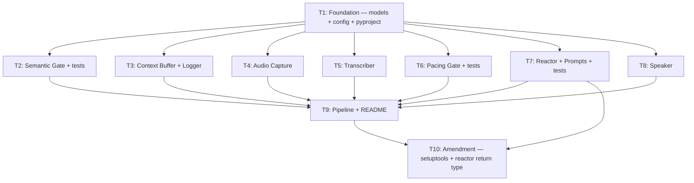

# HECKLER v1.1 — Orchestrator Plan

> **v1.1** — Amendment T10 appended after post-execution audit.
> Closes two findings: setuptools package discovery failure and §2 error-envelope / reactor return-type contract gap.
> Prior plan (v1) retained inline; amended sections marked with *Landed: …* annotations.

## §0 Context Map Intake

- **Path consumed:** N/A — greenfield project, no existing codebase
- **Readiness verdict:** READY (per seed spec header)
- **Scope-area labels flagged:** None
- **Skill version + commit SHA:** N/A — no prior context map

Greenfield override: all files are new, every subtask's "Files to touch" is explicit.
No context map required per validation rule §0/V14.

---

## §1 Task Statement

Build HECKLER, a local reactive audio commentary loop that captures microphone input continuously, segments on silence boundaries via Silero VAD, transcribes via local faster-whisper, generates snarky commentary via Claude Haiku, applies quality and pacing gates, synthesizes speech via Kokoro TTS, and plays back through system audio. Every pipeline event is logged to JSONL regardless of outcome. The system runs as a local Python process on Windows (RTX 3060 / Ryzen 5 / 64 GB RAM) with a soft latency target of 2.5 seconds end-to-end.

**Non-goals:**

- No conversational ability — HECKLER does not respond to user intent directed at it
- No GUI or web interface — console-only with JSONL logging
- No multi-language support — English only for v1
- No cloud TTS or cloud STT — all inference is local except the LLM call
- No persistent state across sessions — no DB, no session memory beyond the rolling context buffer
- No Windows service / daemon mode — runs as a foreground console process
- No score threshold auto-calibration — manual tuning from JSONL logs

---

## §2 Shared Contracts

### Types / Interfaces

All inter-module data shapes live in `heckler/models.py`. No module defines local cross-boundary dataclasses.

| Symbol | Owning subtask | Typed surface | Round-trip / construction test |
|---|---|---|---|
| `CommentType(str, Enum)` | T1 | `models.py` | `test_models.py`: enum value serialization |
| `DiscardReason(str, Enum)` | T1 | `models.py` | `test_models.py`: enum value serialization |
| `AudioChunk` dataclass | T1 | `models.py` | `test_models.py`: construction test |
| `Utterance` dataclass | T1 | `models.py` | `test_models.py`: construction test |
| `ReactorResult` dataclass | T1 | `models.py` | `test_models.py`: serialization round-trip |
| `HeckleEvent` dataclass | T1 | `models.py` | `test_models.py`: serialization round-trip, enum→string coercion |
| `HecklerConfig` frozen dataclass | T1 | `config.py` | `test_models.py`: construction with defaults, env var override |
| `load_config() → HecklerConfig` | T1 | `config.py` | `test_models.py`: ANTHROPIC_API_KEY required |
| `Reactor.react()` return type | T7, *amended T10* | `reactor.py` | *Landed (T10):* widened from `tuple[Optional[ReactorResult], float]` to `tuple[Optional[ReactorResult], float, Optional[DiscardReason]]` |

### Error Envelope

| Error | Type | Produced by | Consumed by |
|---|---|---|---|
| LLM call failure | `DiscardReason.LLM_ERROR` | `reactor.py` returns `(None, latency, DiscardReason.LLM_ERROR)` | `pipeline.py` → `logger.py` |
| LLM parse failure | `DiscardReason.LLM_ERROR` | `reactor.py` returns `(None, latency, DiscardReason.LLM_ERROR)` | `pipeline.py` → `logger.py` |
| TTS synthesis failure | `SpeakerError(Exception)` | `speaker.py` | `pipeline.py` → `logger.py` |
| Score below threshold | `DiscardReason.SCORE_GATE` | `reactor.py` returns `(None, latency, DiscardReason.SCORE_GATE)` | `pipeline.py` → `logger.py` |
| Pacing gate rejects | `DiscardReason.PACING_GATE` | evaluated in `pipeline.py` | `logger.py` |
| Density gate rejects | `DiscardReason.DENSITY_GATE` | evaluated in `pipeline.py` | `logger.py` |

No exceptions propagate to the user. All errors are logged as `HeckleEvent` with the appropriate `DiscardReason`. Pipeline threads must not die on transient errors.

`SpeakerError` is defined in `speaker.py` (T8). It is a plain `Exception` subclass with no structured fields — its only purpose is to distinguish TTS failures from other exceptions in the pipeline's catch clause.

*Landed (T10):* `reactor.react()` now returns `tuple[Optional[ReactorResult], float, Optional[DiscardReason]]`. The third element is `None` on success, `DiscardReason.LLM_ERROR` on API/parse failure, `DiscardReason.SCORE_GATE` on score-gate rejection. Pipeline no longer infers discard reason via monkey-patching — it reads the third element directly. Prior v1 rows that said `reactor.py returns None` are superseded.

### Naming

| Category | Convention |
|---|---|
| Modules | `heckler/<snake_case>.py` per seed §1 layout |
| Classes | `PascalCase`: `AudioCapture`, `Transcriber`, `Reactor`, `PacingGate`, `Speaker`, `HecklerLogger`, `ContextBuffer`, `HecklerConfig` |
| Functions | `snake_case`: `compute_density`, `passes_gate`, `load_config`, `main` |
| Test files | `tests/test_<module_name>.py` |
| Test functions | `test_<behavior_description>` |
| Log files | `logs/heckler_{YYYY-MM-DD}.jsonl` |
| Prompt files | `prompts/system.md`, `prompts/examples.json` |

### Logging

- **Sink:** append-only JSONL, one file per calendar day at `{log_dir}/heckler_{YYYY-MM-DD}.jsonl`
- **Record type:** `HeckleEvent` only — no ad-hoc dicts
- **Serialization:** `dataclasses.asdict()` with enum `.value` coercion (free via `str` inheritance), `audio_chunk` key stripped defensively
- **Thread safety:** `threading.Lock` in `HecklerLogger`
- **Startup banners:** printed to stdout with `[HECKLER]` prefix (not logged to JSONL)

### Tests

- **Framework:** `pytest >= 8.0` with `pytest-mock >= 3.12`
- **Location:** `tests/` directory at repo root
- **Naming:** `test_<module>.py` files, `test_<behavior>` functions
- **Coverage expectations:** semantic_gate (table-driven, full boundary), pacing_gate (timing + thread safety), reactor (mocked LLM, all parse paths), models (serialization round-trip)
- **No integration tests in v1** — hardware dependencies (mic, GPU, speakers) preclude CI testing

### CLI Surface

| Command | Behavior | Owning subtask |
|---|---|---|
| `python -m heckler` | Runs the pipeline (main entrypoint) | T9 |
| `python -m heckler --list-devices` | Lists audio devices via `sounddevice.query_devices()` and exits | T9 |

`pyproject.toml` also exposes `heckler` console script → `heckler.pipeline:main`.

### Wire Contracts (Coupling Surfaces)

All six coupling surfaces from the seed are binding:

1. **AudioChunk.audio dtype/shape:** float32 numpy, 1D, 16 kHz — `audio_capture.py` → `transcriber.py`
2. **speaker.is_playing Event:** `threading.Event`, set before TTS synthesis begins, cleared after playback completes — `speaker.py` → `audio_capture.py` (passed at construction time via pipeline)
3. **Kokoro output sample rate:** 24000 Hz — `sounddevice.play(samplerate=24000)` in `speaker.py`
4. **LLM response JSON schema:** `{"comment": str, "score": float[0,1], "type": CommentType.value}` — `prompts/system.md` ↔ `reactor._parse_response()` ↔ `models.CommentType`
5. **HeckleEvent serialization exclusion:** `audio_chunk` key stripped before `json.dumps` — `logger._serialize()`
6. **pacing_gate.record_output() timing:** called BEFORE `speaker.speak()`, not after — enforced in `pipeline.py`

### Decision Log Paths

| Subtask | Path |
|---|---|
| T7 (Reactor) | `.dev/decision-logs/T7.md` |
| T9 (Pipeline) | `.dev/decision-logs/T9.md` |

---

## §3 Dependency DAG

**Parallel groups:**

- **Layer 0:** `{T1}` — must complete first
- **Layer 1:** `{T2, T3, T4, T5, T6, T7, T8}` — all run in parallel after T1
- **Layer 2:** `{T9}` — depends on all Layer 1 outputs
- **Layer 3 (amendment):** `{T10}` — depends on T7 + T9 (both complete)

**Soft dependencies:** None within Layers 0–2. T10 is a post-audit amendment, not a soft dependency.

---

## §4 Subtask Specs

### T1 — Foundation: Models, Config, Project Scaffolding

| Field | Content |
|---|---|
| **ID** | T1 |
| **Scope** | Create repository skeleton, shared data models, configuration dataclass with env-var loading, pyproject.toml, .env.example, and model serialization tests. |
| **Files to touch** | `heckler/__init__.py`, `heckler/models.py`, `heckler/config.py`, `tests/__init__.py`, `tests/test_models.py`, `pyproject.toml`, `.env.example` |
| **Contract bindings** | All §2 contracts. T1 *defines* Types/interfaces and Naming. Typed-surface binding: every field in `HecklerConfig` must have a typed default or env-var mapping in `load_config()`. `HeckleEvent` serialization must handle enum→string and `audio_chunk` exclusion. |
| **Inputs** | None (root task) |
| **Outputs** | `models.py` with all 6 types · `config.py` with `HecklerConfig` + `load_config()` · `pyproject.toml` per seed §5 · `.env.example` · `test_models.py` passing |
| **Kill criteria** | HALT if `HeckleEvent` serialization round-trip fails (enum fields not serializing to string values, or `audio_chunk` key present in output). HALT if `load_config()` does not raise on missing `ANTHROPIC_API_KEY`. HALT if any dataclass field type contradicts seed §2 signatures. |
| **Log tier** | standard |
| **Risks & mitigations** | `uuid` is stdlib — omit from pyproject.toml dependencies. `dataclasses.asdict()` recurses into nested dataclasses (`ReactorResult` inside `HeckleEvent`); test round-trip explicitly to catch unexpected shapes. Seed §5 lists `uuid` in deps — drop it, note deviation. |

---

### T2 — Semantic Gate + Tests

| Field | Content |
|---|---|
| **ID** | T2 |
| **Scope** | Lexical density filter preventing low-information utterances from reaching the LLM. Pure function, no I/O, no state, no external dependencies. |
| **Files to touch** | `heckler/semantic_gate.py`, `tests/test_semantic_gate.py` |
| **Contract bindings** | All §2 contracts. Consumes `HecklerConfig` (`density_threshold`, `min_word_count`). Returns `tuple[bool, float]`. |
| **Inputs** | T1 (`models.py`, `config.py`) |
| **Outputs** | `semantic_gate.py` with `STOPWORDS` frozenset, `compute_density()`, `passes_gate()` · `test_semantic_gate.py` passing |
| **Kill criteria** | HALT if `passes_gate` signature differs from `(text: str, config: HecklerConfig) -> tuple[bool, float]`. HALT if stopword list omits filler words from seed §4.3 (`like`, `you know`, `right`, `well`, `actually`, `basically`, `literally`). HALT if density computation introduces external dependencies. |
| **Log tier** | trivial |
| **Risks & mitigations** | The seed's `STOPWORDS` set includes `"you know"` — a multi-word entry. Token-level matching splits on whitespace, so `"you know"` as a single set member won't match individual tokens. Mitigation: either (a) add individual words `"know"` to the set, or (b) do a substring pre-pass stripping known multi-word fillers before tokenizing. Executor should pick the simpler option and document the choice. |

---

### T3 — Context Buffer + Logger

| Field | Content |
|---|---|
| **ID** | T3 |
| **Scope** | Thread-safe rolling utterance window and append-only JSONL event logger. Two small modules with no external dependencies beyond stdlib + T1. |
| **Files to touch** | `heckler/context_buffer.py`, `heckler/logger.py` |
| **Contract bindings** | All §2 contracts. Logger serializes `HeckleEvent` only (§2 Logging). `audio_chunk` key stripped (Coupling Surface 5). `ContextBuffer` uses `threading.Lock` — not GIL reliance (seed §7). |
| **Inputs** | T1 (`models.py`, `config.py`) |
| **Outputs** | `context_buffer.py` with `ContextBuffer` class (`push`, `get_context_block`, thread-safe) · `logger.py` with `HecklerLogger` class (`log_event`, `_serialize`, one file per day, thread-safe) |
| **Kill criteria** | HALT if `_serialize()` does not strip `audio_chunk` key. HALT if `_serialize()` does not handle enum→string coercion. HALT if `ContextBuffer` does not use `threading.Lock` for both `push()` and `get_context_block()`. HALT if log file path pattern is not `{log_dir}/heckler_{YYYY-MM-DD}.jsonl`. |
| **Log tier** | standard |
| **Risks & mitigations** | `HeckleEvent` does not directly contain `AudioChunk` (it's a flat record), so the `audio_chunk` pop in `_serialize` is defensive. This is correct — keep it per seed spec. Risk: day-boundary rollover during midnight operation could split events. Mitigation: recompute filename on each `log_event` call, not at init only. |

---

### T4 — Audio Capture

| Field | Content |
|---|---|
| **ID** | T4 |
| **Scope** | Continuous microphone capture with Silero VAD segmentation. Produces `AudioChunk` objects on silence boundaries to a `queue.Queue`. |
| **Files to touch** | `heckler/audio_capture.py` |
| **Contract bindings** | All §2 contracts. `AudioChunk.audio` must be float32 numpy 1D 16 kHz (Coupling Surface 1). Must check `speaker.is_playing` event before queueing (Coupling Surface 2). Queue overflow drops oldest, not newest. |
| **Inputs** | T1 (`models.py`, `config.py`) |
| **Outputs** | `audio_capture.py` with `AudioCapture` class (`__init__`, `start`, `stop`, `_capture_loop`, `_vad_callback`) |
| **Kill criteria** | HALT if `AudioChunk.audio` is not float32 numpy 1D. HALT if sample rate is not 16000 Hz. HALT if VAD callback performs blocking I/O. HALT if `speaker.is_playing` event is not checked before queue put. HALT if queue overflow drops newest instead of oldest. HALT if Silero VAD model is reinitialized per chunk (must be stateful across frames). |
| **Log tier** | standard |
| **Risks & mitigations** | `sounddevice` callback runs on a separate OS thread with strict timing; any blocking call causes audio dropouts. Mitigation: callback writes to internal ring buffer only; capture loop drains it. Windows audio device indexing instability — use `capture_device=None` for v1. Silero VAD v4 API: halt if `torch.hub.load` interface differs from seed §4.1. |

---

### T5 — Transcriber

| Field | Content |
|---|---|
| **ID** | T5 |
| **Scope** | Wrapper around faster-whisper consuming `AudioChunk` from a queue, producing transcript strings. |
| **Files to touch** | `heckler/transcriber.py` |
| **Contract bindings** | All §2 contracts. Consumes `AudioChunk` (Coupling Surface 1). `condition_on_previous_text=False` mandatory. `vad_filter=True`. Startup log message required. |
| **Inputs** | T1 (`models.py`, `config.py`) |
| **Outputs** | `transcriber.py` with `Transcriber` class (`__init__` loads model, `transcribe`, `run`) |
| **Kill criteria** | HALT if `condition_on_previous_text` is not explicitly `False`. HALT if `vad_filter` is not `True`. HALT if startup does not log a clear model-loading message. HALT if `run()` does not handle empty transcripts (whisper silence artifacts). |
| **Log tier** | standard |
| **Risks & mitigations** | faster-whisper API may differ from seed's assumed interface — halt if `model.transcribe()` signature differs. CUDA initialization failure on first run — log clear error and fail fast at init. |

---

### T6 — Pacing Gate + Tests

| Field | Content |
|---|---|
| **ID** | T6 |
| **Scope** | Time-based output throttle with high-score override. Enforces minimum interval between spoken outputs. |
| **Files to touch** | `heckler/pacing_gate.py`, `tests/test_pacing_gate.py` |
| **Contract bindings** | All §2 contracts. Coupling Surface 6: `record_output()` must be called BEFORE `speaker.speak()` — enforced in T9 but documented here. |
| **Inputs** | T1 (`models.py`, `config.py`) |
| **Outputs** | `pacing_gate.py` with `PacingGate` class (`evaluate`, `record_output`) · `test_pacing_gate.py` passing |
| **Kill criteria** | HALT if `evaluate()` signature differs from `(score: float) -> tuple[bool, float]`. HALT if `record_output()` is not thread-safe. HALT if score override logic differs from `score >= config.score_override_threshold`. HALT if test suite does not include thread-safety test. |
| **Log tier** | standard (contract-anchor: `record_output()` timing consumed by T9) |
| **Risks & mitigations** | `time.time()` in tests leads to flaky timing — monkeypatch `time.time` per seed §9. |

---

### T7 — Reactor + Prompts + Tests

| Field | Content |
|---|---|
| **ID** | T7 |
| **Scope** | LLM prompt assembly, Anthropic API call, structured output parsing with regex fallback, score gate. Includes static prompt files. |
| **Files to touch** | `heckler/reactor.py`, `prompts/system.md`, `prompts/examples.json`, `tests/test_reactor.py` |
| **Contract bindings** | All §2 contracts. Coupling Surface 4: JSON schema must be consistent across `prompts/system.md`, `reactor._parse_response()`, and `models.CommentType`. Score gate: `score < config.score_threshold` → return `None`. |
| **Inputs** | T1 (`models.py`, `config.py`) |
| **Outputs** | `reactor.py` with `Reactor` class (`__init__`, `react`, `_parse_response`) · `prompts/system.md` (verbatim seed §4.5) · `prompts/examples.json` (verbatim seed §4.5) · `test_reactor.py` passing |
| **Kill criteria** | HALT if system prompt content differs from seed §4.5. HALT if examples.json content differs from seed §4.5. HALT if `_parse_response` does not attempt regex fallback `r'\{[^}]+\}'` on initial JSON parse failure. HALT if score gate threshold comparison is not `<` (exactly-at-threshold must pass). HALT if API errors propagate as exceptions (must be caught, return `None`). HALT if Anthropic client uses streaming or async. |
| **Log tier** | architectural |
| **Decision log path** | `.dev/decision-logs/T7.md` |
| **Risks & mitigations** | LLM occasionally returns non-JSON despite instructions — regex fallback handles this. `CommentType` enum drift between `system.md` and `models.py` — test validates all types in `examples.json` are valid `CommentType` values. `max_tokens=150` may be low if LLM adds preamble — regex strips it. |

---

### T8 — Speaker

| Field | Content |
|---|---|
| **ID** | T8 |
| **Scope** | TTS synthesis via Kokoro, mic gate management via `threading.Event`, audio playback via sounddevice. |
| **Files to touch** | `heckler/speaker.py` |
| **Contract bindings** | All §2 contracts. Coupling Surface 2: `is_playing` set before synthesis, cleared after playback. Coupling Surface 3: `sounddevice.play(samplerate=24000)`. `SpeakerError(Exception)` defined here (§2 Error Envelope). |
| **Inputs** | T1 (`models.py`, `config.py`) |
| **Outputs** | `speaker.py` with `Speaker` class (`__init__` loads Kokoro, `speak`, `_collect_audio`, `is_playing` event) and `SpeakerError` exception |
| **Kill criteria** | HALT if `is_playing.set()` is called after synthesis starts (must be before). HALT if `is_playing.clear()` is not called on error path. HALT if `sounddevice.play()` receives `samplerate` other than 24000. HALT if Kokoro pipeline uses `lang_code` other than `'a'`. HALT if synthesis error does not clear `is_playing` and raise `SpeakerError`. |
| **Log tier** | standard |
| **Risks & mitigations** | Kokoro downloads ~300 MB on first import — log "downloading TTS model" before init. `sounddevice.play(blocking=True)` blocks thread — intentional, reaction worker is dedicated. Kokoro audio chunk tuple shape may differ — halt if `(graphemes, phonemes, audio_chunk)` is wrong. |

---

### T9 — Pipeline + README

| Field | Content |
|---|---|
| **ID** | T9 |
| **Scope** | Thread orchestration, queue wiring, startup sequence, graceful shutdown, CLI entrypoint with `--list-devices`, `__main__.py`, and README with setup instructions. |
| **Files to touch** | `heckler/pipeline.py`, `heckler/__main__.py`, `README.md` |
| **Contract bindings** | All §2 contracts. All 6 coupling surfaces must be correctly wired. Coupling Surface 6 enforced here: `pacing_gate.record_output()` before `speaker.speak()`. CLI surface: `--list-devices`. |
| **Inputs** | T1 (`models.py`, `config.py`), T2 (`semantic_gate`), T3 (`context_buffer`, `logger`), T4 (`audio_capture`), T5 (`transcriber`), T6 (`pacing_gate`), T7 (`reactor`), T8 (`speaker`) |
| **Outputs** | `pipeline.py` with `main()` per seed §4.9 · `__main__.py` for `python -m heckler` · `README.md` with setup (including CUDA torch), config reference, usage |
| **Kill criteria** | HALT if startup sequence does not match seed §4.9 order (heavy models first, mic last). HALT if `pacing_gate.record_output()` is called after `speaker.speak()`. HALT if queue overflow drops newest instead of oldest. HALT if threads are not properly joined on shutdown. HALT if startup banners do not print with timing per seed §4.9. HALT if `--list-devices` is missing. HALT if README omits CUDA torch install instructions. |
| **Log tier** | architectural |
| **Decision log path** | `.dev/decision-logs/T9.md` |
| **Risks & mitigations** | Thread coordination — three threads, two queues, shared events. Mitigation: follow seed §4.9 exactly. Graceful shutdown — threads may hang on `queue.get()`. Mitigation: use sentinel values or timeout-based gets with a `_running` flag. README may drift from implementation — write it last, after all modules confirmed. |

---

### T10 — Amendment: Setuptools Package Discovery + Reactor Return Type (§7)

*Added in v1.1 after post-execution audit.*

| Field | Content |
|---|---|
| **ID** | T10 |
| **Scope** | Close two audit findings: (1) `pyproject.toml` missing `[tool.setuptools.packages.find]` causes `pip install -e .` to fail because `prompts/` is discovered as a top-level package; (2) `reactor.react()` returns ambiguous `None` for both LLM errors and score-gate rejections, forcing pipeline to monkey-patch `reactor._client` and double-parse responses to recover §2 discard-reason granularity. |
| **Files to touch** | `pyproject.toml`, `heckler/reactor.py`, `tests/test_reactor.py`, `heckler/pipeline.py`, `tests/test_pipeline.py` |
| **Contract bindings** | §2 Error Envelope (amended — reactor now returns explicit `DiscardReason`). §2 Types/Interfaces (amended — `Reactor.react()` return type widened). |
| **Inputs** | T7 (reactor.py as-shipped), T9 (pipeline.py as-shipped) — both complete |
| **Outputs** | (a) `pyproject.toml` with `[tool.setuptools.packages.find] include = ["heckler*"]`. (b) `reactor.react()` returns `tuple[Optional[ReactorResult], float, Optional[DiscardReason]]` — third element is `None` on success, `DiscardReason.LLM_ERROR` on API/parse failure, `DiscardReason.SCORE_GATE` on score-gate rejection. (c) `pipeline.py` removes `_install_reactor_discard_tracking`, `_react_with_discard`, `_extract_text_content` import; uses reactor's third return element directly. (d) Tests updated for new return shape. (e) §2 Error Envelope and Types/Interfaces back-annotated (done in this plan file). |
| **Kill criteria** | HALT if `reactor.react()` still returns a 2-tuple. HALT if pipeline still accesses `reactor._client` or monkey-patches any method. HALT if pipeline still imports `_extract_text_content` from reactor. HALT if `pip install -e .` fails due to package discovery. HALT if any existing test regresses. |
| **Log tier** | standard |
| **Risks & mitigations** | Signature change to `react()` is internal — no external consumers outside this repo. Existing test_reactor.py mocks must be updated for the 3-tuple return. Risk of breaking test_pipeline.py if it asserts on the wrapping pattern — update or remove those assertions. |

---

## §5 Adversarial Pass

*Answered from the packet-only executor persona: "If I received only a single T<n> packet plus executor SKILL.md, would I halt?"*

### 5.1 Rejected Decompositions

**Alternative A — Monolithic executor.** Single subtask builds all 10+ files. Rejected: 7 modules have no inter-dependencies beyond T1's contracts. A monolith loses all parallelization and produces a >2000-line diff with no isolation of hardware-dependent modules.

**Alternative B — Tests as separate T11.** All tests in one subtask after implementation. Rejected: seed §8 says "T11 should be written alongside T2, T7, T8 — not after T10." Tests for pure-logic modules (semantic_gate, pacing_gate, reactor) validate contracts immediately. Deferring tests decouples verification from authoring, increasing drift risk.

**Alternative C — Merge audio_capture + transcriber.** Adjacent in pipeline, same queue boundary. Rejected: audio_capture depends on sounddevice + silero + OS audio stack, while transcriber depends on faster-whisper + CUDA. Different dependency profiles, different failure modes, different VRAM concerns. Separate subtasks keep blast radius small.

### 5.2 Load-Bearing Assumptions

1. (`HecklerConfig field names match env-var mapping in load_config()` | §2 Types/interfaces → HecklerConfig | If false: config silently uses defaults instead of env overrides; all runtime behavior drifts from operator intent | T1)

2. (`models.py dataclass field types match producer and consumer expectations` | §2 Types/interfaces → all 6 types | If false: runtime TypeError or silent data corruption across every module boundary | T1, T2, T3, T4, T5, T6, T7, T8, T9)

3. (`Anthropic Python SDK supports synchronous client.messages.create()` | §2 Types/interfaces → Reactor class | If false: reactor.py blocking call pattern is invalid, requires async rewrite | T7)

4. (`Kokoro KPipeline yields (graphemes, phonemes, audio_chunk) tuples at 24 kHz` | §2 Wire Contracts → Coupling Surface 3 | If false: speaker.py audio collection logic and playback sample rate are wrong | T8)

5. (`Silero VAD v4 torch.hub.load API matches seed §4.1 loading pattern` | §2 Wire Contracts → Coupling Surface 1 | If false: audio_capture.py VAD initialization fails at startup | T4)

6. (`faster-whisper model.transcribe() accepts vad_filter and condition_on_previous_text kwargs` | §2 Types/interfaces → Transcriber class | If false: transcriber call site fails or produces hallucinated cross-chunk output | T5)

7. (`seed §5 pyproject.toml dependency versions are installable together on Python 3.11+ / Windows` | §2 Types/interfaces → HecklerConfig.requires-python | If false: dependency resolution fails, project cannot install | T1)

### 5.3 Highest Re-Plan Risk

**T7 (Reactor)** carries the highest technical re-plan risk. The LLM structured output parsing is inherently fragile — if Claude Haiku's response format drifts from the assumed JSON schema, or if the regex fallback proves insufficient across real conversational input, the reactor becomes the quality bottleneck. The seed's defense-in-depth (direct JSON → regex fallback → None return) limits blast radius to quality degradation rather than crashes, but a fundamental schema mismatch would require prompt reengineering.

**Process risk note:** T9 (Pipeline) is the highest *coordination* risk because it consumes all Layer 1 outputs. If any subtask drifts from its contract, T9 surfaces the conflict. But this is a wiring problem, not a design surprise — the interfaces are fully specified.

### 5.4 Hidden Couplings

1. **confirmed** — (`speaker.is_playing Event shared between AudioCapture and Speaker at construction time` | §2 Wire Contracts → Coupling Surface 2 | AudioCapture (T4) and Speaker (T8) both reference the same Event; if either misuses set/clear semantics, the mic gate fails and the system heckles itself | T4, T8)
   Mitigated: Event is passed by T9 at construction; T4 only reads, T8 only writes. No conflicting state if both honor the contract.

2. **confirmed** — (`Queue overflow drop-oldest policy must be identical in audio_queue producer (T4) and reaction_queue producer (T9)` | §2 Types/interfaces → queue overflow policy | If T4 implements drop-oldest but T9 transcription worker implements drop-newest, behavior diverges silently | T4, T9)
   Mitigated: both packets specify the same put_nowait/get_nowait/retry pattern. T9 kill criterion covers this.

3. **confirmed** — (`pacing_gate.record_output() timing is defined in T6 but enforced in T9` | §2 Wire Contracts → Coupling Surface 6 | T6 defines the method and documents the before-speak contract; T9 must call it in the correct order | T6, T9)
   Mitigated: explicit kill criterion in T9 packet.

4. **suspected** — (`Kokoro speed parameter's effect on output sample rate` | §2 Wire Contracts → Coupling Surface 3 | If kokoro_speed changes output sample rate rather than time-stretching at fixed rate, the 24 kHz playback assumption breaks | T8)
   Would disprove: Kokoro documentation confirming speed is a time-stretch at fixed 24 kHz sample rate.

5. **confirmed** — (`log_density_failures config flag changes pipeline logging behavior` | §2 Types/interfaces → HecklerConfig.log_density_failures | When True, pipeline (T9) must log events that fail the density gate, changing the code path in the transcription worker | T1, T3, T9)
   Mitigated: T9 packet includes this flag in its scope; T3 logger is stateless with respect to which events it receives.

---

## §6 Executor Packets

Packets emitted to `.dev/plans/heckler-v1/packets/T<n>.md`.

Each packet is self-contained: §1 + §2 (verbatim) + subtask spec + filtered §5.2 + filtered §5.4.

| Packet | Path |
|---|---|
| T1 | `packets/T1.md` |
| T2 | `packets/T2.md` |
| T3 | `packets/T3.md` |
| T4 | `packets/T4.md` |
| T5 | `packets/T5.md` |
| T6 | `packets/T6.md` |
| T7 | `packets/T7.md` |
| T8 | `packets/T8.md` |
| T9 | `packets/T9.md` |
| T10 | `packets/T10.md` *(amendment — v1.1)* |

---

## Validation Checklist

| # | Rule | Status |
|---|---|---|
| V1 | Every subtask has all required fields; no TBD in kill criteria | ✅ |
| V2 | DAG has no cycles and no orphan nodes | ✅ |
| V3 | Parallel safety: no two parallel subtasks touch the same interface | ✅ — Layer 1 tasks only consume T1 outputs |
| V4 | Adversarial pass has ≥1 rejected alternative and ≥1 load-bearing assumption | ✅ — 3 alternatives, 7 assumptions |
| V5 | Log tiers assigned and match scope; no trivial-tier contract anchors | ✅ — T2 is trivial (no contract anchors); T6 is standard (anchors record_output timing) |
| V6 | Packet emission completed; self-contained verification passed | ✅ (see packets/) |
| V7 | Typed-surface binding satisfied | ✅ — every §2 type has owning subtask + test |
| V8 | CLI strings frozen: `--list-devices` frozen to T9 | ✅ |
| V9 | Amendment narrative alignment | ✅ — T10 DoD includes §2 back-annotation; Error Envelope and Types/Interfaces amended with *Landed* notes |
| V10 | Wire contract matches shipped behavior | ✅ — all 6 surfaces bound |
| V11 | Decision log paths frozen | ✅ — T7 and T9 paths in §2 |
| V12 | §5.2 and §5.4 entries are tuples with Tn IDs | ✅ |
| V13 | §5 answered with packet-only executor persona | ✅ |
| V14 | Context map present where required | ✅ — greenfield, no unknowns |
