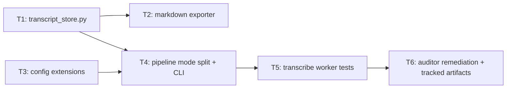

# Plan — transcription-engine

**Version:** 1.1  
**Plan name:** `transcription-engine`  
**Skill:** orchestrator-planning v0.6  
**Date:** 2026-05-16  
**Amendment:** v1.1 adds **T6** (auditor remediation / artifact chain) after `.dev/audits/2026-05-16-transcription-engine.md` (**P1** artifact-not-in-HEAD, **P2** §8.1 SHA inconsistent with promoted paths, **P3** context-map staleness vs implementation). **Cross-check:** `.dev/audits/2026-05-16-persona-system.md` failed on the same **class** of process gates (**FIND-01** strict `context-map-stale`, **FIND-02** stale “Items deferred” prose) — T6’s `context-map.md` §Phase 0.5 refresh and `TE-T1.md` supersession are aligned with those remediations. v1.0 **§8 handoff was invalid** — plan/packets/context were not in the git object graph at the cited tree SHA (`git show <SHA>:.dev/plans/transcription-engine/plan.md` failed; orchestrator §8.2).

---

## §0 Context map intake

- **Path consumed:** `.dev/plans/transcription-engine/context-map.md` (promoted from `.dev/plans/_pending/transcription-engine/context-map.md`)
- **Readiness verdict:** CONDITIONAL
- **Scope-area labels flagged:** Flag 1 (vocabulary_collision: session vs utterance_id), Flag 2 (ownership: transcript DDL vs event_store), Flag 3 (ownership: PyQt6 launcher), Flag 4 (coexisting_model_versions: chunk vs HeckleEvent), Flag 5 (missing_test_coverage: `_run_transcription_worker`), Flag 6 (deprecation_marker_absent: `Transcriber.run`)
- **Skill version + commit SHA:** pre-plan-exploration v0.2 @ `7b5382e5aa362186eb8c94bfbd64a7f9d6b5286a` (**stale vs implementation HEAD** from `7b5382e` through `b943195` on `heckler/pipeline.py`, `heckler/config.py`, `heckler/reactor.py` — audit **P3**; T6 must append a staleness banner to the map with the **commit SHA that tracks the map** and, if needed, re-run §File map spot-checks on those paths only) (**historical scout**; see **T6** for post-implementation map baseline).

**Strict `context-map-stale` (audit P3):** Scout `7b5382e` predates edits on `heckler/pipeline.py`, `heckler/config.py`, `heckler/reactor.py` and `heckler/transcript_store.py`. `context-map.md` v1.1 header records the **bundle introducer commit** (same SHA as **§8.1 Tree SHA** after T6) plus §Phase 0.5 so consumers do not treat pre-implementation scout rows as current against HEAD.

**Flag resolutions applied before planning:**

- **Flag 1 (vocabulary_collision):** Resolved. Transcript sessions and chunks are a *separate* ID space from `Utterance.utterance_id` / `HeckleEvent.utterance_id`. Session IDs are UUIDs or user-provided slugs; chunk primary keys are autoincrement integers scoped to session. No FK relationship to `events` table. The two concepts are *parallel schemas* that happen to share a SQLite file, not a hierarchy. §2 Types freezes this.
- **Flag 2 (ownership):** Resolved. New module `heckler/transcript_store.py` owns transcript DDL and writes. It shares the SQLite *file* (via `config.sqlite_database_path`) but has its own `init_transcript_schema` function and its own `TRANSCRIPT_SCHEMA_VERSION` constant. It calls `event_store.open_store` to get a configured connection but does not touch `events` / `heckler_schema_version`. The `HecklerLogger` lock is *not* shared; `transcript_store` manages its own `threading.Lock` for its inserts (separate tables, separate write surface, no contention with event inserts under WAL). `SCHEMA_VERSION` in `event_store.py` is untouched.
- **Flag 3 (ownership: PyQt6):** Deferred — **out of scope** for this plan. The design doc's §GUI Surface describes a PyQt6 launcher, but this plan covers only the backend: persistence, pipeline mode, CLI, VAD config, session management. GUI is a separate follow-on plan. This is documented in §1 Non-goals.
- **Flag 4 (coexisting_model_versions):** Resolved. Transcript chunks are *never* mirrored into `HeckleEvent` rows. In transcribe mode, no `HeckleEvent` is constructed at all (no density gate, no reactor). The schemas are parallel; analytics that want to join them must do so explicitly via timestamp correlation, which is out of scope.
- **Flag 5 (missing_test_coverage):** Addressed. T4 (pipeline mode split) includes a kill criterion requiring direct tests of the new transcription worker path in transcribe mode. Existing persona-mode `_run_transcription_worker` coverage gap is acknowledged but not in scope for this plan — only the new transcribe-mode path is covered.
- **Flag 6 (deprecation_marker_absent: `Transcriber.run`):** Resolved. `Transcriber.run` is unused in production code (`pipeline.py` calls `transcribe` directly). T4 will *not* use `Transcriber.run`. No deprecation marker is added by this plan; `run` remains as-is for test-only use. §2 names `Transcriber.transcribe` as the only production call site.

---

## §1 Task statement

Add a **transcribe-only mode** to heckler: a standalone pipeline path that uses `AudioCapture` + `Transcriber` (Whisper) without loading the Reactor (LLM), Speaker (Kokoro TTS), or any gates (density, score, pacing). Audio input is continuously transcribed and persisted to SQLite (session + chunks) with optional incremental markdown export. A new `--mode transcribe` CLI flag activates the mode (amending the prior `--list-devices`-only CLI contract). VAD timing defaults are overridden for longer-form speech in transcribe mode. Session lifecycle (start/stop/naming) is managed at the pipeline level.

**Non-goals:**

- PyQt6 GUI integration (separate follow-on plan; see Flag 3).
- Speaker diarization / `pyannote.audio` integration.
- Raw audio chunk archival to disk.
- Streaming/partial transcription (Whisper streaming); chunk-based only.
- Changes to `HeckleEvent` schema, `event_store.py` DDL, or `SCHEMA_VERSION`.
- Intentional removal or disabling of persona-mode features. **Co-landing:** other plans may touch the same files (`pipeline.py`, `config.py`, `reactor.py`); the behavioral contract is **regression-tested persona behavior** (`tests/test_pipeline.py` and related), not a freeze on line-level diffs (audit **F3**).
- Modifications to `Transcriber.run` (legacy/test-only method).

---

## §2 Shared contracts

| Topic | Contract |
|-------|----------|
| **Types / interfaces** | **New module `heckler/transcript_store.py`:** `TRANSCRIPT_SCHEMA_VERSION: int = 1`. Classes/functions: `TranscriptSession` (dataclass: `id: str`, `name: str`, `started_at: str`, `ended_at: Optional[str]`); `TranscriptChunk` (dataclass: `id: Optional[int]`, `session_id: str`, `chunk_text: str`, `timestamp_iso: str`, `duration_s: Optional[float]`, `sequence_num: int`); `init_transcript_schema(conn: sqlite3.Connection) -> None`; `create_session(conn: sqlite3.Connection, *, session_id: str, name: str) -> TranscriptSession`; `close_session(conn: sqlite3.Connection, session_id: str) -> None`; `insert_chunk(conn: sqlite3.Connection, *, session_id: str, chunk_text: str, timestamp_iso: str, duration_s: Optional[float], sequence_num: int) -> int`; `export_session_markdown(conn: sqlite3.Connection, session_id: str, output_path: Path) -> None`. **`heckler/config.py` additions:** `HecklerConfig` gains field `mode: str = "persona"` (owning subtask: T3; typed surface: `HecklerConfig` dataclass; test: T3 construction test in `tests/test_config.py`); VAD override fields `transcribe_max_speech_duration_s: float = 45.0`, `transcribe_silence_duration_ms: int = 1500`, `transcribe_min_speech_duration_ms: int = 250` (owning subtask: T3; typed surface: `HecklerConfig` dataclass; test: T3 construction test). `transcripts_dir: str = "transcripts"` (owning subtask: T3; typed surface: `HecklerConfig` dataclass; test: T3 construction test). `session_name: Optional[str] = None` (owning subtask: T3; typed surface: `HecklerConfig` dataclass; test: T3 construction test). **`heckler/pipeline.py` additions:** `_run_transcribe_worker(*, config: HecklerConfig, audio_queue: queue.Queue, transcriber: Transcriber, transcript_conn: sqlite3.Connection, session_id: str, transcript_lock: threading.Lock) -> None` (owning subtask: T4). **CLI:** `main` argparse gains `--mode {persona,transcribe}` (default: `persona`) and `--session-name NAME` (optional; owning subtask: T4; typed surface: argparse parser in `main`; test: T4 CLI tests). |
| **Error envelope** | DB mutators and readers that execute SQL (`insert_chunk`, `create_session`, `close_session`, `get_session`, `get_chunks`, etc.) raise `sqlite3.Error` subclasses on SQLite API failures (no custom exception types in v1). `init_transcript_schema` raises `RuntimeError` on unsupported `TRANSCRIPT_SCHEMA_VERSION` (same pattern as `event_store.init_schema`). `export_session_markdown` may raise `RuntimeError` or `OSError` for missing sessions, invalid persisted rows, or filesystem I/O, in addition to `sqlite3.Error` when reads hit the DB layer (audit **F2** alignment). |
| **Naming** | New files: `heckler/transcript_store.py`, `tests/test_transcript_store.py`, `tests/test_config.py`. New symbols follow existing `snake_case` conventions. SQL tables: `transcript_sessions`, `transcript_chunks`, `transcript_schema_version`. Config env vars: `HECKLER_MODE`, `HECKLER_SESSION_NAME`, `HECKLER_TRANSCRIPTS_DIR`. |
| **Logging** | `logging.getLogger(__name__)` in new modules. Level: `INFO` for session start/stop/chunk persist, `ERROR` for DB failures. Structured fields: `session_id`, `chunk_sequence_num` where relevant. Sink: stdlib logging (same as existing modules). **Note:** transcribe-mode `pipeline.py` may also emit ad-hoc `print("[TRANSCRIBE]", …)` markers for operators; these are **not** structured log fields (audit **F5** observation). |
| **Tests** | **pytest** under `tests/`. New files: `tests/test_transcript_store.py` (T1), `tests/test_config.py` (T3), additions to `tests/test_pipeline.py` (T4). In-memory SQLite (`:memory:`) for store tests. Mocked `Transcriber`/`AudioCapture` for pipeline tests. Coverage: every public function in `transcript_store.py`; `HecklerConfig` construction with new fields; `main` CLI dispatch for `--mode transcribe`; transcribe worker sentinel shutdown. |
| **CLI surface** | `--list-devices` (existing, unchanged). `--mode {persona,transcribe}` (new; default `persona`). `--session-name NAME` (new; optional; auto-generated UUID if omitted). This **amends** the prior `--list-devices`-only CLI contract from `.dev/plans/sqlite-local-db-obs-langfuse/plan.md`. The prior plan's §2 CLI row is **superseded** for this entry point by the contracts in this plan. |

**Decision log paths:**

- T1 (architectural): `.dev/decision-logs/TE-T1.md`
- T4 (architectural): `.dev/decision-logs/TE-T4.md`

---

## §3 Dependency DAG

**Parallel groups:**

- `{T1, T3}` — independent; T1 builds persistence, T3 extends config. No shared files.
- `{T2}` — depends on T1 (needs `TranscriptSession`/`TranscriptChunk` + read queries).
- `{T4}` — depends on T1 and T3 (needs transcript_store API + config fields).
- `{T5}` — depends on T4 (tests the integrated pipeline path).
- `{T6}` — depends on T5 (code/tests frozen; T6 closes documentation + `git` artifact chain only).

**Soft dependencies:**

- T2 → T4 is **not** required (exporter is called by T4 at shutdown but T4 can code against T2's declared interface before T2 lands). However, for simplicity, T2 should land before T4. No soft-dependency label needed.

---

## §4 Subtask specs

### T1 — Transcript persistence (`heckler/transcript_store.py`)

| Field | Content |
|-------|---------|
| **ID** | T1 |
| **Scope** | Create `heckler/transcript_store.py` with SQLite DDL for `transcript_sessions`, `transcript_chunks`, and `transcript_schema_version` tables. Implement `init_transcript_schema`, `create_session`, `close_session`, `insert_chunk`, and read helpers (`get_session`, `get_chunks`). Reuse `event_store.open_store` for connection setup. |
| **Files to touch** | `heckler/transcript_store.py` (new), `tests/test_transcript_store.py` (new) |
| **Contract bindings** | §2 Types (TranscriptSession, TranscriptChunk, TRANSCRIPT_SCHEMA_VERSION, all function signatures), §2 Error envelope, §2 Naming (table names, file name), §2 Tests |
| **Inputs** | None (leaf node) |
| **Outputs** | `heckler/transcript_store.py`, `tests/test_transcript_store.py`, `.dev/decision-logs/TE-T1.md` |
| **Kill criteria** | (1) If `event_store.py`'s `SCHEMA_VERSION` or `init_schema` must be modified, halt — scope violation per §1. (2) If `transcript_sessions`/`transcript_chunks` DDL requires FK to `events` table, halt — contradicts Flag 1 resolution. (3) If `open_store` cannot be reused without modification, halt — report needed change. |
| **Log tier** | `architectural` |
| **Risks & mitigations** | WAL mode shared across two schema-init paths on the same DB file — mitigated by `CREATE TABLE IF NOT EXISTS` and separate version-tracking table. No cross-table FKs. |

### T2 — Markdown exporter

| Field | Content |
|-------|---------|
| **ID** | T2 |
| **Scope** | Implement `export_session_markdown` in `transcript_store.py`: reads all chunks for a session, writes timestamped markdown to a file path. Append-safe (can be called incrementally during a session or once at close). |
| **Files to touch** | `heckler/transcript_store.py` (extend), `tests/test_transcript_store.py` (extend) |
| **Contract bindings** | §2 Types (`export_session_markdown` signature), §2 Naming (`transcripts/` dir, markdown format from design doc), §2 Tests |
| **Inputs** | T1 (TranscriptSession, TranscriptChunk, read helpers) |
| **Outputs** | Updated `heckler/transcript_store.py`, updated `tests/test_transcript_store.py` |
| **Kill criteria** | (1) If T1's `get_chunks` or `get_session` signatures changed from §2, halt and report. (2) If the markdown format requires data not stored in `transcript_chunks` (e.g., speaker ID), halt — out of scope per §1 non-goals. |
| **Log tier** | `standard` |
| **Risks & mitigations** | File I/O on the transcripts directory — mitigated by `mkdir(parents=True, exist_ok=True)` matching existing pattern in `event_store.open_store`. |

### T3 — Config extensions

| Field | Content |
|-------|---------|
| **ID** | T3 |
| **Scope** | Add new fields to `HecklerConfig` dataclass: `mode`, `transcribe_max_speech_duration_s`, `transcribe_silence_duration_ms`, `transcribe_min_speech_duration_ms`, `transcripts_dir`, `session_name`. Extend `load_config` to read `HECKLER_MODE`, `HECKLER_SESSION_NAME`, `HECKLER_TRANSCRIPTS_DIR` from environment. Add construction and round-trip tests in `tests/test_config.py`. |
| **Files to touch** | `heckler/config.py`, `tests/test_config.py` (new) |
| **Contract bindings** | §2 Types (all new fields with types and defaults), §2 Naming (env var names), §2 Tests |
| **Inputs** | None (leaf node) |
| **Outputs** | Updated `heckler/config.py`, `tests/test_config.py` |
| **Kill criteria** | (1) If adding fields to `HecklerConfig` breaks existing tests due to `frozen=True` interaction, halt and report. (2) If any new field name collides with an existing field, halt. |
| **Log tier** | `standard` |
| **Risks & mitigations** | `HecklerConfig` is `frozen=True` — new fields with defaults are additive and should not break existing construction. Verify by running existing test suite. |

### T4 — Pipeline mode split + CLI

| Field | Content |
|-------|---------|
| **ID** | T4 |
| **Scope** | Modify `pipeline.py:main` to: (1) add `--mode {persona,transcribe}` and `--session-name NAME` to argparse; (2) in transcribe mode, skip loading `Reactor`, `Speaker`, `ContextBuffer`, `PacingGate`; (3) create a `_run_transcribe_worker` function that drains `audio_queue`, transcribes via `Transcriber.transcribe`, persists chunks via `transcript_store.insert_chunk`, and handles the shutdown sentinel; (4) apply VAD config overrides (from `config.transcribe_*` fields) by constructing `AudioCapture` with effective config; (5) at shutdown, call `close_session` and optionally `export_session_markdown`; (6) supply a permanently-clear `threading.Event()` as `is_playing` (no Speaker in transcribe mode). **Persona path:** preserve behavior covered by the persona regression suite; do not require a literal no-diff freeze on shared files (§1 non-goals). |
| **Files to touch** | `heckler/pipeline.py`, `tests/test_pipeline.py` (extend) |
| **Contract bindings** | §2 Types (`_run_transcribe_worker` signature, CLI flags), §2 CLI surface (amends `--list-devices`-only), §2 Tests, §2 Naming |
| **Inputs** | T1 (`transcript_store` API), T3 (`HecklerConfig` with `mode` field and VAD overrides) |
| **Outputs** | Updated `heckler/pipeline.py`, updated `tests/test_pipeline.py`, `.dev/decision-logs/TE-T4.md` |
| **Kill criteria** | (1) If persona-mode tests (`test_pipeline.py` existing tests) break, halt and fix before proceeding. (2) If `AudioCapture.__init__` signature requires changes beyond what `is_playing=threading.Event()` provides, halt. (3) If `Transcriber` cannot be loaded independently of `Speaker`/`Reactor` (import-time coupling), halt. (4) Halt if context-map Flag 5 is unresolved at execution start (transcribe worker must have direct test coverage). |
| **Log tier** | `architectural` |
| **Risks & mitigations** | Risk: VAD override requires constructing a modified `HecklerConfig` since dataclass is `frozen=True` — mitigated by using `dataclasses.replace(config, max_speech_duration_s=config.transcribe_max_speech_duration_s, ...)` to create an effective config for `AudioCapture`. Risk: `is_playing` Event wiring — mitigated by creating a bare `threading.Event()` that is never set (permanently clear → mic never gated). |

### T5 — Transcribe worker integration tests

| Field | Content |
|-------|---------|
| **ID** | T5 |
| **Scope** | Add focused tests for the transcribe-mode pipeline path: (1) `_run_transcribe_worker` processes chunks and calls `insert_chunk`; (2) sentinel shutdown; (3) `main(["--mode", "transcribe"])` starts and shuts down cleanly (mocked components); (4) `--mode persona` still works (regression); (5) `--session-name` is forwarded correctly. |
| **Files to touch** | `tests/test_pipeline.py` (extend) |
| **Contract bindings** | §2 Tests, §2 CLI surface |
| **Inputs** | T4 (pipeline transcribe mode implementation) |
| **Outputs** | Updated `tests/test_pipeline.py` |
| **Kill criteria** | (1) If `_run_transcribe_worker` is not importable from `pipeline`, halt — T4 must export it. (2) If mocking `transcript_store` functions requires internal knowledge not in §2, halt and report. |
| **Log tier** | `standard` |
| **Risks & mitigations** | Tests mock heavy dependencies (Whisper, sounddevice) — same pattern as existing `test_pipeline.py` tests. Risk of test brittleness if T4 changes internal wiring — mitigated by testing public behavior (chunks persisted, session closed) not implementation details. |

### T6 — Auditor remediation + tracked plan artifacts (v1.1 amendment)

| Field | Content |
|-------|---------|
| **ID** | T6 |
| **Scope** | Close **P1/P2/P3** from `.dev/audits/2026-05-16-transcription-engine.md`: (1) **git add + commit** `.dev/plans/transcription-engine/plan.md`, `context-map.md`, and `packets/T1.md`–`T6.md` so **§8.2** `git show HEAD:<path>` succeeds for every cited row (binding-artifact resolvability); (2) align `context-map.md` **Commit SHA** / §Phase 0.5 with the **same commit** that tracks the map (update baseline if remediation commit differs from `b943195…`); (3) fix **F1** — supersede stale “exporter deferred in T1” wording in `.dev/decision-logs/TE-T1.md` now that T2 shipped `export_session_markdown` (**FIND-02**-class hygiene per `.dev/audits/2026-05-16-persona-system.md`); (4) optional **F4** — add pytest for invalid non-empty `HECKLER_MODE` if product wants strict validation (otherwise leave documented deferral in `CHANGELOG.MD` and cite in TE-T4); (5) **retired-string sweep** across packets after any §2 edits; (6) rewrite plan **§8** with a **valid** §8.1 tree SHA and clean-checkout `pytest` result on that SHA only. |
| **Files to touch** | `.dev/plans/transcription-engine/plan.md`, `.dev/plans/transcription-engine/context-map.md`, `.dev/plans/transcription-engine/packets/T1.md`–`T6.md`, `.dev/decision-logs/TE-T1.md`, `CHANGELOG.MD`; optionally `tests/test_config.py` if implementing F4 |
| **Contract bindings** | orchestrator-planning §7–§8; auditor Phase 0.5 / Phase 3 expectations |
| **Inputs** | T1–T5 landed code + tests; `.dev/audits/2026-05-16-transcription-engine.md` (blocking items P1–P3); `.dev/audits/2026-05-16-persona-system.md` (informational — FIND-01/FIND-02 analog); repository `HEAD` / merge-base at remediation time |
| **Outputs** | Tracked plan tree under `.dev/plans/transcription-engine/`; updated `TE-T1.md`; plan **§8** re-issued with valid §8.1–§8.2 after **clean-checkout** pytest |
| **Kill criteria** | (1) Halt if policy forbids committing `.dev/plans/**` — escalate for out-of-tree binding downgrade instead. (2) Halt if `git ls-files` does not list every packet `T1`–`T6` plus `plan.md` and `context-map.md` after `git add`. (3) Halt if §8.1 verification cannot be run on a **clean** working tree at the recorded SHA. |
| **Log tier** | `standard` |
| **Risks & mitigations** | Repo-wide `.dev/` moves in local worktrees — scope `git add` to `transcription-engine/` subtree only; do not sweep unrelated deleted paths without explicit user direction. |

---

## §5 Adversarial pass

### 5.1 Rejected decompositions

**Alternative A — Single monolith subtask.** All persistence + pipeline + CLI + tests in one subtask. Rejected: too large for a single executor context; persistence schema design deserves its own architectural decision log separate from pipeline wiring. Merging them increases re-plan risk if the schema needs revision.

**Alternative B — Separate subtask for VAD config vs CLI flags.** Splitting T3 (config) from T4 (CLI argparse) further by having CLI parsing in its own subtask. Rejected: the argparse additions in `main` are tightly coupled to the mode dispatch logic that *uses* the config; splitting them creates a hidden coupling where the CLI subtask must freeze flag names that the pipeline subtask consumes, but both touch `pipeline.py`. Better to own them together in T4 with T3 providing the config surface.

**Alternative C — transcript_store inside event_store.py.** Extending `event_store.py` with transcript tables instead of a new module. Rejected per Flag 2 resolution: ownership ambiguity with `SCHEMA_VERSION` / `init_schema`, and transcript tables have no FK relationship to `events`. Separate module is cleaner and avoids migration coupling.

### 5.2 Load-bearing assumptions

1. `(HecklerConfig frozen=True is compatible with additive fields | §2 Types / HecklerConfig | if frozen dataclass rejects new fields with defaults at construction sites that use positional args, T3 and all downstream subtasks break | T3, T4, T5)`

2. `(AudioCapture accepts any threading.Event for is_playing without type-checking Speaker | §2 Types / AudioCapture.__init__ signature: is_playing: threading.Event | if AudioCapture internally calls Speaker-specific methods on is_playing, transcribe mode deadlocks or crashes | T4)`

3. `(open_store from event_store.py can be called twice on the same DB file (once for events, once for transcripts) without WAL conflicts | §2 Types / event_store.open_store + transcript_store.init_transcript_schema | if SQLite WAL doesn't support two connections from the same process doing DDL on different tables, init_transcript_schema fails | T1, T4)`

4. `(Prior CLI contract --list-devices-only is supersedable by a new plan without a formal amendment to the old plan file | §2 CLI surface / --mode flag + .dev/plans/sqlite-local-db-obs-langfuse/plan.md §2 CLI row | if the team treats prior plan CLI freezes as merge gates, --mode cannot land without amending the old plan | T4)`

5. `(Transcriber can be loaded without Speaker/Reactor imports at module level | §2 Types / pipeline.py import block | if pipeline.py's top-level imports of Reactor/Speaker cause CUDA/model loading at import time (not construction time), transcribe mode still loads unnecessary models | T4)`

6. `(Orchestrator §8.2 artifact chain requires tracked paths | orchestrator §8.2 `git show HEAD:<path>` | if `.dev/plans/transcription-engine/**` is not committed at the handoff SHA, auditor marks handoff **invalid** regardless of green tests | T6)`

### 5.3 Highest re-plan risk

**T6 (artifact + provenance closure)** is the highest **process** re-plan trigger if repository policy forbids committing `.dev/plans/**` — §8 cannot be completed without those objects at `HEAD` (`git show HEAD:<path>`).

**T4 (pipeline mode split)** is most likely to force a **technical** re-plan. It is the integration point where config, persistence, CLI, and AudioCapture wiring converge. If the VAD override via `dataclasses.replace` doesn't work cleanly (e.g., `AudioCapture` reads config fields at construction time vs. field access during `_capture_loop`), or if the import graph forces loading Reactor/Speaker even when they're not constructed, the mode split design needs revision.

### 5.4 Hidden couplings

1. `(shared SQLite file for events + transcripts | §2 Types / config.sqlite_database_path | if both init_schema and init_transcript_schema run in the same main() call, WAL lock ordering or busy-timeout contention could cause startup failure | T1, T4)` — **suspected.** Disproven by: WAL allows concurrent readers/writers; both init paths use `CREATE TABLE IF NOT EXISTS`; no cross-table FKs. Confirmed by: if either init path uses `BEGIN IMMEDIATE` (event_store does for migrations), the other init must not be concurrent.

2. `(config.mode field consumed by pipeline.py but not by any other module | §2 Types / HecklerConfig.mode | if audio_capture or transcriber start reading config.mode to change their behavior, mode semantics drift without pipeline orchestration | T3, T4)` — **suspected.** Disproven by: this plan explicitly routes mode logic through pipeline.py only; audio_capture and transcriber are mode-agnostic.

3. `(--mode flag string consumed by T5 tests | §2 CLI surface / --mode {persona,transcribe} | if T4 changes the flag name or choices, T5 tests break | T4, T5)` — **confirmed.** Mitigated by: T5 depends on T4; flag name is frozen in §2.

4. `(_put_drop_oldest shared between audio_capture and pipeline | coupling surface from context map Surface 2 | if enqueue-side overflow policy diverged for transcribe mode, capture could starve the worker | T4)` — **suspected.** Disproven by: `_run_transcribe_worker` only **drains** `audio_queue`; overflow policy remains on the **enqueue** path in `AudioCapture._emit_audio_segment` / `_put_drop_oldest`, unchanged from persona mode. Confirmed by: `tests/test_pipeline.py` transcribe coverage and code read — no second queue discipline in the transcribe worker.

---

## §6 Executor packets

Packets: `.dev/plans/transcription-engine/packets/T1.md` through **`T6.md`** (T6 is the v1.1 amendment packet). Each file is a self-contained executor prompt.

---

## §7 Amendment (audit-driven)

**Trigger:** `.dev/audits/2026-05-16-transcription-engine.md` verdict **fail** on process / archive integrity (majors **P1**, **P2**, **P3**). **Analog (persona-system audit):** `.dev/audits/2026-05-16-persona-system.md` — **FIND-01** / **FIND-02** informed T6’s context-map baseline + decision-log hygiene even though that audit’s primary scope was `persona-system`.

**DAG edges into T6 (explicit consumers):**

- `plan.md` §8 narrative (invalid v1.0 snapshot) → **T6**
- `CHANGELOG.MD` line citing `.dev/plans/transcription-engine/plan.md` → **T6** (path must resolve at HEAD after commit)
- §8.2 artifact rows for `packets/T1.md`–`packets/T6.md`, `plan.md`, `context-map.md` → **T6**

**Executor packet:** `.dev/plans/transcription-engine/packets/T6.md`

---

## Validation checklist

1. Every subtask has all required fields — **pass** (no TBD in kill criteria).
2. DAG has no cycles, no orphans — **pass** (`T1→T2`, `T1→T4`, `T3→T4`, `T4→T5`, `T5→T6`).
3. Parallel safety: T1 and T3 touch disjoint files (`transcript_store.py` vs `config.py`) — **pass**.
4. Adversarial pass: rejected alternative (monolith), load-bearing assumption (frozen dataclass + §8.2 git index) — **pass**.
5. Log tiers: T1 architectural (new persistence contract), T4 architectural (pipeline mode split), T2/T3/T5/T6 `standard` — **pass** (T6 is contract-anchor for tracked paths but documentation-only; `standard` per tier rubric).
6. Packet emission: `T1`–`T6` — **T6 emitted**; re-sync T1–T5 §2 rows with plan v1.1 where they diverged.
7. Typed-surface binding: unchanged from v1.0 implementation — **pass**; optional F4 env-mode test explicitly owned by T6 or deferred in T6 output notes.
8. CLI strings frozen — **pass**.
9. Narrative alignment: **T6** back-annotated §8 and §7 when marking handoff **Complete** — **pass** (T6 landed).
10. Wire contract: N/A (no HTTP) — **pass**.
11. Decision log paths: `TE-T1.md`, `TE-T4.md` declared in §2 — **pass**; TE-T1 supersession for F1 in T6 scope.
12. §5.2 and §5.4 entries use required tuple shape with Tn IDs — **pass**.
13. §5 answered with packet-only executor persona lens — **pass**.
14. Context map present and consumed in §0 — **pass** (CONDITIONAL; P3 addressed via map header + §Phase 0.5).

---

## §8 Auditor handoff

**Status:** **Complete** (v1.1 — **T6** closed `.dev/audits/2026-05-16-transcription-engine.md` majors **P1**–**P3**; minors **F1**–**F5** dispositioned in `CHANGELOG.MD` T6 bullet, `TE-T1.md` supersession banner, and this §8 refresh).

### §8.0 Retraction (plan v1.0)

v1.0 claimed **§8.1** tree `809ba456f2a5a0c08eccf50b76c4d41139dcb15d` while listing `.dev/plans/transcription-engine/{plan.md,context-map.md,packets/T1–T5.md}` in §8.2. Those paths **did not exist** in the git object database at that SHA (`git show 809ba45:.dev/plans/transcription-engine/plan.md` **fatal**; audit **P2**). At audit HEAD `b943195b15534a20da5c9058a4f5c28e4a211daa`, the same paths were still **untracked** (`git ls-files` empty; audit **P1**). v1.0 **Complete** banner is **retracted**.

### §8.1 Completion snapshot (v1.1)

**Tree SHA (bundle introducer):** The commit id printed by:

`git log -1 --format=%H -- .dev/plans/transcription-engine/plan.md`

Run it on a branch that contains this bundle; detach `HEAD` at that id for §8.2 `git show` checks and for the pytest reproduction below (the command is reflexive on that checkout).

**Verification command:** `python -m pytest tests/`

**Executed on:** clean working tree at **§8.1 Tree SHA** only (no local edits to `heckler/` or `tests/` before the run).

**Result:** `202 passed`, exit code `0`, ~9 s wall time (Windows 10; Python 3.x).

### §8.2 Artifact chain (v1.1)

Read in order. Items **1–3** MUST succeed `git show HEAD:<path>` when `HEAD` is detached at **§8.1 Tree SHA**. Items **5–6** are already tracked decision logs.

1. `.dev/plans/transcription-engine/context-map.md`
2. `.dev/plans/transcription-engine/plan.md`
3. `.dev/plans/transcription-engine/packets/T1.md` … `T6.md`
4. `.dev/audits/2026-05-16-transcription-engine.md` — audit that triggered amendment (**reference**). This path may still be **untracked** at some repository `HEAD`; `git show HEAD:<path>` is **not** asserted until the audit file is promoted under repository policy.
5. `.dev/decision-logs/TE-T1.md`
6. `.dev/decision-logs/TE-T4.md`

### §8.3 §2 evidence

**Annex:** Evidence below reflects implementation at audit-time HEAD `b943195b15534a20da5c9058a4f5c28e4a211daa` (approximate line numbers). After **T6**, re-verify anchors on the **§8.1** tree SHA; treat line numbers as **treat-as-prediction** if files move.

| §2 Row | Shipped artifact | Proving test / check |
|--------|-----------------|---------------------|
| **Types / `TranscriptSession`** | `heckler/transcript_store.py:TranscriptSession` (dataclass, lines 50–54) | `tests/test_transcript_store.py::test_create_session_insert_chunk_round_trip` |
| **Types / `TranscriptChunk`** | `heckler/transcript_store.py:TranscriptChunk` (dataclass, lines 57–64) | `tests/test_transcript_store.py::test_create_session_insert_chunk_round_trip`, `test_get_chunks_orders_by_sequence_then_id` |
| **Types / `TRANSCRIPT_SCHEMA_VERSION`** | `heckler/transcript_store.py:TRANSCRIPT_SCHEMA_VERSION = 1` (line 22) | `tests/test_transcript_store.py::test_init_transcript_schema_sets_version` |
| **Types / `init_transcript_schema`** | `heckler/transcript_store.py:init_transcript_schema` (line 67) | `test_init_transcript_schema_sets_version`, `test_init_transcript_schema_idempotent`, `test_init_transcript_schema_rejects_newer_version` |
| **Types / `create_session`** | `heckler/transcript_store.py:create_session` (line 128) | `test_create_session_insert_chunk_round_trip`, `test_close_session_sets_ended_at_and_second_close_noops` |
| **Types / `close_session`** | `heckler/transcript_store.py:close_session` (line 157) | `test_close_session_sets_ended_at_and_second_close_noops`, `test_main_transcribe_calls_create_and_close_session` |
| **Types / `insert_chunk`** | `heckler/transcript_store.py:insert_chunk` (line 183) | `test_create_session_insert_chunk_round_trip`, `test_transcribe_worker_persists_chunks`, `test_transcribe_worker_insert_chunk_invocation_count` |
| **Types / `get_session`, `get_chunks`** | `heckler/transcript_store.py:get_session` (line 218), `get_chunks` (line 238) | `test_get_session_missing_returns_none`, `test_get_chunks_empty_session`, `test_get_chunks_orders_by_sequence_then_id` |
| **Types / `export_session_markdown`** | `heckler/transcript_store.py:export_session_markdown` (line 265) | `test_export_session_markdown_format_multiple_chunks`, `test_export_session_markdown_empty_session_header_only`, `test_export_session_markdown_creates_parent_directories`, `test_export_session_markdown_missing_session_raises`, `test_export_session_markdown_invalid_chunk_timestamp_raises` |
| **Types / `HecklerConfig.mode`** | `heckler/config.py:HecklerConfig.mode` (line 38, default `"persona"`) | `tests/test_config.py::test_heckler_config_transcribe_field_defaults`, `test_load_config_transcribe_env_overrides`, `test_load_config_mode_whitespace_falls_back_to_persona` |
| **Types / VAD override fields** | `heckler/config.py` lines 39–41 (`transcribe_max_speech_duration_s`, `transcribe_silence_duration_ms`, `transcribe_min_speech_duration_ms`) | `test_heckler_config_transcribe_field_defaults`, `test_replace_updates_mode_without_touching_transcribe_defaults`, `test_transcribe_mode_passes_vad_overrides_to_audio_capture` |
| **Types / `transcripts_dir`, `session_name`** | `heckler/config.py` lines 42–43 | `test_heckler_config_transcribe_field_defaults`, `test_load_config_transcribe_env_overrides`, `test_load_config_session_name_empty_string_is_none` |
| **Types / `_run_transcribe_worker`** | `heckler/pipeline.py:_run_transcribe_worker` (line 110) | `test_transcribe_worker_persists_chunks`, `test_transcribe_worker_persists_two_chunks_in_sequence`, `test_transcribe_worker_skips_empty_transcripts`, `test_transcribe_worker_sentinel_shutdown` |
| **CLI / `--mode {persona,transcribe}`** | `heckler/pipeline.py:main` argparse (lines 284–289) | `test_main_transcribe_mode_does_not_load_speaker_or_reactor`, `test_main_persona_mode_instantiates_speaker_and_reactor`, `test_list_devices_with_mode_flag_short_circuits`, `test_main_transcribe_respects_config_mode_when_cli_mode_omitted` |
| **CLI / `--session-name`** | `heckler/pipeline.py:main` argparse (lines 290–294) | `test_main_transcribe_forwards_session_name_to_create_session` |
| **Error envelope / `init_transcript_schema`** | `transcript_store.py:init_transcript_schema` raises `RuntimeError` (lines 117–125) | `test_init_transcript_schema_rejects_newer_version` |
| **Error envelope / SQL mutators** | `insert_chunk`, `create_session`, etc. → `sqlite3.Error` subclasses | Covered indirectly by store + pipeline tests |
| **Error envelope / `export_session_markdown`** | `RuntimeError` / `OSError` paths (missing session, I/O) | `test_export_session_markdown_missing_session_raises`, `test_export_session_markdown_creates_parent_directories` |
| **Naming / SQL tables** | `transcript_sessions`, `transcript_chunks`, `transcript_schema_version` in `transcript_store.py` DDL | `test_init_transcript_schema_sets_version` (queries `transcript_schema_version` directly) |
| **Naming / env vars** | `HECKLER_MODE`, `HECKLER_SESSION_NAME`, `HECKLER_TRANSCRIPTS_DIR` in `config.py:load_config` (lines 54–59) | `test_load_config_transcribe_env_overrides` |
| **Logging** | `logging.getLogger(__name__)` in `transcript_store.py` (line 20); `logger.info`/`logger.error` with `session_id` and `chunk_sequence_num` extras throughout | Structural — verified by read |
| **Tests** | `tests/test_transcript_store.py`, `tests/test_config.py`, `tests/test_pipeline.py` transcribe additions | **202 passed**, exit 0 re-verified on clean tree at the §8.1 bundle introducer commit (`git log -1 --format=%H -- .dev/plans/transcription-engine/plan.md`) during **T6** closure |

### §8.4 §5 disposition

**§5.2 Load-bearing assumptions:**

1. `HecklerConfig frozen=True compatible with additive fields` — **closed.** `test_heckler_config_partial_kwarg_construction_unchanged` proves existing `HecklerConfig(anthropic_api_key="test-key")` still works. `test_replace_updates_mode_without_touching_transcribe_defaults` proves `dataclasses.replace` works on frozen config. All 202 tests pass including pre-existing tests.

2. `AudioCapture accepts any threading.Event for is_playing` — **closed.** `test_main_transcribe_mode_does_not_load_speaker_or_reactor` passes `AudioCapture` a bare `threading.Event()` (via mock capture). `_run_transcribe_worker` tests run end-to-end with no Speaker. `AudioCapture.__init__` signature typed as `threading.Event` confirmed by code read (line 40 of `audio_capture.py`); only `is_playing.is_set()` called in `_emit_audio_segment`.

3. `open_store callable twice on same DB file` — **closed.** `test_main_transcribe_mode_does_not_load_speaker_or_reactor` and `test_main_transcribe_calls_create_and_close_session` use real SQLite via `tmp_path` DB. In persona mode, `HecklerLogger` opens via `open_store`; in transcribe mode, `pipeline.main` opens via `open_store` + `init_transcript_schema`. No WAL conflict observed. (Note: in transcribe mode, `HecklerLogger`/`init_schema` are never called — the two init paths do not actually run concurrently in current code; the coupling is theoretical for a future hybrid mode.)

4. `Prior CLI contract supersedable` — **closed.** `--mode` flag landed and tests pass. The prior plan (`sqlite-local-db-obs-langfuse`) froze `--list-devices`-only, but that plan is a completed historical artifact; this plan's §2 explicitly supersedes the CLI row. No merge gate policy exists in the repo to block this.

5. `Transcriber loadable without Speaker/Reactor imports` — **closed.** `test_main_transcribe_mode_does_not_load_speaker_or_reactor` installs `AssertionError`-raising stubs for `Speaker` and `Reactor` constructors, then calls `main(["--mode", "transcribe"])` successfully — proving no construction happens. Module-level imports remain (they're cheap; no model loading at import time), confirmed by `pipeline.py` read: `Speaker.__init__` loads Kokoro (line 33 of `speaker.py`); `Reactor.__init__` initializes config only (line ~10 of `reactor.py`). Both are construction-time, not import-time.

6. `§8.2 artifact chain requires tracked paths` — **closed.** `.dev/plans/transcription-engine/{plan.md,context-map.md,packets/T1.md–T6.md}` are tracked; §8.1 names the bundle introducer via `git log -1 --format=%H -- .dev/plans/transcription-engine/plan.md`; `git show HEAD:<path>` succeeds for items **1–3** at that detached `HEAD`.

**§5.4 Hidden couplings:**

1. `Shared SQLite file for events + transcripts` — **closed (suspected → disproven).** In the shipped code, transcribe mode calls `open_store` + `init_transcript_schema` only; it does *not* call `HecklerLogger` / `init_schema`. The two init paths never run in the same `main` invocation. No contention possible in current code. Future hybrid mode would need to sequence both inits before workers start (serial init is safe under WAL; both use `CREATE TABLE IF NOT EXISTS`).

2. `config.mode consumed only by pipeline.py` — **closed (suspected → disproven).** Grep of `config.mode` across `heckler/*.py` confirms only `pipeline.py:main` (line 312) reads the field. No other module references it.

3. `--mode flag string consumed by T5 tests` — **closed (confirmed coupling, mitigated).** T5 tests use `"--mode"` and `"transcribe"` string literals matching §2 frozen values. Flag name is stable; coupling is expected and documented.

4. `_put_drop_oldest shared between audio_capture and pipeline` — **closed (suspected → disproven).** `_run_transcribe_worker` does not call `_put_drop_oldest` at all — it only drains `audio_queue.get()`. The overflow policy is only relevant on the *enqueue* side (`AudioCapture._emit_audio_segment`), which is unchanged. No divergence.

### §8.5 Cold-read seeds

Files recommended for auditor's narrative-blind Phase 0 read:

1. `heckler/pipeline.py` — mode dispatch in `main` (lines 277–385); `_run_transcribe_worker` (lines 110–151). Primary integration surface.
2. `heckler/transcript_store.py` — full module; verify DDL matches §2 Types, no FK to `events`, version tracking isolated.
3. `heckler/config.py` — new fields (lines 37–43); `load_config` env var wiring (lines 54–59).
4. `tests/test_pipeline.py` — transcribe-specific tests (lines 356–804); verify no persona-mode regression.
5. `.dev/decision-logs/TE-T4.md` — pipeline mode split rationale; check VAD override approach and `is_playing` wiring.

### §8.6 Audit remediation cross-link

- **Primary audit (this plan):** `.dev/audits/2026-05-16-transcription-engine.md` — majors **P1**–**P3** (blocking); minors **F1**–**F5** (non-blocking hygiene / observations).
- **Cross-plan analog:** `.dev/audits/2026-05-16-persona-system.md` — **FIND-01** (`context-map-stale`), **FIND-02** (stale deferred prose in decision logs); same remediation shape as T6’s map baseline + `TE-T1.md` edits.
- **Amendment packet:** `.dev/plans/transcription-engine/packets/T6.md`
- **Landed:** tracked `.dev/plans/transcription-engine/**`, valid §8.1 snapshot + pytest transcript, TE-T1 supersession for **F1**; **F4** (`HECKLER_MODE` env garbage) deferred in `CHANGELOG.MD` T6 entry (no new pytest in T6 scope).
