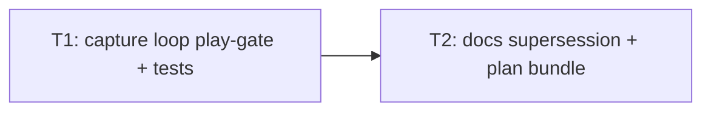

# Plan — capture-mic-gate-during-play

**Version:** 1.0  
**Plan name:** `capture-mic-gate-during-play`  
**Skill:** orchestrator-planning v0.6  
**Date:** 2026-05-22  
**Status:** Planning complete — execution not started

---

## §0 Context map intake

- **Path consumed:** `.dev/plans/capture-mic-gate-during-play/context-map.md` (already at final plan path; not promoted from `_pending/`)
- **Readiness verdict:** CONDITIONAL
- **Scope-area labels flagged:** Flag 1 (`capture` — loop gate placement), Flag 2 (`capture`, `UX` — segment spanning play), Flag 3 (`capture`, `tests` — falsify without Silero hub), Flag 4 (`capture`, `docs` — emit-time check retention), Flag 5 (`capture`, `pacing` — ship order vs pacing-before-llm)
- **Skill version + commit SHA:** pre-plan-exploration v0.2 @ `e3fd9dc5c58278f46e3d5729f214927db5dd3dcd` (matches `git rev-parse HEAD` at planning time)

**Binding-artifact note:** Context map and this plan bundle are **not yet tracked** at planning SHA; **T2** commits `.dev/plans/capture-mic-gate-during-play/` so §8.2 can resolve. `.dev/decision-logs/tts-mic-gate-tail-T2.md` and `heckler_seed.md` are tracked and authoritative for prior tail behavior.

**Flag resolutions applied before planning:**

- **Flag 1 (loop placement):** Resolved. At the **top of each VAD frame** in `_capture_loop` (`for frame in frames`), if `self._is_playing.is_set()`: discard in-progress `capturing`/`segment`, **do not** call `vad_iter`, **do not** honor `"start"`/`"end"`, `continue` to next frame. Drained PCM is consumed (deque drained) but frames are dropped on the floor while gated — prevents post-unmute backlog bleed (context-map Surface 5).
- **Flag 2 (segment spanning play):** Resolved. **Discard entire partial segment** when the gate becomes active; no user-only prefix emit on gate clear. User speech overlapping TTS is intentionally dropped for that segment (tradeoff documented in T1 decision log; aligns with Rule 1 “if it’s playing, don’t listen”).
- **Flag 3 (CI without hub):** Resolved. Extract a **pure, module-level** play-gate state helper in `heckler/audio_capture.py` (see §2) unit-tested in `tests/test_audio_capture.py` without calling `_capture_loop` or `torch.hub.load`. Optional integration test that loads Silero is **out of scope** for default pytest.
- **Flag 4 (emit-time check):** Resolved. **Keep** `_emit_audio_segment` early return when `is_playing.is_set()` as second line of defense; update docs to describe loop + emit layers.
- **Flag 5 (pacing-before-llm):** Resolved. **Capture-first** in this plan; pacing-before-llm remains a separate plan and explicit non-goal here.

**Supersession (prior contracts):**

- `.dev/decision-logs/tts-mic-gate-tail-T2.md` assumption: “extending hold in `Speaker` is sufficient **without capture changes**” — **superseded** by this plan (emit-time-only suppression cannot stop buffer-then-emit).
- `heckler_seed.md` §4.7 mic-gate prose (“checks before putting a chunk to the queue”) — superseded to **no VAD segment formation** while `is_playing` is set, plus emit-time guard.

---

## §1 Task statement

While `Speaker.is_playing` is set (synthesis, blocking playback, and `tts_gate_tail_ms` tail), `AudioCapture` must implement capture-layer **Rule 1** (“if it’s playing, don’t listen”): do not start or accumulate Silero VAD segments, discard any in-progress capture, ignore `"start"` events, and reset the `VADIterator` when the gate clears so TTS/acoustic bleed is not buffered and emitted after unmute. This complements the shipped Speaker tail and the existing emit-time gate in `_emit_audio_segment`, fixing echo transcripts where bleed was recorded during play and flushed when the gate cleared.

**Non-goals:**

- Changing `Speaker.speak`, `tts_gate_tail_ms`, or `controller.py` wiring (shared `threading.Event` reference unchanged).
- Reactor dedup, AEC, headphone routing, or transcriber `vad_filter` behavior.
- `pacing_gate.py`, `pipeline._run_reaction_worker` order, or `.dev/plans/_pending/pacing-before-llm/` (Rule 2 — ship separately; capture-first recommended).
- New config keys, CLI flags, or env vars.
- GUI-specific capture logic.
- Refactoring transcribe mode (never-set `Event` remains always-open).
- Default pytest tests that download Silero via `torch.hub.load` or require GPU/network.

---

## §2 Shared contracts

| Topic | Contract |
|-------|----------|
| **Types / interfaces** | **`heckler/audio_capture.py` — `PlayGateFrameResult` (owning subtask: **T1**): frozen dataclass or `NamedTuple` with fields `capturing: bool`, `segment: list[np.ndarray]`, `was_gated: bool`, `reset_vad: bool`. **`play_gate_frame_tick(is_playing: bool, was_gated: bool, capturing: bool, segment: list[np.ndarray]) -> PlayGateFrameResult`** (owning subtask: **T1**; module-level; test: `tests/test_audio_capture.py` — no torch hub). Semantics: if `is_playing`: return `capturing=False`, `segment=[]`, `was_gated=True`, `reset_vad=False`; if not `is_playing` and `was_gated`: return prior capture state unchanged except `was_gated=False`, `reset_vad=True`; else pass through `capturing`/`segment`, `was_gated=False`, `reset_vad=False`. **`AudioCapture._capture_loop`:** maintains instance `self._play_gate_was_gated: bool` (init `False`); per frame after shape check, call `play_gate_frame_tick`; if `is_playing` continue without `vad_iter`; if `result.reset_vad` assign `vad_iter = new_vad_iterator()`; max-speech flush branch must not call `_emit_audio_segment` while `is_playing.is_set()` (discard flush same as play-gate discard). **`AudioCapture._emit_audio_segment`:** unchanged signature; **retain** `if self._is_playing.is_set(): return` (owning subtask: **T1**; test: existing `test_emit_skips_when_speaker_is_playing`). **`Speaker.is_playing` / `controller.py`:** no signature changes. |
| **Error envelope** | Unchanged: `ValueError` for `sample_rate != 16000` in `_capture_loop`; `TypeError` in `_emit_audio_segment` for bad dtype/shape; `RuntimeError` for unexpected Silero utils length. No new exception types. |
| **Naming** | Helper: `play_gate_frame_tick`. Result type: `PlayGateFrameResult`. Decision log: `.dev/decision-logs/capture-mic-gate-during-play-T1.md`. Supersession banner in `.dev/decision-logs/tts-mic-gate-tail-T2.md` (T2). |
| **Logging** | No new structured log fields. Optional `DEBUG` on gate discard is **out of scope** (YAGNI). |
| **Tests** | **pytest** under `tests/`. Extend `tests/test_audio_capture.py` only for T1 (pure helper + retain emit tests). Run `pytest tests/test_audio_capture.py -q` after T1. No new dependencies; no `torch.hub.load` in tests added by this plan. |
| **CLI surface** | N/A — no new flags or subcommands. |

**Decision log paths:**

- T1 (architectural): `.dev/decision-logs/capture-mic-gate-during-play-T1.md`

---

## §3 Dependency DAG

**Parallel groups:** None — strict sequence `T1 → T2`.

**Soft dependencies:** None.

---

## §4 Subtask specs

### T1 — Capture-layer play gate in `_capture_loop`

| Field | Content |
|-------|---------|
| **ID** | T1 |
| **Scope** | Implement Rule 1 in `AudioCapture._capture_loop` via `play_gate_frame_tick`, VAD reset on gate clear, PCM frame discard while gated, max-speech path guarded; add unit tests without Silero hub; write architectural decision log. |
| **Files to touch** | `heckler/audio_capture.py`, `tests/test_audio_capture.py`, `.dev/decision-logs/capture-mic-gate-during-play-T1.md` (new) |
| **Contract bindings** | All §2 rows |
| **Inputs** | None |
| **Outputs** | Updated capture module and tests; decision log |
| **Kill criteria** | (1) Halt if context-map Flag 1 unresolved at execution start: gate only in `_emit_audio_segment` without per-frame loop discard. (2) Halt if context-map Flag 2 unresolved: emit partial segment after gate was set without plan amendment. (3) Halt if context-map Flag 3 forces default pytest to call `torch.hub.load` or network. (4) Halt if `Speaker`, `controller.py`, or `HecklerConfig` gain changes without plan amendment. (5) Halt if `_emit_audio_segment` play check removed without plan amendment and test update. (6) Halt if max-speech flush still enqueues while `is_playing.is_set()`. |
| **Log tier** | `architectural` |
| **Risks & mitigations** | Barge-in during tail still blocked by shared `Event` (Surface 2) — document in decision log; tail tunable via existing `TTS_GATE_TAIL_MS`. Stale `vad_iter` after unmute (Surface 3) — mitigated by `reset_vad` on clear edge. |

### T2 — Docs supersession + tracked plan bundle

| Field | Content |
|-------|---------|
| **ID** | T2 |
| **Scope** | Supersede mic-gate prose in `heckler_seed.md`; add `CHANGELOG.MD` entry; optional one-line `README.md` clarification; add supersession note to `tts-mic-gate-tail-T2.md`; commit `.dev/plans/capture-mic-gate-during-play/` (context-map, plan, packets) and decision log from T1. |
| **Files to touch** | `heckler_seed.md`, `CHANGELOG.MD`, `README.md` (optional sentence), `.dev/decision-logs/tts-mic-gate-tail-T2.md`, `.dev/decision-logs/capture-mic-gate-during-play-T1.md`, `.dev/plans/capture-mic-gate-during-play/*` |
| **Contract bindings** | §2 Naming; §2 Tests N/A for prose |
| **Inputs** | T1 (landed loop behavior + decision log) |
| **Outputs** | Doc updates; git-tracked plan bundle |
| **Kill criteria** | (1) Halt if context-map Flag 5 unresolved at execution start: do not edit `pacing_gate.py` or reactor order in this subtask. (2) Halt if `heckler_seed.md` still describes emit-only gate without loop discard after T1 landed. (3) Halt if T2 assumption in `tts-mic-gate-tail-T2.md` left unmarked superseded. |
| **Log tier** | `standard` |
| **Risks & mitigations** | Plan bundle untracked until commit — T2 must include paths in commit so auditor §8.2 resolves. |

---

## §5 Adversarial pass

### 5.1 Rejected decompositions

1. **Speaker-only extension (reuse tts-mic-gate-tail shape):** Rejected — validated failure mode is buffer-then-emit in `_capture_loop`; longer tail does not stop VAD from recording bleed (context-map §Orchestrator handoff notes).
2. **Emit-path-only fix (delete loop work, rely on `_emit_audio_segment`):** Rejected — current code already skips enqueue at emit; echo persists when gate clears after segment accumulated (lines 148–184 today).
3. **Three-way split T1 loop / T2 tests / T3 docs:** Rejected — tests are contract falsifiers for the helper and loop policy; splitting increases packet coupling without parallel benefit (strict DAG, single interface owner).

### 5.2 Load-bearing assumptions

| Tuple |
|-------|
| (`Persona mode shares one Speaker.is_playing Event with AudioCapture` \| §2 Types → `controller.py:_start_persona_mode` + `AudioCapture.__init__` \| gate timing diverges between modules → echo or stuck mute \| T1) |
| (`Discarding PCM frames while gated prevents post-unmute bleed burst` \| §2 Types → `_capture_loop` per-frame `continue` when `is_playing` \| backlog still fed to `vad_iter` after clear → echo returns \| T1) |
| (`VADIterator reset on gate clear edge prevents spurious start/end` \| §2 Types → `play_gate_frame_tick.reset_vad` \| stale internal state after unmute \| T1) |
| (`Emit-time check remains harmless second defense` \| §2 Types → `_emit_audio_segment` lines 77–78 \| removing check without loop fix regresses if loop bypassed \| T1) |
| (`tts_gate_tail_ms already landed` \| `HecklerConfig.tts_gate_tail_ms` / `TTS_GATE_TAIL_MS` \| retuning Speaker in this plan → scope creep \| T2) |

### 5.3 Highest re-plan risk

**T1** — Silero `VADIterator` edge behavior after reset may surprise (spurious segment boundaries, interaction with max-speech flush). A packet-only executor might under-specify the max-speech branch without reading `_capture_loop` lines 158–166.

### 5.4 Hidden couplings

| Tuple | Status |
|-------|--------|
| (`test_emit_skips_when_speaker_is_playing documents emit layer only` \| `tests/test_audio_capture.py:test_emit_skips_when_speaker_is_playing` \| loop fix ships without new tests → regression undetected \| T1) | **confirmed** |
| (`_capture_loop loads silero via torch.hub` \| `audio_capture.py:_capture_loop` \| T1 “integration test” tempts CI network/GPU \| T1) | **confirmed** |
| (`max-speech flush calls _emit_audio_segment` \| `audio_capture.py:158-166` \| flush during play emits after gate clear \| T1) | **confirmed** (context-map Surface 6) |
| (`Transcribe mode never-set Event` \| `controller.py:_start_transcribe_mode` \| shared refactor breaks transcribe path \| T1) | **confirmed** |
| (`heckler_seed.md mic gate prose misleads auditors` \| `heckler_seed.md` §4.7 \| audit thinks emit-only is sufficient \| T2) | **confirmed** |
| (`pacing-before-llm shares echo symptom` \| separate plan slug \| wrong kill criteria blame capture \| T2) | **suspected** — disproven by Flag 5 resolution and T2 kill (1) |

---

## §6 Executor packets

| Packet | Path |
|--------|------|
| T1 | `.dev/plans/capture-mic-gate-during-play/packets/T1.md` |
| T2 | `.dev/plans/capture-mic-gate-during-play/packets/T2.md` |

---

## §7 Amendment subtasks

None (plan v1.0).

---

## §8 Auditor handoff

**Not produced** — populate when execution marks plan *Complete* (requires clean-tree verification at landed SHA per orchestrator-planning §8.1).
