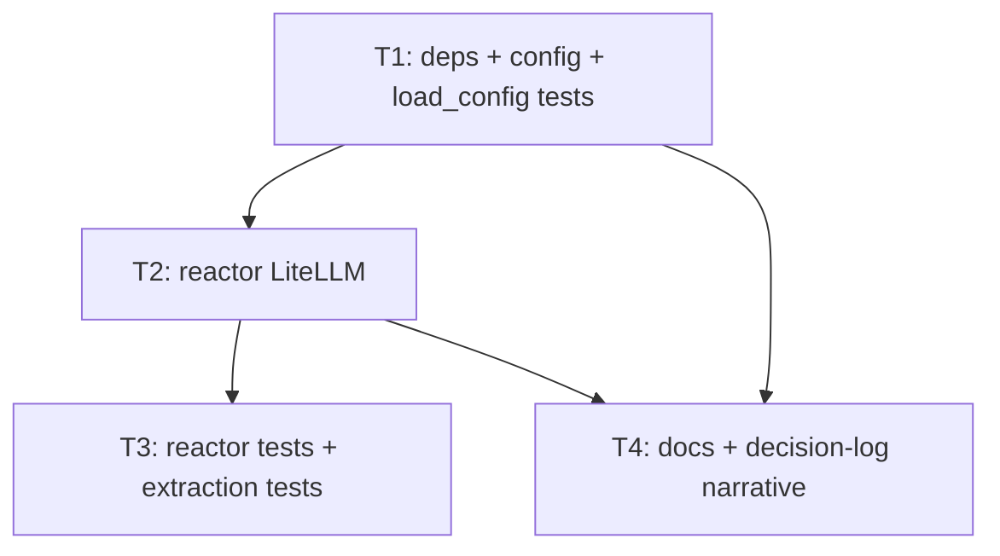

# Plan: litellm-provider-switch

**Orchestrator skill:** orchestrator-planning v0.5  
**Plan status:** Complete (pending execution)

---

## 0. Context map intake

| Field | Value |
|-------|--------|
| **Path consumed** | `.dev/plans/litellm-provider-switch/context-map.md` (promoted from `.dev/plans/_pending/litellm-provider-switch/context-map.md`; `_pending/` path is retired) |
| **Readiness verdict** | CONDITIONAL |
| **Scope-area labels (§Ambiguity flags)** | `config`, `reactor`, `docs`, `tests`, `README`, `.env.example` |
| **Map generator** | pre-plan-exploration v0.2 |
| **Commit SHA (map vs repo)** | Map records **unavailable (no `.git` at repository root)** at exploration time. Current workspace: `git rev-parse HEAD` fails (`HEAD` ambiguous / no revision); treat SHA as **unavailable until git history exists** — executors must re-run pre-plan or `git log -1` on touched paths before execution if a SHA becomes available. |

**CONDITIONAL handling:** §5.2 and §5.4 reference ambiguity flags 1–3. Subtasks whose scope matches a flagged ambiguity include the kill criterion: *halt if context-map flag \<N\> is unresolved at execution start* (Flags 1–3 only; Flag 4–5 are none_found / non-blocking per map).

---

## 1. Task statement

Migrate the heckler LLM integration from the Anthropic Python SDK (`Anthropic.messages.create`) to **LiteLLM** so operators can switch providers (OpenAI, Anthropic, Ollama, and other LiteLLM-supported backends) by configuration and environment variables, without changing the rest of the pipeline. Change the **default** chat model to OpenAI **GPT-4o mini** using the LiteLLM model id `openai/gpt-4o-mini`. Preserve the public `Reactor.react` contract (return type, score gate, JSON parsing, `DiscardReason` semantics) and keep the CLI entry (`python -m heckler`, console script `heckler`) limited to existing flags unless explicitly extended elsewhere.

**Non-goals**

- Adding new LLM-related CLI flags or subcommands (provider switching remains env/config-driven).
- Streaming or async LLM calls.
- Changing `CommentType`, `ReactorResult`, `Utterance`, or pipeline threading architecture beyond what falls out from `HecklerConfig` / `Reactor` constructor needs.
- Pinning or vendoring LiteLLM beyond declaring a normal PyPI dependency range in `pyproject.toml`.
- Rewriting prompts for provider-specific quirks beyond what is required for LiteLLM message compatibility.

---

## 2. Shared contracts

| Topic | Binding |
|--------|---------|
| **Types / interfaces** | **`HecklerConfig`** (dataclass in `heckler/config.py`): `llm_model: str` default **`openai/gpt-4o-mini`** (LiteLLM model string; resolves context-map Flag 2 as *binding*: colloquial “4o mini” = this id). Retain **`anthropic_api_key: str`** (default `""`) populated from **`ANTHROPIC_API_KEY`** via `load_config`. Add **`openai_api_key: str`** (default `""`) populated from **`OPENAI_API_KEY`**. Optional **`ollama_api_base: str`** (default `""`) populated from **`OLLAMA_API_BASE`** only (v1 frozen name). `load_config() -> HecklerConfig` **must not** use `os.environ["ANTHROPIC_API_KEY"]` KeyError as today; it uses `os.getenv` for keys with empty-string default for missing vars. **`HECKLER_LLM_MODEL`** env overrides `llm_model` when set (non-empty). Owning subtask **T1**; typed parse path: `load_config` + dataclass fields; round-trip / construction tests in **`tests/test_models.py`**. |
| **Reactor** | **`Reactor.__init__(config: HecklerConfig) -> None`** and **`react(...) -> tuple[Optional[ReactorResult], float, Optional[DiscardReason]]`** unchanged at the type level. Owning subtask **T2**; construction unchanged for call sites. |
| **LiteLLM call** | Use **`litellm.completion`** (or **`litellm.acompletion`** is out of scope) with **`messages`** shaped as OpenAI-style chat messages carrying the existing user payload (system + user split as today: system prompt from `prompts/system.md`, user string includes examples + context + utterance). **`model=`** must be `config.llm_model`. Pass **`api_key`** only when the selected provider’s key on `HecklerConfig` is non-empty; otherwise omit so LiteLLM/env defaults apply. Owning subtask **T2**; no new user-facing Python API beyond config fields above. |
| **Error envelope** | On transport/SDK failure inside `react`, catch **`Exception`**, log at **ERROR**, return **`(None, latency_ms, DiscardReason.LLM_ERROR)`** — same as today. Log message text must be **provider-agnostic** (e.g. **`LLM API call failed: %s`**); do not hard-code “Anthropic” in new log lines. Owning subtask **T2**. |
| **Naming** | New symbols: env **`HECKLER_LLM_MODEL`**, config fields **`openai_api_key`**, **`ollama_api_base`**. New dependency: **`litellm`** in `pyproject.toml`. Remove direct runtime dependency on **`anthropic`** unless T1 decision log documents a concrete reason to keep it (default: **remove**). |
| **Logging** | Levels unchanged (`error` on API failure, `warning` on parse issues). Structured fields: none required beyond existing `%s` interpolation. |
| **Tests** | **pytest** under **`tests/`**; file naming `test_*.py`. All touched behavior requires tests: config construction (`test_models.py`), reactor behavior (`test_reactor.py`). Add focused tests for **response text extraction** from LiteLLM/OpenAI-shaped responses if `_extract_text_content` (or successor) branches change — owning **T3**, satisfies context-map Flag 3. |
| **CLI surface** | **`heckler.pipeline:main`** exposes only **`--list-devices`** today — unchanged. Downstream docs/tests must not invent other flags without a new subtask. |

**Typed-surface binding checklist**

| Key / field | Owner | Typed surface | Test |
|-------------|-------|---------------|------|
| `HECKLER_LLM_MODEL` → `llm_model` | T1 | `load_config`, `HecklerConfig` | `test_load_config_env_overrides` extended or new test |
| `OPENAI_API_KEY` → `openai_api_key` | T1 | `load_config` | `test_models` env fixture |
| `ANTHROPIC_API_KEY` → `anthropic_api_key` | T1 | `load_config` | `test_models` (replaces KeyError-only test) |
| `OLLAMA_API_BASE` → `ollama_api_base` | T1 | `load_config` | `test_models` asserts optional empty default and non-empty override when env set — T1 |
| `litellm.completion` parameters | T2 | `reactor.py` | `test_reactor.py` mocks |

**CLI-as-contract:** `--list-devices` frozen; no downstream packet references other CLI strings.

**Wire / error-envelope:** No HTTP server; N/A beyond reactor return shape above.

**Architectural decision logs**

- **T1** → `.dev/decision-logs/T10.md` (config/env schema, optional-key policy, Ollama base env name).
- **T2** → `.dev/decision-logs/T11.md` (LiteLLM entrypoint, message shape, api_key pass-through rules).

---

## 3. Dependency DAG

**Parallel groups:** `{T3, T4}` may run in parallel **after T2 completes**, subject to merge coordination (both may edit repo docs; if conflict-prone, sequence T3 then T4).

**Soft dependency:** T4 soft-depends on T3 only for narrative that references test coverage; can proceed in parallel if T4 avoids claiming test details not yet landed.

---

## 4. Subtask specs

### T1 — Dependencies and configuration contract

| Field | Content |
|--------|---------|
| **ID** | T1 |
| **Scope** | Add `litellm` to `pyproject.toml`; remove `anthropic` unless decision log justifies keeping it. Extend `HecklerConfig` and `load_config` per §2: new defaults and env bindings, eliminate mandatory `KeyError` on missing `ANTHROPIC_API_KEY`. |
| **Files to touch** | `pyproject.toml`, `heckler/config.py`, `tests/test_models.py`, `.dev/decision-logs/T10.md` |
| **Contract bindings** | All §2 rows; exceptions: none |
| **Inputs** | Context map §Prior reasoning (do not contradict without T10 amendment) |
| **Outputs** | Updated dependency set; typed config; tests; decision log T10 |
| **Kill criteria** | Halt if context-map **Flag 1** is unresolved at execution start (credential ownership for multi-provider keys is documented in T10 and matches §2). Halt if removing `anthropic` breaks any remaining import outside T2’s scope without scheduling a fix. Halt if any §2 key lacks parse path + test. |
| **Log tier** | architectural |
| **Risks & mitigations** | Env explosion → document minimal matrix in T10; test matrix in `test_models` for primary env combinations. |

### T2 — Reactor LiteLLM integration

| Field | Content |
|--------|---------|
| **ID** | T2 |
| **Scope** | Replace Anthropic SDK usage with LiteLLM; normalize response text extraction for LiteLLM/OpenAI-style return objects; align logging with §2. |
| **Files to touch** | `heckler/reactor.py`, `.dev/decision-logs/T11.md` |
| **Contract bindings** | Types (Reactor), LiteLLM call row, Error envelope, Logging, Naming |
| **Inputs** | T1 (config fields and defaults) |
| **Outputs** | LiteLLM-backed reactor; decision log T11 |
| **Kill criteria** | Halt if T1’s `HecklerConfig` / `load_config` artifacts are missing. Halt if LiteLLM integration cannot return text compatible with existing `_parse_response` / JSON contract without changing `pipeline.py`. Halt if context-map **Flag 3** is still open: T2 must either expose a single package-level function for “raw completion → assistant text string” documented in T11 for T3 to test, or halt and request T3 packet clarification (no guessing private helpers). |
| **Log tier** | architectural |
| **Risks & mitigations** | Response shape drift → T11 documents expected object shape; T3 adds regression tests. |

### T3 — Reactor test suite migration

| Field | Content |
|--------|---------|
| **ID** | T3 |
| **Scope** | Replace monkeypatch target from `heckler.reactor.Anthropic` to the LiteLLM entrypoint used in T2 (e.g. `litellm.completion` or a thin wrapper module symbol — **must match T11**). Add tests for response parsing / error paths per Flag 3. |
| **Files to touch** | `tests/test_reactor.py` |
| **Contract bindings** | Tests, Types (indirect), Error envelope |
| **Inputs** | T2 |
| **Outputs** | Green pytest for reactor tests |
| **Kill criteria** | Halt if context-map **Flag 3** unresolved: no test asserts plain-text extraction from a LiteLLM-like response object (MagicMock with `choices[0].message.content` or equivalent per T11). Halt if patch target string disagrees with T11 without T11 amendment. |
| **Log tier** | standard |
| **Risks & mitigations** | Brittle mocks → mirror only the surface documented in T11. |

### T4 — Documentation and narrative alignment

| Field | Content |
|--------|---------|
| **ID** | T4 |
| **Scope** | Update `.env.example` and `README.md` for multi-provider setup and new defaults. Append *Landed:* bullets to `.dev/decision-logs/T7.md` and `.dev/decision-logs/T9.md` correcting stale Anthropic-only / wrapper narrative per context-map Surface 7 (or add short errata section — **must not leave logs asserting false current behavior**). Optionally sync `heckler_seed.md` if it documents env keys (context-map handoff). |
| **Files to touch** | `.env.example`, `README.md`, `.dev/decision-logs/T7.md`, `.dev/decision-logs/T9.md`, optionally `heckler_seed.md` |
| **Contract bindings** | Naming (env vars), CLI (`--list-devices` only), Types (documented env keys must match §2) |
| **Inputs** | T1, T2 |
| **Outputs** | Doc + log narrative aligned with shipped behavior |
| **Kill criteria** | Halt if README documents an env key not present in §2 / `load_config`. Halt if context-map **Flag 2** wording in user-facing docs uses a model id other than `openai/gpt-4o-mini` for the default without §2 amendment. |
| **Log tier** | standard |
| **Risks & mitigations** | Doc drift from `heckler_seed.md` → grep `ANTHROPIC` across repo in T4 kill path self-check. |

---

## 5. Adversarial pass

**Lens:** Executor receives only one `T<n>` packet plus executor SKILL.md.

### 5.1 Rejected decompositions

- **Single mega-subtask (“do LiteLLM”)** — Rejected: T1 config and T2 reactor are the same contract surface (`HecklerConfig` fields consumed by `Reactor`); parallel edits would violate parallel-safety; splitting keeps decision logs T10/T11 focused.
- **Provider-specific reactor subclasses** — Rejected: YAGNI; LiteLLM already abstracts providers; extra types would drift from `pipeline.py` single `Reactor` construction.

### 5.2 Load-bearing assumptions

Tuple shape: `(claim | contract surface referenced | failure mode | subtask IDs)`

1. (`LiteLLM completion API accepts OpenAI-style messages for all target providers in scope` | §2 LiteLLM call row (`messages`, `model`) | Runtime errors or silent wrong behavior for Ollama/Anthropic | T2,T3)
2. (`Removing mandatory KeyError on ANTHROPIC_API_KEY does not violate undeclared external CI expectations` | §2 Types (`load_config` getenv behavior) | CI or deploy scripts assume hard failure at import/config | T1,T4)
3. (`Mocking LiteLLM at module attribute chosen in T11 is stable across litellm minor versions` | §2 Tests + T11 named symbol | Tests flap or break on version bump | T3)
4. (`Default model id openai/gpt-4o-mini is valid on LiteLLM + OpenAI for this repo’s Python range` | §2 `llm_model` default | API 400 on first call | T1,T2,T4)
5. **(Flag 1)** (`Single frozen env name for Ollama base is sufficient for v1` | §2 `ollama_api_base` / T10 | Wrong base URL or unset Ollama | T1,T2) — *halt if unresolved per T1 kill criteria*

### 5.3 Highest re-plan risk

**T2** — LiteLLM response object shape and authentication edge cases (Ollama without API key, Azure-style keys) most often force message-shape or config amendments that ripple to T3 and §2.

### 5.4 Hidden couplings

| Mark | Tuple |
|------|--------|
| confirmed | (`test_pipeline constructs HecklerConfig(anthropic_api_key=...)` | `tests/test_pipeline.py` + §2 `anthropic_api_key` field | Field rename/removal breaks pipeline test | T1) |
| confirmed | (`grep-based doc sync` | README / `.env.example` / §2 env keys | Users follow stale Anthropic-only docs | T4) |
| suspected | (`litellm import side effects (network, DNS, version check)` | `heckler/reactor.py` import of `litellm` | Slow tests or import failures in air-gapped CI | T2,T3) — disproven if import in reactor is lazy; proven if pytest import triggers network |
| confirmed | (`Decision logs T7/T9 describe old pipeline/reactor` | `.dev/decision-logs/T7.md`, `T9.md` | Planner/auditor assumes wrong integration | T4) |

---

## 6. Executor packets

Self-contained packets (§1 + §2 + §4 block for `Tn` + filtered §5.2/§5.4 + inputs) are stored as:

- `.dev/plans/litellm-provider-switch/packets/T1.md`
- `.dev/plans/litellm-provider-switch/packets/T2.md`
- `.dev/plans/litellm-provider-switch/packets/T3.md`
- `.dev/plans/litellm-provider-switch/packets/T4.md`

---

## 7. Amendment subtasks

None. Open amendments if audit finds §2 / README / T7-T9 narrative drift after execution.
