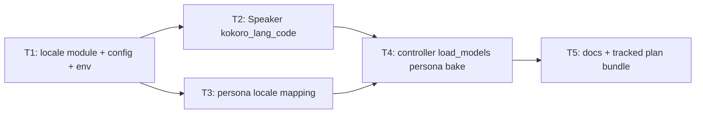

# Plan — locale-lang-propagation

**Version:** 1.0  
**Plan name:** `locale-lang-propagation`  
**Skill:** orchestrator-planning v0.6  
**Date:** 2026-05-22  
**Status:** Draft — executors pending (§8 not populated)

---

## §0 Context map intake

- **Path consumed:** `.dev/plans/locale-lang-propagation/context-map.md` (promoted from `.dev/plans/_pending/locale-lang-propagation/`)
- **Readiness verdict:** CONDITIONAL
- **Scope-area labels flagged:** Flag 1 (`STT-TTS-unified-knob`), Flag 2 (`persona-hot-swap`), Flag 3 (`LLM-alignment`), Flag 4 (`config-env-STT`)
- **Skill version + commit SHA:** pre-plan-exploration v0.2 @ `56c3748e99ea84bb6fa398bbaf474e0508918a99` (map); planning-time `HEAD` = `692dfa0c9a398544b611d1d59b7609f8e0609261` — **stale vs map**; reconcile touched files against current tree at execution.

**Binding-artifact note:** Plan bundle (context-map, plan, packets) is **not yet tracked** at planning SHA; **T5** commits `.dev/plans/locale-lang-propagation/` so §8.2 can resolve. `.dev/decision-logs/persona-system-T1.md` and `gui-T1.md` are tracked and authoritative for persona flattening and heavy-model ownership.

**Operator resolutions applied before planning** (from context-map §Orchestrator handoff notes):

- **Flag 1 (unified knob):** Resolved. Single product field `HecklerConfig.locale` (BCP-47-ish slug, normalized lowercase) maps via `heckler/locale.py` to Whisper ISO 639-1 `whisper_language` and Kokoro single-letter `kokoro_lang_code`. Mapping table + unit tests are **T1** contract anchors; no raw Kokoro letter passed through env/persona.
- **Flag 2 (persona hot-swap):** Resolved. `swap_persona` does **not** rebuild `Transcriber`/`Speaker` or change STT/TTS language; document and test. Persona `[voice].locale` affects STT/TTS only when baked into heavy models at `load_models(..., persona_name=...)` (or process env before load). **T4** owns controller semantics.
- **Flag 3 (LLM register):** Resolved as **non-goal**. LLM language/register remains `system.md` / `examples.json` only; no `HecklerConfig` LLM-locale field or Reactor template injection in v1.
- **Flag 4 (env wiring):** Resolved. `load_config()` reads `HECKLER_LOCALE` with strip / whitespace fallback like `HECKLER_MODE`; **T1** tests required.

**Supersession / historical:**

- Archive heckler-v1 T8 kill criterion “`lang_code` other than `'a'`” is **historical only** — superseded by this plan’s multilingual Kokoro contract.
- `README.md` L3 “English speech” — **T5** amends operator-facing positioning when multilingual locales ship.

---

## §1 Task statement

Implement a **unified locale knob** on `HecklerConfig` that propagates to faster-whisper (`whisper_language`) and Kokoro (`kokoro_lang_code` on `KPipeline`), with operator entry points via **`HECKLER_LOCALE`** and persona **`[voice].locale`**, plus resolution at config construction so STT and TTS stay aligned. Wire `Speaker` off the hard-coded `lang_code="a"`, close the `load_config()` gap for language env, and fix controller **load-time** binding so `Transcriber`/`Speaker` use the locale effective for the session (including persona merge when `load_models(persona_name=...)` is used). Document that **persona hot-swap does not change STT/TTS language** without a process restart / `load_models` reload.

**Non-goals:**

- GUI language picker or PyQt controls (`heckler/gui/**`).
- New CLI flags (env + persona TOML + optional `load_models` persona arg only in v1).
- LLM “locale” field, Reactor template injection, or automatic register alignment beyond existing prompts.
- Rebuilding `Transcriber`/`Speaker` on `swap_persona` or mode switch without explicit `load_models` reload.
- Auto-detect language from audio (Whisper `language=None` “detect” mode).
- Expanding Kokoro beyond locales listed in §2 mapping table without plan amendment.
- Split per-stack knobs (`whisper_language` vs `kokoro_lang_code` as independent user inputs) — internal fields exist; operators set **`locale`** only.

---

## §2 Shared contracts

| Topic | Contract |
|-------|----------|
| **Types / interfaces** | **`heckler/locale.py` (owning subtask: **T1**):** `UnsupportedLocaleError(ValueError)` when normalized locale not in `SUPPORTED_LOCALES`. **`SUPPORTED_LOCALES: dict[str, LocaleProfile]`** frozen mapping (test: `tests/test_locale.py`). **`LocaleProfile`** `NamedTuple` or frozen dataclass: `whisper_language: str`, `kokoro_lang_code: str`. **`normalize_locale(raw: str) -> str`**: strip, lower, reject empty → `UnsupportedLocaleError`. **`resolve_locale(locale: str) -> LocaleProfile`**: normalize then lookup. **Initial supported keys (binding):** `en`, `en-us`, `en-gb`, `es` → profiles: `(en,a)`, `(en,a)`, `(en,b)`, `(es,e)` respectively (Kokoro aliases per hexgrad/kokoro `ALIASES` / `LANG_CODES`). **`heckler/config.py` — `HecklerConfig` (T1):** add `locale: str = "en"`; add `kokoro_lang_code: str = "a"`; retain `whisper_language: str = "en"` as **derived** from locale (not env-direct in v1). **`apply_resolved_locale(cfg: HecklerConfig) -> HecklerConfig` (T1):** `dataclasses.replace(cfg, whisper_language=profile.whisper_language, kokoro_lang_code=profile.kokoro_lang_code)` after `resolve_locale(cfg.locale)`; test: `tests/test_locale.py` + `tests/test_config.py`. **`load_config()` (T1):** read `HECKLER_LOCALE` with strip; whitespace-only → default `"en"`; then `apply_resolved_locale` on returned config; tests mirror `HECKLER_MODE` strip semantics. **`heckler/speaker.py` — `Speaker.__init__` (T2):** `KPipeline(lang_code=config.kokoro_lang_code)`; test: `tests/test_speaker.py` parametrized or updated assertions. **`heckler/transcriber.py` (unchanged signature):** continues `language=self._config.whisper_language`; falsified by existing `tests/test_transcriber.py` once T1 resolves fields. **`heckler/persona.py` (T3):** `_TOML_TO_CONFIG` adds `("voice", "locale") → "locale"`. **`apply_persona_overrides` (T3):** after merge valid fields, return `apply_resolved_locale(replace(...))`. **`PipelineController.load_models` (T4):** add optional keyword-only `persona_name: str | None = None`; when set, construct heavy models from `apply_persona_overrides(self._config, load_persona(...))` (resolved locale), else `apply_resolved_locale(self._config)`; **do not** change `swap_persona` to rebuild transcriber/speaker. **Persona TOML table (T3):** `[voice] locale = "es"` documented in README / persona_builder optional. |
| **Error envelope** | `UnsupportedLocaleError` on unknown/empty locale at `resolve_locale` / `apply_resolved_locale` (fail at config construction, not at first transcribe). `load_config` invalid `TTS_GATE_TAIL_MS` behavior unchanged. No change to `SpeakerError`, `PersonaNotFoundError`. |
| **Naming** | Module `heckler/locale.py`. Env `HECKLER_LOCALE`. Config fields `locale`, `kokoro_lang_code` (retain `whisper_language`). Persona key `[voice].locale`. Decision logs: `.dev/decision-logs/locale-lang-propagation-T1.md`, `.dev/decision-logs/locale-lang-propagation-T4.md`. |
| **Logging** | Optional `logger.info` on `load_models` when persona locale differs from base `self._config.locale` — **out of scope** (YAGNI). No new structured log fields required. |
| **Tests** | **pytest** under `tests/`. New `tests/test_locale.py` (T1). Extend `tests/test_config.py`, `tests/test_speaker.py`, `tests/test_persona.py`, `tests/test_controller.py`. Default run: `pytest tests/test_locale.py tests/test_config.py tests/test_speaker.py tests/test_persona.py tests/test_controller.py -q` (no GPU/network). |
| **CLI surface** | N/A — no new argparse flags in v1. Existing `--mode`, `--session-name` unchanged. |

**Decision log paths:**

- T1 (architectural): `.dev/decision-logs/locale-lang-propagation-T1.md`
- T4 (architectural): `.dev/decision-logs/locale-lang-propagation-T4.md`

---

## §3 Dependency DAG

**Parallel groups:** `{T2, T3}` may run in parallel after **T1** completes.

**Soft dependencies:** None.

---

## §4 Subtask specs

### T1 — Locale resolution module and config/env wiring

| Field | Content |
|-------|---------|
| **ID** | T1 |
| **Scope** | Add `heckler/locale.py` with supported locale table, normalization, and resolution; extend `HecklerConfig` with `locale` + `kokoro_lang_code`; implement `apply_resolved_locale`; wire `HECKLER_LOCALE` in `load_config()`; add `tests/test_locale.py` and config tests. |
| **Files to touch** | `heckler/locale.py` (new), `heckler/config.py`, `tests/test_locale.py` (new), `tests/test_config.py`, `.dev/decision-logs/locale-lang-propagation-T1.md` (new) |
| **Contract bindings** | All §2 rows owned by T1 |
| **Inputs** | None |
| **Outputs** | Locale module, config fields, env wiring, tests, decision log |
| **Kill criteria** | (1) Halt if context-map Flag 1 unresolved at execution start: no mapping table or operators must set `whisper_language` / `kokoro_lang_code` independently via env. (2) Halt if context-map Flag 4 unresolved: `load_config()` omits `HECKLER_LOCALE` or lacks strip/fallback tests. (3) Halt if `Speaker` or `controller.py` edited in this subtask (wrong packet). (4) Halt if unknown locale silently falls through to English without `UnsupportedLocaleError`. (5) Halt if `SUPPORTED_LOCALES` ships without at least `en` and `es` entries per §2. |
| **Log tier** | `architectural` |
| **Risks & mitigations** | Kokoro voice ids may not exist for non-English locales — document in decision log; voice selection remains `kokoro_voice` / operator responsibility. Map SHA stale — verify `config.py` field list before edit. |

### T2 — Speaker uses config kokoro_lang_code

| Field | Content |
|-------|---------|
| **ID** | T2 |
| **Scope** | Replace hard-coded `KPipeline(lang_code="a")` with `config.kokoro_lang_code`; update `tests/test_speaker.py` (including rename of American-English-specific test name if needed). |
| **Files to touch** | `heckler/speaker.py`, `tests/test_speaker.py` |
| **Contract bindings** | §2 Types (Speaker), §2 Tests |
| **Inputs** | T1 (`kokoro_lang_code` on `HecklerConfig`, resolver landed) |
| **Outputs** | Speaker wired to config; updated speaker tests |
| **Kill criteria** | (1) Halt if context-map Flag 1 unresolved: literal `lang_code="a"` remains in `speaker.py` production path. (2) Halt if `test_init_uses_american_english_*` still asserts `lang_code="a"` when config supplies `kokoro_lang_code="e"` without amendment. (3) Halt if `HecklerConfig` or `locale.py` modified for new locales without T1 owning table (contract drift). |
| **Log tier** | `standard` |
| **Risks & mitigations** | Kokoro import in tests unchanged (existing shim). |

### T3 — Persona `[voice].locale` mapping

| Field | Content |
|-------|---------|
| **ID** | T3 |
| **Scope** | Extend `_TOML_TO_CONFIG` and ensure `apply_persona_overrides` re-resolves whisper/kokoro fields from merged `locale`; add persona tests with Spanish locale example. |
| **Files to touch** | `heckler/persona.py`, `tests/test_persona.py` |
| **Contract bindings** | §2 Types (persona), §2 Error envelope |
| **Inputs** | T1 (`apply_resolved_locale`, `resolve_locale`) |
| **Outputs** | Persona locale mapping + tests |
| **Kill criteria** | (1) Halt if context-map Flag 1 unresolved at execution start. (2) Halt if persona `locale` override updates `Reactor` path only — `apply_persona_overrides` must set `whisper_language` and `kokoro_lang_code` on returned config when `locale` present. (3) Halt if unmapped `[voice].locale` passthrough uses TOML-local name without hitting `HecklerConfig.locale` field. (4) Halt if `swap_persona` or controller rebuilt in this subtask. |
| **Log tier** | `standard` |
| **Risks & mitigations** | Persona bundle `prompts/heckler/` unchanged unless tests need fixture — optional doc-only in T5. |

### T4 — Controller load_models persona locale bake + hot-swap docs

| Field | Content |
|-------|---------|
| **ID** | T4 |
| **Scope** | `load_models(..., persona_name=...)` merges persona before constructing `Transcriber`/`Speaker`; document `swap_persona` STT/TTS limitation; add controller tests (persona locale baked at load; swap does not change transcriber language). |
| **Files to touch** | `heckler/controller.py`, `tests/test_controller.py`, `.dev/decision-logs/locale-lang-propagation-T4.md` (new) |
| **Contract bindings** | §2 Types (controller), §2 Tests |
| **Inputs** | T2 (Speaker uses `kokoro_lang_code`), T3 (persona locale overrides) |
| **Outputs** | Controller load path, tests, decision log |
| **Kill criteria** | (1) Halt if context-map Flag 2 unresolved at execution start: executor rebuilds `Transcriber`/`Speaker` inside `swap_persona` without plan amendment. (2) Halt if `load_models` still always passes raw `self._config` while persona TOML defines divergent `locale` and `persona_name` was available at load time. (3) Halt if test suite claims persona swap changes `Transcriber._config.whisper_language`. (4) Halt if `gui` or `pipeline.py` CLI flags added without amendment. |
| **Log tier** | `architectural` |
| **Risks & mitigations** | GUI may call `load_models()` before persona pick — document that operators should reload models after persona change for STT/TTS alignment (runtime-armed only for GUI until a future plan). |

### T5 — Operator docs and tracked plan bundle

| Field | Content |
|-------|---------|
| **ID** | T5 |
| **Scope** | README locale table + multilingual positioning; `.env.example` `HECKLER_LOCALE`; `CHANGELOG.MD` entry; commit `.dev/plans/locale-lang-propagation/`; optional one-line `.cursor/skills/persona_builder/SKILL.md` `[voice].locale` hint. |
| **Files to touch** | `README.md`, `.env.example`, `CHANGELOG.MD`, `.cursor/skills/persona_builder/SKILL.md` (optional), `.dev/plans/locale-lang-propagation/*` |
| **Contract bindings** | §2 Naming (`HECKLER_LOCALE`), §2 CLI N/A |
| **Inputs** | T4 (landed behavior) |
| **Outputs** | Docs; git-tracked plan bundle |
| **Kill criteria** | (1) Halt if README still states English-only without qualifying default locale / supported list. (2) Halt if `.env.example` documents `WHISPER_LANGUAGE` or raw Kokoro `lang_code` as operator env. (3) Halt if plan bundle left untracked. (4) Halt if `heckler_seed.md` edited without plan amendment (out of scope). |
| **Log tier** | `standard` |
| **Risks & mitigations** | README scope creep into GUI — stay env/persona/reload docs only. |

---

## §5 Adversarial pass

### 5.1 Rejected decompositions

1. **Split STT and TTS subtasks without shared locale field (parallel `whisper_language` env + `KOKORO_LANG` env):** Rejected — violates operator resolution for unified knob (Flag 1); reintroduces vocabulary collision (Whisper ISO vs Kokoro letters).
2. **Rebuild Transcriber/Speaker on every `swap_persona`:** Rejected — contradicts gui-T1 heavy-model ownership and operator Flag 2 resolution; expensive and racy on live mic.
3. **Six-way split (locale / config / speaker / transcriber / persona / controller / docs):** Rejected — transcriber already forwards `whisper_language`; separate transcriber subtask is mechanical with no contract anchor; increases packet coupling without parallel benefit.

### 5.2 Load-bearing assumptions

| Tuple |
|-------|
| (`Unified locale maps correctly to Whisper ISO and Kokoro letter` \| §2 Types → `heckler/locale.py:SUPPORTED_LOCALES` + `resolve_locale` \| STT and TTS diverge silently → wrong language pair shipped \| T1,T2,T3) |
| (`Kokoro accepts resolved lang_code for es/e and en/a,b` \| §2 Types → `Speaker.__init__` / Kokoro `LANG_CODES` \| `SpeakerError` at init on valid locale \| T2) |
| (`apply_resolved_locale runs after every persona merge` \| §2 Types → `apply_persona_overrides` \| persona `locale` changes gates path config but not whisper/kokoro fields \| T3) |
| (`Heavy models snapshot config at load_models` \| §2 Types → `PipelineController.load_models` \| persona TOML locale ignored for STT/TTS when load without persona_name \| T4) |
| (`swap_persona does not rebuild transcriber` \| §2 Types → `controller.swap_persona` \| hot-swap appears to change language but Whisper still uses load-time language \| T4) |
| (`whisper_language not read from env directly` \| §2 Types → `load_config` only `HECKLER_LOCALE` \| operators set WHISPER_LANGUAGE and expect it to work \| T1) |
| (`LLM register stays prompt-only` \| §1 non-goals \| scope creep into Reactor \| T5) |

### 5.3 Highest re-plan risk

**T4** — GUI/CLI call order (`load_models` before persona selection) may force either reload API or amended Flag 2 semantics; a packet-only executor might patch `start()` instead of `load_models` and reintroduce Surface 1 (merged `cfg` vs base `Transcriber`).

### 5.4 Hidden couplings

| Tuple | Status |
|-------|--------|
| (`Transcriber constructed with self._config in load_models while workers get merged cfg` \| `controller.py:load_models` + `_start_persona_mode` \| persona env gates differ from STT language \| T4) | **confirmed** (context-map Surface 1) |
| (`Speaker hard-coded lang_code="a"` \| `speaker.py:35` \| Spanish kokoro_voice with English phonemizer \| T2) | **confirmed** (context-map Surface 2) |
| (`load_config skips whisper_language` \| `config.py:load_config` \| HECKLER_LOCALE lands without resolver hook \| T1) | **confirmed** (context-map Surface 3 / Flag 4) |
| (`test_speaker asserts lang_code="a"` \| `tests/test_speaker.py:test_init_uses_american_english_*` \| T2 passes without driving config.kokoro_lang_code \| T2) | **confirmed** |
| (`test_controller swap_persona mocks may hide transcriber config` \| `tests/test_controller.py` \| false confidence on hot-swap \| T4) | **suspected** — disproven by explicit transcriber `_config.whisper_language` assertion test in T4 |
| (`prompts/heckler lacks locale key` \| `prompts/heckler/persona.toml` \| shipped persona stays English until operator edits \| T5) | **confirmed** — informational |
| (`README English-only positioning` \| `README.md:L3` \| operators think locale knob is no-op \| T5) | **confirmed** |

---

## §6 Executor packets

| Packet | Path |
|--------|------|
| T1 | `.dev/plans/locale-lang-propagation/packets/T1.md` |
| T2 | `.dev/plans/locale-lang-propagation/packets/T2.md` |
| T3 | `.dev/plans/locale-lang-propagation/packets/T3.md` |
| T4 | `.dev/plans/locale-lang-propagation/packets/T4.md` |
| T5 | `.dev/plans/locale-lang-propagation/packets/T5.md` |

---

## §7 Amendment subtasks

None (plan v1.0 draft).

---

## §8 Auditor handoff

*Pending plan execution and **Complete** banner — populate §8.1–§8.6 per orchestrator-planning v0.6 when T1–T5 land.*
