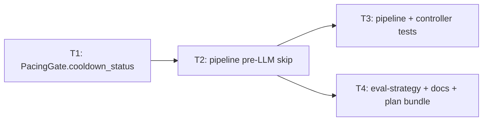

# Plan — pacing-before-llm

**Version:** 1.0  
**Plan name:** `pacing-before-llm`  
**Skill:** orchestrator-planning v0.6  
**Date:** 2026-05-22  
**Status:** Draft (planning complete; §8 auditor handoff populated at *Complete*)

---

## §0 Context map intake

- **Path consumed:** `.dev/plans/pacing-before-llm/context-map.md`
- **Readiness verdict:** CONDITIONAL
- **Scope-area labels flagged:** Flag 1 (score override + pre-LLM pacing), Flag 2 (HeckleEvent shape), Flag 3 (`on_reaction` when LLM skipped), Flag 4 (missing pre-LLM test), Flag 5 (echo skip vs pacing-only scope)
- **Skill version + commit SHA:** pre-plan-exploration v0.2 @ `58f10f132078691a70cc0ae70a5304816fce1f25` (map scout SHA; planning-time `git rev-parse HEAD` = `e3fd9dc5c58278f46e3d5729f214927db5dd3dcd` — **stale** vs map; executors re-verify touched surfaces)

**Binding-artifact resolvability:** All binding sources resolve at planning time via `git ls-files`: context map, `.dev/decision-logs/gui-T1.md`, `.dev/eval-strategy.md`, `.dev/decision-logs/persona-system-T1.md`, `.dev/decision-logs/persona-system-T3.md`, `.dev/decision-logs/T20-event-decomposition-arch.md`.

**Flag resolutions applied before planning (closes CONDITIONAL gates for packet emission):**

| Flag | Resolution |
|------|------------|
| **Flag 1** (A1) | **Drop `score_override_threshold` on the pre-LLM skip path.** Cooldown skip runs before `react()`; no score exists. Post-`react()` path keeps `evaluate(score)` unchanged (override still applies to TTS when LLM ran). Tradeoff documented in T1/T2 decision logs and `.dev/eval-strategy.md`. |
| **Flag 2** (B1–B3) | Pre-LLM pacing reject: `reactor_result=None`, `passed_score_gate=None`, `passed_pacing_gate=False`, `discard_reason=PACING_GATE`, `llm_latency_ms=None`, `cooldown_remaining_at_eval` set. No `event_reactor_results` child row (existing insert guard). `passed_pacing_gate=None` reserved for score-gate / LLM-error paths only. |
| **Flag 3** (C1) | **`on_reaction` does not fire** when pre-LLM pacing skips `react()` (no `ReactorResult`). Aligns with gui-T1 landed rule. Post-LLM pacing reject (react ran, evaluate failed) unchanged: callback fires with `was_spoken=False`. |
| **Flag 4** | New adversarial tests in **T3**: `react` not called when `cooldown_status` reports in-cooldown; post-LLM `evaluate` path retained. |
| **Flag 5** (A3) | **Pacing-only.** Echo / last-spoken skip is a separate future task; not in Files to touch. |
| **A4** | **Keep `context_buffer.push(utterance.transcript)`** on pre-LLM pacing fail (same as post-LLM pacing fail today). |
| **A5** | **Deferred** — lowering `min_output_interval_s` / `PACING_INTERVAL` is config-only; out of scope. |
| **B4** | **`correlation_json` NULL** on pre-LLM pacing rejects — accepted; note in eval-strategy (T4). |
| **C2** | **Pipeline + tests + docs only** — no `gui/` file edits; contract note in T4 for GUI consumers. |

---

## §1 Task statement

In `_run_reaction_worker`, `pacing_gate.evaluate(result.score)` runs only after a successful `reactor.react()`, so pacing blocks TTS but **not** the LLM. During cooldown, echo and low-value segments still incur reactor cost (validated in logs and `thoughts_so_far.md`). Add a **score-free pre-LLM cooldown probe** on `PacingGate`, call it before `react()`, and skip the LLM entirely when in cooldown. Preserve the post-`react()` `evaluate(score)` → `_execute_spoken_reply` path (including score override and `record_output()` before `speak()`). Update persistence, tests, and eval docs for the new pacing-only reject row shape.

**Non-goals:**

- Echo / “transcript ≈ last spoken” skip (`thoughts_so_far.md` L12) — separate mechanism; no `last_spoken` tracker in repo.
- Lowering `min_output_interval_s`, `PACING_INTERVAL`, or persona `pacing_interval` (config-only; composes later).
- `semantic_density` / density gate changes, `audio_capture`, `transcriber`.
- `gui/` implementation edits (contract documented only).
- Moving `record_output()` to after playback or changing TTS/mic-gate behavior.
- Restoring score override during cooldown without running the LLM (would require a new signal — out of scope).
- New CLI flags or env keys.

---

## §2 Shared contracts

| Topic | Contract |
|-------|----------|
| **Types / interfaces** | **`heckler/pacing_gate.py` — `PacingGate.cooldown_status(self) -> tuple[bool, float]`** returns `(in_cooldown, cooldown_remaining)` using the same elapsed/interval math as `evaluate()` but **without** reading `score` or `score_override_threshold`. Owning subtask: **T1**; test: `tests/test_pacing_gate.py` (new cases + existing tests unchanged for `evaluate`). **`PacingGate.evaluate(score: float) -> tuple[bool, float]`** — signature and override semantics **unchanged**; owning subtask: **T1** (regression guard); test: existing `tests/test_pacing_gate.py`. **`heckler/pipeline.py` — `_run_reaction_worker`** order: `cooldown_status()` → if `in_cooldown`: log pre-LLM pacing event, `context_buffer.push`, `continue` (no `react`, no `on_reaction`); else: `react()` → `evaluate(score)` → `_execute_spoken_reply` / error branches as today. Owning subtask: **T2**; test: `tests/test_pipeline.py`. **Pre-LLM `HeckleEvent` branch:** `reactor_result=None`, `passed_score_gate=None`, `passed_pacing_gate=False`, `spoken=False`, `discard_reason=DiscardReason.PACING_GATE`, `cooldown_remaining_at_eval=<from cooldown_status>`, `llm_latency_ms=None`, `tts_latency_ms=None`. Owning subtask: **T2**; test: `tests/test_pipeline.py`. **`passed_pacing_gate` tri-state:** `None` = pacing not evaluated (LLM error / score gate); `False` = pacing failed (pre-LLM or post-LLM); `True` = passed. Owning subtask: **T2**; test: pipeline tests. **`on_reaction`:** fires only when `ReactorResult` exists (post-LLM paths); **not** on pre-LLM pacing skip. Owning subtask: **T2**; test: `tests/test_controller.py` + new pipeline test. |
| **Error envelope** | Unchanged: `reactor.react()` tuple `(Optional[ReactorResult], float, Optional[DiscardReason])`; `SpeakerError` on TTS failure. No new exception types. |
| **Naming** | Method: `cooldown_status`. Decision logs: `.dev/decision-logs/pacing-before-llm-T1.md`, `.dev/decision-logs/pacing-before-llm-T2.md`. |
| **Logging** | No new log levels. `HeckleLogger.log_event` shape per pre-LLM branch above. |
| **Tests** | **pytest** under `tests/`. Extend `tests/test_pacing_gate.py` (T1), `tests/test_pipeline.py` (T3), `tests/test_controller.py` (T3). `test_execute_spoken_reply_records_before_speak` and `test_reaction_worker_pacing_gate_after_successful_react` must still pass (post-LLM evaluate path). No new dependencies. |
| **CLI surface** | N/A — no new flags or subcommands. |

**Decision log paths:**

- T1 (architectural): `.dev/decision-logs/pacing-before-llm-T1.md`
- T2 (architectural): `.dev/decision-logs/pacing-before-llm-T2.md`

**Landed invariants (must not break):**

- `record_output()` immediately before `speaker.speak()` in `_execute_spoken_reply` (T9 / `pacing_gate.py` docstring).
- Persona `pacing_interval` → `min_output_interval_s` (persona-system-T1).
- Bad parseable `type` → `ReactorResult` + `UNKNOWN`, not `None` (persona-system-T3) — score gate inside `react` unchanged.

---

## §3 Dependency DAG

**Parallel groups:** `{T3, T4}` after T2 completes.

**Soft dependencies:** None.

---

## §4 Subtask specs

### T1 — `PacingGate.cooldown_status()` + unit tests

| Field | Content |
|-------|---------|
| **ID** | T1 |
| **Scope** | Extract score-free cooldown probe from `evaluate()` into `cooldown_status()`; keep `evaluate(score)` behavior identical. |
| **Files to touch** | `heckler/pacing_gate.py`, `tests/test_pacing_gate.py`, `.dev/decision-logs/pacing-before-llm-T1.md` (new) |
| **Contract bindings** | §2 Types (`cooldown_status`, `evaluate` unchanged), §2 Tests |
| **Inputs** | None |
| **Outputs** | `cooldown_status()` implementation, unit tests, decision log documenting override tradeoff |
| **Kill criteria** | (1) Halt if context-map Flag 1 is unresolved at execution start: must not call `evaluate()` without a score from pipeline pre-LLM branch. (2) Halt if `evaluate(score)` override semantics change (any existing `test_pacing_gate.py` case fails without plan amendment). (3) Halt if `record_output()` docstring or call sites move. |
| **Log tier** | `architectural` |
| **Risks & mitigations** | Duplicated cooldown math — mitigate by having `evaluate()` delegate cooldown slice to shared private helper or `cooldown_status()` internally. |

### T2 — Pipeline pre-LLM skip + event shape

| Field | Content |
|-------|---------|
| **ID** | T2 |
| **Scope** | Reorder `_run_reaction_worker`: `cooldown_status()` before `react()`; pre-LLM pacing branch logs new `HeckleEvent` shape; skip `on_reaction`; retain post-`react()` `evaluate` + TTS path. |
| **Files to touch** | `heckler/pipeline.py`, `heckler/models.py` (comment on `passed_pacing_gate` only if needed for tri-state clarity) |
| **Contract bindings** | All §2 rows |
| **Inputs** | T1 (`cooldown_status` on `PacingGate`) |
| **Outputs** | Updated `pipeline.py`, optional `models.py` comment, decision log |
| **Kill criteria** | (1) Halt if context-map Flag 2 unresolved: pre-LLM reject must not populate `reactor_result` or `passed_score_gate=True`. (2) Halt if context-map Flag 3 unresolved: `on_reaction` fires without `ReactorResult`. (3) Halt if `_execute_spoken_reply` or `record_output`/`speak` order changes. (4) Halt if `react()` is skipped when `cooldown_status` reports not in cooldown. |
| **Log tier** | `architectural` |
| **Risks & mitigations** | Race between pre-check and `evaluate` after slow LLM — single reaction worker serializes utterances; document in decision log. |

### T3 — Pipeline and controller tests

| Field | Content |
|-------|---------|
| **ID** | T3 |
| **Scope** | Add pre-LLM skip test (`react` not called); assert pre-LLM `HeckleEvent` fields; keep post-LLM pacing test; add/adjust controller callback coverage if needed. |
| **Files to touch** | `tests/test_pipeline.py`, `tests/test_controller.py` |
| **Contract bindings** | §2 Tests, §2 Types (event shape, `on_reaction`) |
| **Inputs** | T2 (landed pipeline behavior) |
| **Outputs** | Updated tests; all pacing-related tests green |
| **Kill criteria** | (1) Halt if context-map Flag 4 unresolved: no test asserts `react` skipped on pre-LLM cooldown. (2) Halt if `test_execute_spoken_reply_records_before_speak` fails. (3) Halt if `test_reaction_worker_pacing_gate_after_successful_react` removed without replacement covering post-LLM `evaluate` after `react`. |
| **Log tier** | `standard` |
| **Risks & mitigations** | MagicMock must mock `cooldown_status` on pre-LLM tests and `evaluate` on post-LLM tests — separate call expectations. |

### T4 — Eval docs + plan bundle

| Field | Content |
|-------|---------|
| **ID** | T4 |
| **Scope** | Update `.dev/eval-strategy.md` §4 stratification for two pacing reject cohorts; note gui-T1 pre-LLM callback gap in README or decision-log cross-ref; `CHANGELOG.MD` entry; commit `.dev/plans/pacing-before-llm/` artifacts. |
| **Files to touch** | `.dev/eval-strategy.md`, `CHANGELOG.MD`, `README.md` (short behavior note), `.dev/plans/pacing-before-llm/*` |
| **Contract bindings** | §2 Naming (docs only), §2 Tests (N/A) |
| **Inputs** | T2 (landed event shape + override tradeoff) |
| **Outputs** | Doc updates; tracked plan directory at HEAD |
| **Kill criteria** | (1) Halt if eval-strategy still claims all `pacing_gate` rows have reactor child rows without pre-LLM caveat. (2) Halt if plan/packets reference `_pending/pacing-before-llm` paths. |
| **Log tier** | `standard` |
| **Risks & mitigations** | Stale gui-T1 prose — add supersession note in T4 pointing to T2 decision log, not full gui-T1 rewrite unless user requests. |

---

## §5 Adversarial pass

*Lens: packet-only executor — halt-shaped findings.*

### 5.1 Rejected decompositions

**Rejected: hybrid “pre-LLM cooldown + post-LLM override probe”.** Run `react()` only when `cooldown_status` says not in cooldown OR when a cheap heuristic predicts override — rejected because no score exists without LLM; heuristics are new scope. **Rejected: merge echo skip into this plan.** Would require `last_spoken` state on `Speaker`/`pipeline`, violating pacing-only boundary (Flag 5). **Rejected: overload `evaluate()` with optional score.** `evaluate(score=None)` blurs tri-state analytics and complicates tests; dedicated `cooldown_status()` is clearer.

### 5.2 Load-bearing assumptions

| Tuple |
|-------|
| `(Pre-LLM cooldown skip is acceptable without score_override during cooldown | §2 Types + score_override_threshold in evaluate | failure mode: best lines never air during cooldown; user expects override | T1,T2,T4)` |
| `(Single reaction worker serializes utterances; no concurrent react on same PacingGate | §2 pipeline ordering | failure mode: cooldown_status stale between probe and evaluate after multi-second LLM | T2)` |
| `(event_reactor_results insert only when reactor_result object present | heckler/event_store.py insert guard | failure mode: empty child rows on pre-LLM rejects break SQL | T2,T4)` |
| `(gui-T1 on_reaction rule still authoritative for GUI | .dev/decision-logs/gui-T1.md | failure mode: GUI assumes preview on all pacing rejects | T2,T4)` |
| `(Operators accept LLM cost savings over override during cooldown | product / thoughts_so_far.md motive | failure mode: re-plan to restore override via always-LLM | T1,T2)` |

### 5.3 Highest re-plan risk

**T2 (pipeline reorder)** — highest technical surprise: subtle ordering with `context_buffer.push`, score-gate branches, and callback sites; a missed branch could call `react()` during cooldown or drop push semantics.

### 5.4 Hidden couplings

| Tuple | Status |
|-------|--------|
| `(evaluate(score) requires post-LLM score for override | heckler/pacing_gate.py:PacingGate.evaluate + pipeline.py post-react call | failure mode: override silently removed on pre-LLM path without docs | T1,T2,T4)` | **confirmed** |
| `(record_output before speak | pipeline._execute_spoken_reply + pacing_gate.record_output | failure mode: cooldown drift / stacked TTS | T2)` | **confirmed** |
| `(Post-LLM pacing fail event includes full reactor_result | pipeline.py:220-235 | failure mode: analytics conflate cohorts if pre-LLM rows look the same | T2,T4)` | **confirmed** — mitigated by distinct pre-LLM shape |
| `(on_reaction assumes ReactorResult on pacing reject | gui-T1 + pipeline.py:237-241 | failure mode: GUI stale if pre-LLM fires callback | T2,T3)` | **confirmed** — mitigated by not firing |
| `(context_buffer.push after pacing reject | pipeline.py post-fail branches | failure mode: echo context still advances without LLM | T2)` | **confirmed** — intentional per A4 |
| `(test_reaction_worker_pacing_gate_after_successful_react encodes post-LLM only | tests/test_pipeline.py | failure mode: executor deletes test thinking it conflicts | T3)` | **confirmed** |
| `(MagicMock pacing_gate without cooldown_status breaks pre-LLM tests | tests using MagicMock for pacing_gate | failure mode: AttributeError or react always runs | T3)` | **suspected** — disproven by: setting `cooldown_status.return_value` on mocks in new tests |

---

## §6 Executor packets

| Packet | Path |
|--------|------|
| T1 | `.dev/plans/pacing-before-llm/packets/T1.md` |
| T2 | `.dev/plans/pacing-before-llm/packets/T2.md` |
| T3 | `.dev/plans/pacing-before-llm/packets/T3.md` |
| T4 | `.dev/plans/pacing-before-llm/packets/T4.md` |

---

## §7 Amendment subtasks

None at v1.0.

---

## §8 Auditor handoff

*Populated when plan status moves to **Complete** after all subtasks land and verification runs on a clean checkout of the handoff SHA.*
