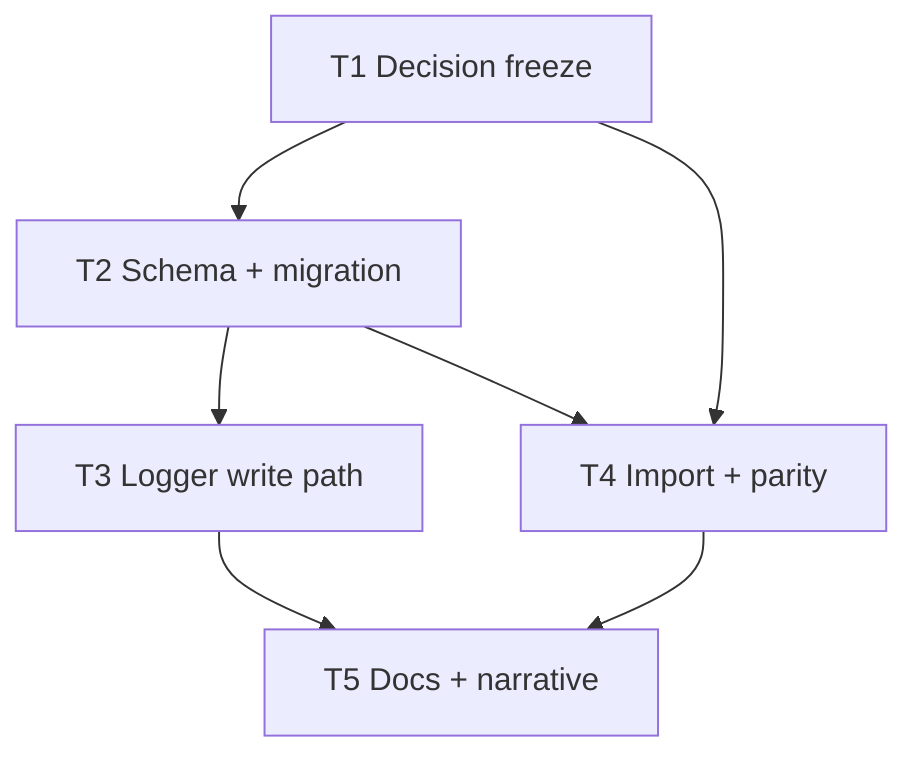

# Orchestrator plan — sqlite-event-decomposition-analytics

**Orchestrator skill version:** 0.5 (user-attached)  
**Plan status:** **Executable** — owner resolutions landed in `.dev/decision-logs/T20-event-decomposition-arch.md` (2026-05-11). Context-map CONDITIONAL flags are addressed for execution; §0 staleness note still applies to line-level map citations.

---

## 0. Context map intake

| Field | Value |
|--------|--------|
| **Path consumed** | `.dev/plans/sqlite-event-decomposition-analytics/context-map.md` |
| **Readiness verdict** | **CONDITIONAL** (verbatim from map) |
| **Scope-area labels (ambiguity flags)** | persistence, analytics; observability; pipeline (Flag 4 vocabulary) |
| **Map metadata** | pre-plan-exploration **v0.2**; map **Commit SHA:** `7d5b1f0b5eb97088b4d4826e868a79dee1bdd4c8` |
| **Current repo HEAD (staleness check)** | `11f5c662e38c93c37e433c80c54b39b642fb211c` — **differs** from map SHA; executors MUST re-read touched files (`heckler/event_store.py`, `heckler/logger.py`, `heckler/models.py`) before relying on line-level citations from the map. |

**BLOCKED?** No — planning proceeds per CONDITIONAL rules: §5.2 lists every ambiguity flag; each subtask whose scope touches persistence/analytics includes a kill criterion referencing unresolved flags at execution start.

### Owner resolutions (question cards → T1 artifact)

- **Recorded in:** `.dev/decision-logs/T20-event-decomposition-arch.md`
- **Effect:** T1 satisfied; **T2+** use T20 as resolved **T1** input. Packet §1/§2 prose that assumed JSON-as-canonical is **non-binding** where it conflicts with T20; T20 wins.

---

## 1. Task statement

Decompose heckler’s persisted event shape (`events.payload_json` / `serialize_heckle_event`) into relational structure suitable for **post hoc SQL analytics** (filtering, aggregates, joins on correlation fields) while preserving a single, testable contract with `HeckleEvent` JSON round-trips and the legacy JSONL import path. Work spans **DDL**, optional **write-time denormalization** or **view-only projections**, **`SCHEMA_VERSION` / migration posture** for existing on-disk databases, and **tests/docs** so operators are not misled by stale “JSONL logging” language.

**Non-goals**

- Re-implementing the completed sqlite-local-db baseline (JSONL→SQLite, correlation plumbing) except where decomposition forces coordinated edits.
- Changing LiteLLM / hosted observability products themselves; only how heckler **persists** correlation and (optionally) eval-adjacent metadata.
- Building a full Langfuse-style UI or hosted eval pipeline inside this repo.
- Introducing ORM dependencies **unless** T1 explicitly supersedes the stdlib `sqlite3` default (would be a new architectural fork and likely a re-plan).

---

## 2. Shared contracts

Binding for **all** subtasks. Values that depend on owner choice are **frozen by T1** in the decision log; until T1 lands, T2–T5 executors halt per kill criteria.

| Topic | Binding |
|--------|---------|
| **Types / interfaces** | **`SCHEMA_VERSION`** (`heckler/event_store.py`) — bumped only when DDL requires migration logic; **T2** owns integer value + migration behavior described in T1. **`init_schema`** — continues to raise `RuntimeError` on unsupported stored version until migration path runs (exact UX frozen by T1). **`insert_event_row`** — today `(conn_or_cursor, payload_json: str, correlation_json: str \| None) -> int`; **T2/T3** own any new public insert helper (e.g. multi-statement transaction API) with signatures and docstrings in `event_store.py`; callers remain **`HecklerLogger`** and **`scripts/import_legacy_jsonl.py`** unless T1 retires a path. **`serialize_heckle_event` / `heckle_event_from_json_dict`** (`heckler/models.py`) — remain the **only** semantic definition of `payload_json` contents unless T1 explicitly chooses normalized-only storage **and** documents supersession of round-trip parity (otherwise parity tests remain binding). **`HeckleEvent` fields** — listed in `heckler/models.py` dataclass; any exploded SQL columns must map 1:1 to these names/semantics or nested `reactor_result` keys **per T1 Flag 6**. **Config** — no new `HecklerConfig` keys required for core decomposition unless T1 chooses separate DB file or feature flags; if added, **T2 or T3** owns typed fields in `heckler/config.py`, `load_config` / env parsing, and a construction or round-trip test. |
| **Error envelope** | **`RuntimeError`** for unsupported schema version (existing). SQLite insert failures: logger continues to log and **re-raise** after `clear_correlation()` in `finally` (existing). No new silent failure modes for persistence. |
| **Naming** | New SQL objects (tables, views, columns) and Python helpers named in **T1 decision log**; **T2** implements. Avoid ad-hoc string keys not mirrored in typed models or decision log. |
| **Logging** | No new log namespaces required; optional `INFO`/`DEBUG` for migration steps owned by **T2** if automatic migration is chosen (must be rate-safe, not per-row spam). |
| **Tests** | **pytest**; extend `tests/test_event_store.py`, `tests/test_context_buffer_and_logger.py`, `tests/test_models.py` as needed; **T4** owns import/backfill coverage **per T1 Flag 5** (if “required”, add tests; if “defer”, explicit deferral note in T1 log). |
| **CLI surface** | Any new flags for import/backfill **T4** owns; freeze strings in T1/T4 packet before CI or docs reference them (**CLI-as-contract rule**). Existing `scripts/import_legacy_jsonl.py` behavior (`--skip-existing`, dedupe via `json_extract`) must remain coherent with stored shape **or** T1 documents breaking change + migration. |

**Typed-surface binding rule.** Every new user-visible config key or construction parameter is owned by **T2** or **T3** with typed parse path + test, or marked *deferred to Tn* in T1 with a blocking follow-up ID.

**Decision log path (architectural subtasks).** Per executor skill alignment: **T1** → `.dev/decision-logs/T20-event-decomposition-arch.md`; **T2** → `.dev/decision-logs/T21-event-decomposition-schema.md`.

**Landed (T1, 2026-05-11):** Architecture freeze for Flags 1–6 (SSOT, migration, eval storage, vocabulary, import tests, `reactor_result` layout) → `.dev/decision-logs/T20-event-decomposition-arch.md`.

---

## 3. Dependency DAG

- **Parallel groups after T1:** `{T2, T4}` is **not** parallel-safe if T4 edits DDL-consuming code while T2 changes DDL — **serialize `T2 → T4`**.  
- **Parallel after T2:** `{T3, T4}` may run in parallel **only if** T4’s edits are limited to dedupe `json_extract` paths that do not depend on the new insert API; default plan: **T3 then T4** to avoid transaction/insert helper drift.  
- **Soft dependency:** T5 can start doc sweep early as a draft, but must **re-grep** after T3/T4 land (retired-string sweep).

---

## 4. Subtask specs

### T1 — Architecture decision freeze

| Field | Content |
|--------|---------|
| **ID** | T1 |
| **Scope** | Codify owner resolutions for context-map ambiguity flags 1–6 (especially 1–4, 6, 5) into a single architectural decision log so downstream executors do not guess SSOT, migration, eval storage, reactor_result layout, or test policy for import scripts. |
| **Files to touch** | `.dev/decision-logs/T20-event-decomposition-arch.md` (create); optionally one-line pointer from `.dev/plans/sqlite-event-decomposition-analytics/plan.md` §2 “Landed” bullets after execution (amendment-style). |
| **Contract bindings** | §2 Types (decision outputs); §2 Tests (Flag 5 policy); §2 CLI (if T1 pre-names import flags). |
| **Inputs** | Owner answers (question cards). |
| **Outputs** | Decision log with explicit: SSOT posture (JSON vs redundant columns vs views-only vs normalized-only), migration posture for existing DBs, eval/label storage choice, disambiguated “eval” meaning for this plan, `reactor_result` storage shape, whether import/backfill tests are required now or deferred with ID. |
| **Kill criteria** | Halt if any of flags **1, 2, 3, 4, 5, 6** lack an explicit landed answer. Halt if the log contradicts §2 without a *Supersedes* note. **Halt if context-map flag 1–6 is unresolved at execution start** (CONDITIONAL rule). |
| **Log tier** | architectural |
| **Risks & mitigations** | Ambiguous wording in the log → downstream re-plan; mitigate with bullet **Binding / Non-binding** labels and concrete examples (e.g. exact table names). |

### T2 — Schema + migration implementation

| Field | Content |
|--------|---------|
| **ID** | T2 |
| **Scope** | Implement DDL and version/migration behavior per T1 in `heckler/event_store.py`; bump `SCHEMA_VERSION` and ensure existing user DBs have a documented, safe path (automatic, scripted, or explicit rebuild-only). |
| **Files to touch** | `heckler/event_store.py`, `tests/test_event_store.py`, `.dev/decision-logs/T21-event-decomposition-schema.md` (create). |
| **Contract bindings** | All §2 rows touching schema, errors, naming; decision log T21. |
| **Inputs** | T1 |
| **Outputs** | Landed DDL; migration code or explicit no-op with documented operator steps; tests for version gate and migration happy-path; T21 rationale for alternatives not chosen. |
| **Kill criteria** | Halt if T1 outputs omit any physical schema decision they were supposed to freeze. Halt if migration would run implicitly without tests covering at least one upgraded file fixture **when T1 chooses automatic migration**. **Halt if context-map flag 1 or 2 is unresolved at execution start** (persistence SSOT / migration). Halt on HEAD vs map drift without re-reading current `init_schema` / `SCHEMA_VERSION`. |
| **Log tier** | architectural |
| **Risks & mitigations** | Partial writes on multi-table DDL — use transactions; align with suspected Surface 5 (lock + transaction boundaries). |

### T3 — Logger write path + atomicity

| Field | Content |
|--------|---------|
| **ID** | T3 |
| **Scope** | Align `HecklerLogger.log_event` (and any new `event_store` helpers) with T1/T2: redundant writes, single-row unchanged, or multi-row inserts **inside one transaction** where required. |
| **Files to touch** | `heckler/logger.py`, `heckler/event_store.py` (if helpers added), `tests/test_context_buffer_and_logger.py`. |
| **Contract bindings** | §2 Types for insert helpers; §2 Error envelope; threading/lock story vs transactions. |
| **Inputs** | T2 |
| **Outputs** | Code + tests proving `payload_json` still matches `serialize_heckle_event` when JSON is retained; or explicit T1-backed exception documented in tests. |
| **Kill criteria** | Halt if T2 schema does not match logger assumptions. **Halt if context-map flag 1 or 6 is unresolved at execution start** (SSOT + reactor_result shape affect write path). |
| **Log tier** | standard (architectural if new public insert contract is introduced — then also append §2 *Landed*). |
| **Risks & mitigations** | Surface 5 — add test or explicit single-transaction API; document lock + transaction interaction. |

### T4 — Legacy import + dedupe parity

| Field | Content |
|--------|---------|
| **ID** | T4 |
| **Scope** | Update `scripts/import_legacy_jsonl.py` so dedupe and insert paths stay consistent with stored JSON keys and any new columns/tables per T1/T2; add backfill or one-shot migration script **only if T1 requires**. |
| **Files to touch** | `scripts/import_legacy_jsonl.py`; tests under `tests/` **if T1 Flag 5 = required**; otherwise document deferral in T1 and keep manual checklist updates only with kill criterion. |
| **Contract bindings** | §2 CLI; §2 Types for `json_extract` paths (Surface 3). |
| **Inputs** | T1, T2 |
| **Outputs** | Working import; optional new tests; frozen CLI strings. |
| **Kill criteria** | Halt if `json_extract` paths no longer match serialized keys. **Halt if context-map flag 1 or 5 is unresolved at execution start** (import depends on SSOT; tests policy). |
| **Log tier** | standard |
| **Risks & mitigations** | Large file import performance — out of scope unless T1 expands; document. |

### T5 — Documentation + retired-string sweep

| Field | Content |
|--------|---------|
| **ID** | T5 |
| **Scope** | Align operator-facing prose with SQLite + decomposition (e.g. pipeline module header Surface 6); grep for retired “JSONL logging” claims; ensure README or docs match frozen CLI from T4. |
| **Files to touch** | `heckler/pipeline.py` (module docstring if stale), `README.md` or docs **if present and already describing logging** — discovery: `rg JSONL heckler README.md docs 2>nul`; do not expand doc scope beyond logging/persistence claims. |
| **Contract bindings** | §2 naming/CLI illustrative vs binding labels in narrative. |
| **Inputs** | T3, T4 |
| **Outputs** | Updated strings; no contradictory examples. |
| **Kill criteria** | Halt if packets/plan still cite pre-T2 `SCHEMA_VERSION` or retired insert signatures after code landed (**retired-string sweep**). **Halt if context-map flag 4 is unresolved at execution start** (wrong audience for “eval” language in docs). |
| **Log tier** | trivial (upgrade to **standard** if T5 freezes any CLI string for CI — then treat as contract-anchor). |
| **Risks & mitigations** | Over-editing docs — stay within persistence/logging claims. |

---

## 5. Adversarial pass

**Lens:** Executor receives only `T<n>.md` + executor SKILL — no parent plan.

### 5.1 Rejected decompositions

- **Single subtask “do all persistence work”** — rejected: T2/T3/T4 would compete on the same contract surfaces (`insert_event_row`, DDL, import dedupe), maximizing merge conflicts and silent contract drift. Splitting by **decision freeze → schema → write path → import → docs** keeps packets cold-start executable.

### 5.2 Load-bearing assumptions

| Tuple |
|--------|
| `(Existing single-row insert API remains sufficient for all strategies \| §2 Types / insert_event_row \| If T1 chooses multi-table writes without a new transactional helper, partial rows on crash \| T2,T3)` |
| `(HeckleEvent JSON keys remain stable for import dedupe \| §2 Types / serialize_heckle_event keys utterance_id, timestamp_iso \| Silent duplicate or skipped imports \| T4)` |
| `(Owners respond to ambiguity flags before coding \| §0 CONDITIONAL + T1 outputs \| Executors halt repeatedly; plan stalls \| T1)` |
| `(stdlib sqlite3 remains the persistence stack \| §1 Non-goals + T1 \| Introducing ORM mid-stream invalidates T2 packet assumptions \| T2)` |

### 5.3 Highest re-plan risk

**T2** — migration logic and DDL choices most often surface unexpected state on real user `.db` files (partial indexes, WAL, version table semantics). Process risk: **T1 log ambiguity** forces T2 to invent schema — mitigated by hard T1 kill criteria.

### 5.4 Hidden couplings

| Tuple | Status |
|--------|--------|
| `(Logger lock wraps insert \| §2 Types / HecklerLogger + sqlite transaction semantics \| Long-held lock during migration or multi-insert \| T3` | **suspected** — disproven by keeping migrations outside `log_event` or short transactions. |
| `(import_legacy_jsonl mirrors insert_heckle_event_row SQL \| §2 Types / transactional insert \| If T3 changes commit ownership (cursor vs connection), import may double-commit or not commit \| T4` | **confirmed** — T4 matches `event_store` commit semantics (one `commit` per `import_lines` batch; inlined SQL aligned with `insert_heckle_event_row`). |
| `(Correlation key names consumed by future SQL views \| §2 Types / correlation_json key names from reactor \| External dashboards break if renamed independently \| T2,T5` | **suspected** — disproven by documenting frozen key set in T1/T5. |

---

## 6. Executor packets

Self-contained packets (duplicate §1, §2, Tn block, filtered §5.2/§5.4):

| Packet |
|--------|
| [`.dev/plans/sqlite-event-decomposition-analytics/packets/T1.md`](packets/T1.md) |
| [`.dev/plans/sqlite-event-decomposition-analytics/packets/T2.md`](packets/T2.md) |
| [`.dev/plans/sqlite-event-decomposition-analytics/packets/T3.md`](packets/T3.md) |
| [`.dev/plans/sqlite-event-decomposition-analytics/packets/T4.md`](packets/T4.md) |
| [`.dev/plans/sqlite-event-decomposition-analytics/packets/T5.md`](packets/T5.md) |

---

## 7. Amendment subtasks

None at plan authoring time. Use §7 if post-audit findings require a narrow doc+code alignment subtask after *Complete*.

---

## Validation checklist (orchestrator)

1. Subtask fields complete — **yes**  
2. DAG acyclic, no orphans — **yes**  
3. Parallel safety — **T2 → T4** serialized; T3/T4 default sequential  
4. Adversarial: rejected alternative + ≥1 assumption — **yes**  
5. Log tiers — **yes** (T5 watch contract-anchor override if CI reads doc strings)  
6. Packets emitted — **see §6**  
7. Typed-surface binding — **T1 must freeze**; T2/T3 own implementations  
8. CLI frozen before downstream — **T4**  
9. Wire/errors — **N/A** (no HTTP)  
10. Decision log paths — **T1, T2** in §2  
11. §5 tuples attributable to Tn — **yes**  
12. Packet-only lens — **yes**  
13. Context map — **consumed**; no “unknown — discovery required” without map  

**Plan complete** ~~pending owner answers that unblock T1 execution~~ **→ Owner resolutions landed 2026-05-11** in `.dev/decision-logs/T20-event-decomposition-arch.md` (normalized SSOT, auto migration with fixtures, eval tables in same DB, dual “eval” vocabulary with doc disambiguation, import tests required, `reactor_result` in child table). **T1** may be marked satisfied by that log; executors for **T2+** proceed per DAG using T20 as resolved input.

**Retired-string / packet note:** Packets were authored under CONDITIONAL ambiguity; they remain structurally valid, but **T2–T4** implementations must treat **T20** as superseding any “JSON canonical” examples in §1/§2 prose within those packets. Prefer **T20 + this §** as binding for SSOT and reactor layout.
