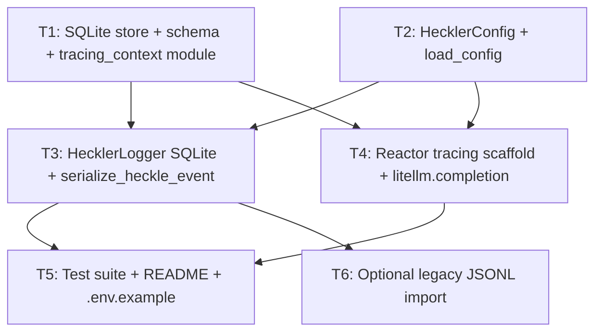

# Plan: sqlite-local-db-obs-langfuse

**Plan document version:** 1.0  
**Orchestrator skill:** orchestrator-planning v0.5  
**Plan status:** Draft — ready for executor packets.

---

## 0. Context map intake

| Field | Value |
|-------|--------|
| **Path consumed** | `.dev/plans/sqlite-local-db-obs-langfuse/context-map.md` (promoted from `.dev/plans/_pending/sqlite-local-db-obs-langfuse/context-map.md`; `_pending/` path is **retired** for this task slug) |
| **Readiness verdict** | **READY** |
| **Scope-area labels (§Ambiguity flags)** | None blocking; residual **optional legacy JSONL import** is scoped to **T6** (kill criterion if treated as required without a packet). |
| **Skill version + commit SHA (map)** | pre-plan-exploration **v0.2** · map records **`0afd022fc5c9b83872a3bc6b015aa6627eed6ee5`** |
| **Current `git rev-parse HEAD` at planning time** | **`0afd022fc5c9b83872a3bc6b015aa6627eed6ee5`** — matches map SHA on plan creation (staleness: re-verify after further commits on touched paths). |

**READY handling:** No CONDITIONAL ambiguity kill criteria in §4 beyond T6’s optional scope.

---

## 1. Task statement

Replace heckler’s append-only **JSONL** logging under `log_dir` with **SQLite** as the sole steady-state structured event store (stdlib **`sqlite3`**), persisting **non-audio** payloads aligned with `HeckleEvent` (no audio blobs or paths). Add a **reactor-local tracing scaffold** at **`litellm.completion`** in **`heckler/reactor.py`** so hosted observability (Langfuse / Langsmith-style tooling via LiteLLM and environment configuration) can attach to LLM calls, with **correlation hooks** into persisted rows. Include **minimal DDL / hooks** for future eval and analytics (no committed eval methodology, analytics UI, funniness metric, or prompt taxonomy in this cycle). Optionally provide a **one-shot legacy import** from historical `heckler_*.jsonl` files—explicitly non-blocking.

**Non-goals**

- Dual-write JSONL + SQLite as steady state.
- Persisting audio data, file paths to audio, or full `ContextBuffer` state to SQLite.
- SQLAlchemy / Alembic (unless a later plan revisits schema complexity).
- Production-grade dashboards, Langfuse cloud onboarding docs beyond `.env.example` pointers, or batch-only “export from SQLite then trace” as the **primary** observability pattern (call-site scaffold is primary per context map).
- Changing pipeline threading architecture, `Reactor.react` return type, or adding LLM streaming/async.
- New **required** funniness metrics or typed prompt-version taxonomy.

---

## 2. Shared contracts

| Topic | Binding |
|--------|---------|
| **Types / interfaces** | **`HecklerConfig`** (`heckler/config.py`): Remove **`log_dir`** as the persistence root for events. Add **`sqlite_database_path: str`** (default **`"logs/heckler.db"`** — keeps artifacts under the historical `logs/` directory convention). **`load_config()`** reads **`HECKLER_DATABASE_PATH`** (non-empty overrides default path string). Owning subtask **T2**; typed parse path: dataclass field + `load_config`; construction tests in **`tests/test_models.py`** (or dedicated config test module if already split). **`HecklerLogger`** (`heckler/logger.py`): **`__init__(config: HecklerConfig) -> None`** and **`log_event(event: HeckleEvent) -> None`** signatures **unchanged** at call sites. **`log_event`** persists via SQLite using the **single** JSON projection **`serialize_heckle_event(event)`** from **`heckler/models.py`** followed by `json.dumps` (eliminating divergent `_serialize` / `_coerce_json` logic for event bodies). Owning subtask **T3**. **SQLite module API** (new module, name finalized in **T12** decision log, e.g. `heckler/event_store.py`): **`open_store(path: Path) -> ...`**, **`init_schema(conn)`**, **`insert_event_row(conn | cursor, payload_json: str, correlation_json: str | None)`** (exact helper names per implementation; binding is **typed init + insert** with tests). Owning subtask **T1**. **`heckler/tracing_context.py`** (new): holds **thread-local or contextvar** storage for **optional** completion correlation (`litellm` response id / provider metadata as strings) set on the **reaction worker thread** and consumed when **`log_event`** runs—owning subtask **T1** (module skeleton + reset/read helpers); **T4** sets values after **`litellm.completion`** returns; **T3** reads/clears around insert. **`HeckleEvent`** fields unchanged in v1 unless **T3** adds optional metadata **only** via `tracing_context` / side columns—not ad-hoc `getattr` on events. |
| **Error envelope** | **`litellm.completion`** failures remain **`(None, latency_ms, DiscardReason.LLM_ERROR)`** with provider-agnostic ERROR logging (**T4** must not change that contract). SQLite **insert** failures: log at **ERROR** with exception text; **prefer raising** after log (match prior JSONL behavior where write failures surface) — owning **T3**; tests assert at least one failure path (e.g. read-only directory or mocked connection). Tracing scaffold: **no new user-facing exceptions** when Langfuse/Langsmith env is absent (no-op). |
| **Naming** | New modules: **`tracing_context`**, event store module (**T12** names), optional **`heckler/tools/import_legacy_jsonl.py`** or **`scripts/`** helper for **T6** (no new console entrypoint unless §2 amended). New env: **`HECKLER_DATABASE_PATH`**. Retired persistence env/key paths: document **`log_dir` removal** in changelog/README. |
| **Logging** | Application logger levels unchanged. Optional **DEBUG** lines behind existing patterns if tracing scaffold needs diagnostics—must default **off** for normal runs. |
| **Tests** | **pytest** under **`tests/`**; **`tests/test_context_buffer_and_logger.py`** rewritten for SQLite persistence (no JSONL path assertions). **`tests/test_pipeline.py`** remains valid with mocked **`HecklerLogger`** if signature unchanged. Add store/schema tests (**T1**), config path tests (**T2**), reactor tracing smoke (**T4**) without requiring live Langfuse servers (mock **`litellm.completion`** or env). **Coverage:** `serialize_heckle_event` remains the single JSON shape contract (**`tests/test_models.py`** extended if new columns touch round-trip—prefer avoiding **HeckleEvent** shape change in v1). |
| **CLI surface** | **`heckler.pipeline:main`** remains **`--list-devices`** only. **T6** must **not** add `project.scripts` entries without a plan amendment; standalone scripts are invoked via **`python path/to/script.py`** or documented module run. |

**Typed-surface binding checklist**

| Key / field | Owner | Typed surface | Test |
|-------------|-------|---------------|------|
| `HECKLER_DATABASE_PATH` → `sqlite_database_path` | T2 | `HecklerConfig`, `load_config` | Config construction / env override |
| `sqlite_database_path` default + parent dir creation | T2, T3 | `HecklerLogger.__init__` creates parent of DB path | Logger init test |
| Event JSON body | T3 | `serialize_heckle_event` + DB `TEXT` column | Logger + models tests |
| Store `insert_*` | T1 | event store module public API | Dedicated store tests |
| `tracing_context` set/clear | T1, T3, T4 | `tracing_context` + reactor + logger | Thread-scoped integration test or unit tests |

**CLI-as-contract:** `--list-devices` only; no downstream packet references other entrypoint strings unless **T6** stays script-only.

**Wire / error-envelope:** No HTTP server; N/A beyond reactor return tuple and SQLite error behavior above.

**Architectural decision logs**

| Subtask | Path |
|---------|------|
| **T1** | `.dev/decision-logs/T12.md` — DDL, WAL vs DELETE journaling, thread model for `sqlite3`, correlation column layout |
| **T2** | `.dev/decision-logs/T13.md` — `log_dir` retirement, default DB path rationale, env naming |
| **T3** | `.dev/decision-logs/T14.md` — serialization unification, failure modes, transaction boundaries |
| **T4** | `.dev/decision-logs/T15.md` — LiteLLM observability integration approach (callbacks vs env-only), what metadata is captured for SQLite correlation |

---

## 3. Dependency DAG

**Parallel groups**

- **`{T1, T2}`** may run in parallel (disjoint primary files: new store module vs `config.py`).

**Sequential note**

- **`{T3, T4}`** may run in parallel **after** `T1` and `T2` complete **only if** `tracing_context` API is stable from **T1** and **T4** does not rename helpers mid-flight; if executor finds import cycles or incomplete symbols, complete **T4** before **T3** (soft dependency—coordinate via shared **§2** signatures).

**Soft dependency**

- **T4 → T3 ordering** preferred when correlation wiring crosses both files for the first integration build.

---

## 4. Subtask specs

### T1 — SQLite store module, schema, tracing_context

| Field | Content |
|--------|---------|
| **Scope** | Implement stdlib **`sqlite3`** persistence layer: schema creation ( **`events`** table + **`schema_version`** or equivalent migration marker), WAL pragmas appropriate for single-process multi-threaded writers (pipeline reaction worker + any concurrent callers), and insert primitive accepting JSON **payload** and optional **correlation** blob. Add **`heckler/tracing_context.py`** with minimal get/set/clear for reaction-thread completion metadata. |
| **Files to touch** | New: `heckler/event_store.py` (name per **T12** decision log if renamed), `heckler/tracing_context.py`; `tests/test_event_store.py` (new). |
| **Contract bindings** | All §2 rows for store API and **tracing_context**; decision log **T12**. |
| **Inputs** | None. |
| **Outputs** | Store module + tests + **`.dev/decision-logs/T12.md`**. |
| **Kill criteria** | HALT if SQLAlchemy requested; HALT if **`audio`** columns appear; HALT if context-map flag **legacy JSONL import** is mistaken for required persistence work; HALT if **`tracing_context`** requires cross-thread propagation beyond documented reaction-worker model without explicit §2 amendment. |
| **Log tier** | architectural |
| **Risks & mitigations** | **SQLite locking:** document writer serialization + WAL; test concurrent inserts from threads mimicking logger. **Mitigation:** use single connection with lock or documented pattern in T12. |

### T2 — Config: sqlite path, retire log_dir

| Field | Content |
|--------|---------|
| **Scope** | Replace **`log_dir`**-based persistence configuration with **`sqlite_database_path`** and **`HECKLER_DATABASE_PATH`**. Update **`load_config()`**. Grep-update tests and non-persistence references to **`log_dir`** (including **`HecklerConfig(..., log_dir=...)`** call sites). |
| **Files to touch** | `heckler/config.py`, `tests/test_models.py`, `tests/test_audio_capture.py`, `tests/test_pipeline.py`, `tests/test_context_buffer_and_logger.py` (partial until T3), any other `grep` hits for `log_dir`. |
| **Contract bindings** | §2 Types (config); **T13** decision log. |
| **Inputs** | None. |
| **Outputs** | Typed config + tests for env override + **`.dev/decision-logs/T13.md`**. |
| **Kill criteria** | HALT if **`log_dir`** remains the canonical persistence key without **T13** documenting migration; HALT if new deps added for config parsing. |
| **Log tier** | architectural |
| **Risks & mitigations** | **Breaking dev ergonomics:** README snippet for new env var; mitigate in **T5** if not done here. |

### T3 — HecklerLogger: SQLite persistence + unified serialization

| Field | Content |
|--------|---------|
| **Scope** | Refactor **`HecklerLogger`** to write rows via **T1** store API; use **`serialize_heckle_event`** for payload JSON; remove JSONL **`_path_for_date`** / daily file semantics from steady state; read optional correlation from **`tracing_context`** for dedicated columns or JSON subfield per **T12**. Ensure **`PacingGate` / `speaker` ordering** is unchanged (observability must not reorder **`record_output`** vs **`speak`**). |
| **Files to touch** | `heckler/logger.py`, `heckler/models.py` (only if helper exports needed—avoid **HeckleEvent** field creep), `tests/test_context_buffer_and_logger.py`. |
| **Contract bindings** | §2 Types (logger, serialization); **T14** decision log. |
| **Inputs** | **T1**, **T2**, **T4** (for stable **`tracing_context` writes**—if **T4** lags, stub no-op correlation reads). |
| **Outputs** | SQLite-backed logger + updated logger tests + **`.dev/decision-logs/T14.md`**. |
| **Kill criteria** | HALT if duplicate JSON coercion paths remain for event bodies; HALT if steady-state JSONL write paths remain without **T6** explicitly owning legacy behavior; HALT if **`audio_chunk`** reappears in stored JSON. |
| **Log tier** | architectural |
| **Risks & mitigations** | **Import cycle:** logger ↔ store ↔ config—mitigate with local imports or thin facade per T14. |

### T4 — Reactor: tracing scaffold at litellm.completion

| Field | Content |
|--------|---------|
| **Scope** | At **`litellm.completion`** call site, add **scaffold** for hosted tracing (environment-driven Langfuse/Langsmith-style behavior consistent with LiteLLM ≥1.40 as declared in **`pyproject.toml`**). Populate **`tracing_context`** with optional provider identifiers from the completion **response** object where available. **Do not** break **`react`** return contract. |
| **Files to touch** | `heckler/reactor.py`, `tests/test_reactor.py`. |
| **Contract bindings** | §2 Error envelope for LLM failures; **T15** decision log; **tracing_context** contract from **T1**. |
| **Inputs** | **T1**, **T2**. |
| **Outputs** | Instrumented reactor + tests + **`.dev/decision-logs/T15.md`**. |
| **Kill criteria** | HALT if a second **root** tracing layer wraps the pipeline outside **`litellm.completion`** without **T15** decision-log rationale (duplicate spans risk per context map Surface 4); HALT if network calls to observability backends are **required** for tests (must mock); HALT if context-map **“eval” vocabulary** collides with **`PacingGate.evaluate`** naming in new APIs. |
| **Log tier** | architectural |
| **Risks & mitigations** | **LiteLLM observability API drift:** pin behavior to installed range and document discovery steps in T15. |

### T5 — Tests, README, .env.example

| Field | Content |
|--------|---------|
| **Scope** | Finalize test updates deferred from **T2**; ensure **full pytest suite** green. Document **`HECKLER_DATABASE_PATH`**, removed **`log_dir`**, and observability env vars (informational list—Langfuse/Langsmith typically via process env consumed by LiteLLM). Update **`CHANGELOG.MD`** entry per repo conventions. |
| **Files to touch** | `README.md`, `.env.example` (if present; create only if repo pattern exists), `CHANGELOG.MD`, remaining tests. |
| **Contract bindings** | §2 CLI freeze (`--list-devices` only); docs must not invent CLI flags. |
| **Inputs** | **T3**, **T4**. |
| **Outputs** | Green tests + documentation deltas. |
| **Kill criteria** | HALT if README references JSONL as steady-state sink; HALT if new console scripts documented without §2 amendment. |
| **Log tier** | standard |
| **Risks & mitigations** | **Drift:** grep for `jsonl`, `log_dir`, `heckler_20`. |

### T6 — Optional legacy JSONL import

| Field | Content |
|--------|---------|
| **Scope** | One-shot tool to import **`heckler_YYYY-MM-DD.jsonl`** lines into the **`events`** table using the same JSON shape as **`heckle_event_from_json_dict`** validation allows—**optional**; skip if out of time with explicit handoff note. |
| **Files to touch** | New script under **`scripts/`** or **`heckler/tools/`** (discovery: prefer non-packaged **scripts/** to avoid console entrypoint contracts). |
| **Contract bindings** | §2 non-CLI rule; reuse **T1** insert API. |
| **Inputs** | **T3** (stable insert path). |
| **Outputs** | Script + minimal test or documented manual verification checklist. |
| **Kill criteria** | HALT if context-map flag **optional import** is unresolved and product owner required import in this cycle—escalate re-plan; HALT if **`project.scripts`** modified without amendment. |
| **Log tier** | standard |
| **Risks & mitigations** | **Duplicate imports:** document idempotency strategy (e.g. skip by `utterance_id` + timestamp) in script header. |

---

## 5. Adversarial pass

### 5.1 Rejected decompositions

- **Single subtask “do SQLite + tracing”:** Rejected—same PR would touch **`config`**, **`logger`**, **`reactor`**, and tests with high conflict risk and unclear serialization ownership; fails parallelization and obscures kill criteria for persistence vs observability.
- **SQLAlchemy-first:** Rejected by owner decision (stdlib **`sqlite3`** default); Alembic adds dependency weight not justified for initial **`events`** table.

### 5.2 Load-bearing assumptions

| Tuple |
|-------|
| `(stdlib sqlite3 suffices for single-machine heckler | §2 Types / `sqlite3` + WAL assumptions | writer contention or corruption under mic + reaction threads | T1,T3)` |
| `(LiteLLM 1.40+ exposes stable hooks/env for observability | §2 T4 / litellm.completion | scaffold no-ops or breaks on upgrade | T4)` |
| `(reaction worker stays the only thread calling reactor.react + HecklerLogger.log_event for a given event chain | §2 tracing_context + Surface “PacingGate ordering” from context map | correlation ContextVar/thread-local wrong if logging moves threads | T3,T4)` |
| `(serialize_heckle_event covers all persisted columns without HeckleEvent schema change | §2 unified serialization | missing fields in SQLite vs pipeline | T1,T3)` |

### 5.3 Highest re-plan risk

**T3** — highest technical re-plan risk: bridges **`serialize_heckle_event`**, **`tracing_context`**, SQLite I/O, and legacy test expectations; surprises often surface as **“tests pass but rows wrong.”**

### 5.4 Hidden couplings

| Tuple | Status |
|-------|--------|
| `(duplicate JSON paths | §2 serialize_heckle_event vs legacy logger `_coerce_json` | inconsistent DB rows vs model tests | T3)` | **confirmed** (context map Surface 3) |
| `(log_dir semantics | §2 `sqlite_database_path` + README | operators/scripts still point tooling at `logs/*.jsonl` | T2,T5)` | **confirmed** |
| `(litellm tracing + SQLite correlation | §2 tracing_context + events DDL | orphan spans or duplicate trace roots if second instrumentation layer added | T4)` | **suspected** — disprove by grep for `callback`, `langfuse` outside **`reactor`** after T4 |
| `(T3 parallel T4 | §2 tracing_context API | import error or partial wiring if both edit shared module without ordering | T3,T4)` | **suspected** — mitigate by completing **T1** first and preferring **T4 → T3** if CI fails |

---

## 6. Executor packets

Self-contained executor packets (§1 + §2 + own §4 + filtered §5.2 / §5.4 + resolved inputs):

| Packet |
|--------|
| `.dev/plans/sqlite-local-db-obs-langfuse/packets/T1.md` |
| `.dev/plans/sqlite-local-db-obs-langfuse/packets/T2.md` |
| `.dev/plans/sqlite-local-db-obs-langfuse/packets/T3.md` |
| `.dev/plans/sqlite-local-db-obs-langfuse/packets/T4.md` |
| `.dev/plans/sqlite-local-db-obs-langfuse/packets/T5.md` |
| `.dev/plans/sqlite-local-db-obs-langfuse/packets/T6.md` |

The plan does not duplicate full packet bodies beyond §6 references above.

---

## 7. Amendment subtasks

None. Future audits should use **§7** if blocking issues arise post-*Complete*.

---

## Validation checklist (orchestrator)

1. Subtasks have required fields — **pass** (no TBD in kill criteria).
2. DAG acyclic — **pass**.
3. Parallel safety — **`T3`/`T4`** documented with soft ordering; **T1/T2** parallel-safe — **pass**.
4. Adversarial — rejected alternative + load-bearing assumptions — **pass**.
5. Log tiers — **pass** (architectural anchors have decision log paths in §2).
6. Packets — emitted as separate files — **pass** (see `packets/`).
7. Typed-surface binding — checklist in §2 — **pass**.
8. CLI strings — only **`--list-devices`** + **T6** script-only — **pass**.
9. Wire contract — N/A HTTP — **pass**.
10. Decision log paths — §2 table — **pass**.
11. §5 tuples attribute **Tn** — **pass**.
12. §5 lens — packet-only executor persona applied — **pass**.
13. Context map — present; no **unknown—discovery required** without map — **pass**.
