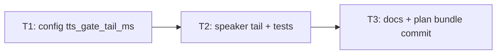

# Plan — tts-mic-gate-tail

**Version:** 1.0  
**Plan name:** `tts-mic-gate-tail`  
**Skill:** orchestrator-planning v0.6  
**Date:** 2026-05-21  
**Status:** Planning complete — execution pending (§8 auditor handoff not populated until *Complete*)

---

## §0 Context map intake

- **Path consumed:** `.dev/plans/tts-mic-gate-tail/context-map.md` (already at final plan path; not promoted from `_pending/`)
- **Readiness verdict:** CONDITIONAL
- **Scope-area labels flagged:** Flag 1 (`config`, `speaker` — tail configurable vs constant), Flag 2 (`speaker`, `tests` — tail on error paths), Flag 3 (`tests` — post-play hold assertion), Flag 4 (`speaker`, `UX` — default ms tradeoff)
- **Skill version + commit SHA:** pre-plan-exploration v0.2 @ `58f10f132078691a70cc0ae70a5304816fce1f25` (matches `git rev-parse HEAD` at planning time; working tree dirty with out-of-scope `next_steps.md`)

**Binding-artifact note:** `context-map.md` and this plan are **not** in the git object graph at the planning SHA (`git ls-files` empty). Executors may proceed; **§8.2 is invalid** until the plan bundle is committed with the implementation (T3 Outputs).

**Flag resolutions applied before planning:**

- **Flag 1 (vocabulary_collision):** Resolved. Tail duration is **`HecklerConfig.tts_gate_tail_ms`** with env override **`TTS_GATE_TAIL_MS`** (default `400`). Dataclass default + `load_config()` parse; not a hardcoded constant in `speaker.py`. Supersedes “speaker-only” decomposition.
- **Flag 2 (ownership_ambiguity):** Resolved. Post-playback tail runs **only after successful** `sd.play(..., blocking=True)` returns. Synthesis failure: `clear()` before play (unchanged). Playback failure: `clear()` in `finally` **without** tail (unchanged semantics for error paths).
- **Flag 3 (missing_test_coverage):** Addressed in **T2** — new test monkeypatches `time.sleep` and asserts `is_playing` remains set through the tail window; existing immediate-clear test updated to use `tts_gate_tail_ms=0` or equivalent.
- **Flag 4 (coexisting_model_versions):** Resolved. Default **400 ms** (mid 300–500 ms band). Operators may raise via env on reverberant setups; `0` disables tail for tests/diagnostics. Rationale recorded in T2 decision log.

**Supersession (prior contract):** `.dev/archive/plans/heckler-v1/packets/T8.md` and `heckler_seed.md` mic-gate prose (“cleared after playback ends / completes”) are superseded by “cleared after playback **and** configurable post-playback acoustic tail.” Explicit back-annotation in **T3**.

---

## §1 Task statement

After Kokoro TTS finishes digital playback, the mic gate (`Speaker.is_playing`) is cleared immediately while **acoustic bleed** from speakers can still reach the capture path. That causes the transcriber to pick up the system’s own commentary and feed echo transcripts into the reactor (validated in `logs/heckler_2026-05-09.jsonl`). Extend the mic-gate hold with a short post-playback silence buffer (~300–500 ms target band) before `is_playing.clear()`, centralized in `Speaker.speak`, without changing `AudioCapture` or pacing call order.

**Non-goals:**

- Reactor-side dedup of transcript ≈ last comment, AEC, or headphone-routing mitigations.
- Moving `PacingGate.record_output()` to after playback or tail (`_execute_spoken_reply` order frozen).
- Changing transcribe mode’s never-set `threading.Event()` wiring.
- Folding tail duration into `speak()`’s `tts_latency_ms` return (synthesis wall time only).
- GUI-specific gate logic, `pacing_gate.py` behavior changes, or new CLI flags.
- `freezegun` or new test dependencies.

---

## §2 Shared contracts

| Topic | Contract |
|-------|----------|
| **Types / interfaces** | **`heckler/config.py`:** `HecklerConfig` gains `tts_gate_tail_ms: int = 400` (owning subtask: **T1**; typed surface: frozen dataclass field; test: `tests/test_config.py` default + env override). **`load_config()`:** reads `TTS_GATE_TAIL_MS` via `int(os.getenv("TTS_GATE_TAIL_MS", "400"))` with no strip/special-case (owning subtask: **T1**; test: `tests/test_config.py` env override). **`heckler/speaker.py`:** after successful `sd.play(..., blocking=True)`, if `self._config.tts_gate_tail_ms > 0`, call `time.sleep(self._config.tts_gate_tail_ms / 1000.0)` before `is_playing.clear()` in the playback `finally` block; on synthesis error or play exception, clear without tail (owning subtask: **T2**; test: `tests/test_speaker.py`). **`speak()` return:** still synthesis-only `tts_latency_ms`; tail sleep excluded (owning subtask: **T2**; test: existing latency tests or new assertion that mocked sleep does not inflate return). **`AudioCapture`:** no signature changes; continues `is_playing.is_set()` early return in `_emit_audio_segment`. |
| **Error envelope** | Unchanged: `SpeakerError` on synthesis failure; `sd.play` exceptions propagate after `clear()` in `finally`. No new exception types. |
| **Naming** | Field: `tts_gate_tail_ms`. Env: `TTS_GATE_TAIL_MS`. Decision log: `.dev/decision-logs/tts-mic-gate-tail-T2.md`. |
| **Logging** | No new structured log fields required. Optional `DEBUG` on tail is **out of scope** (YAGNI). |
| **Tests** | **pytest** under `tests/`. Extend `tests/test_config.py` (T1), `tests/test_speaker.py` (T2). Prefer `monkeypatch.setattr(speaker_mod.time, "sleep", ...)` to assert gate state during tail. `tts_gate_tail_ms=0` in fixtures where immediate clear is the behavior under test. No new dependencies. |
| **CLI surface** | N/A — no new flags or subcommands. |

**Decision log paths:**

- T2 (architectural): `.dev/decision-logs/tts-mic-gate-tail-T2.md`

---

## §3 Dependency DAG

**Parallel groups:** None — strict sequence `T1 → T2 → T3`.

**Soft dependencies:** None.

---

## §4 Subtask specs

### T1 — Config surface (`tts_gate_tail_ms`)

| Field | Content |
|-------|---------|
| **ID** | T1 |
| **Scope** | Add `tts_gate_tail_ms` to `HecklerConfig` and wire `TTS_GATE_TAIL_MS` in `load_config()`. |
| **Files to touch** | `heckler/config.py`, `tests/test_config.py` |
| **Contract bindings** | §2 Types (`tts_gate_tail_ms`, `TTS_GATE_TAIL_MS`), §2 Tests |
| **Inputs** | None |
| **Outputs** | Updated `heckler/config.py`, `tests/test_config.py` |
| **Kill criteria** | (1) Halt if context-map Flag 1 is reopened at execution start (executor must use configurable field, not hardcoded ms in `speaker.py`). (2) Halt if env key name drifts from `TTS_GATE_TAIL_MS` without plan amendment. |
| **Log tier** | `standard` |
| **Risks & mitigations** | Invalid env string raises `ValueError` at startup — same class of failure as other bare `int()` env parses; document in README. |

### T2 — Speaker post-playback tail + tests

| Field | Content |
|-------|---------|
| **ID** | T2 |
| **Scope** | Hold `is_playing` through configurable post-playback sleep after successful `sd.play`; extend unit tests for tail hold, error paths without tail, and return value excluding tail time. |
| **Files to touch** | `heckler/speaker.py`, `tests/test_speaker.py`, `.dev/decision-logs/tts-mic-gate-tail-T2.md` (new) |
| **Contract bindings** | All §2 rows |
| **Inputs** | T1 (`tts_gate_tail_ms` on `HecklerConfig`) |
| **Outputs** | Updated `speaker.py`, `tests/test_speaker.py`, decision log |
| **Kill criteria** | (1) Halt if context-map Flag 2 unresolved: tail must not run on synthesis failure or `sd.play` exception. (2) Halt if `pacing_gate.record_output()` or `_execute_spoken_reply` call order changes. (3) Halt if `tts_latency_ms` includes tail sleep. (4) Halt if `AudioCapture` or `controller.py` wiring changes without plan amendment. |
| **Log tier** | `architectural` |
| **Risks & mitigations** | Longer hold increases barge-in latency (coupling surface 6) — mitigated by default 400 ms and env tunability; log documents tradeoff. |

### T3 — Docs supersession + tracked plan bundle

| Field | Content |
|-------|---------|
| **ID** | T3 |
| **Scope** | Supersede mic-gate prose in `heckler_seed.md`; add `CHANGELOG.MD` entry; document `TTS_GATE_TAIL_MS` in `README.md` and `.env.example`. Commit `.dev/plans/tts-mic-gate-tail/` (context-map, plan, packets) so §8.2 can resolve. |
| **Files to touch** | `heckler_seed.md`, `CHANGELOG.MD`, `README.md`, `.env.example`, `.dev/plans/tts-mic-gate-tail/*` (commit only — no content edits to plan/packets unless contract drift found) |
| **Contract bindings** | §2 Naming (`TTS_GATE_TAIL_MS`), §2 Tests (N/A) |
| **Inputs** | T2 (landed behavior + decision log rationale) |
| **Outputs** | Doc updates; git commit including plan artifacts (user-requested commit or bundled with implementation commit) |
| **Kill criteria** | (1) Halt if `heckler_seed.md` still says gate clears immediately when digital playback ends without mentioning acoustic tail. (2) Halt if README documents a different env name than §2. (3) Halt if plan bundle remains untracked at handoff. |
| **Log tier** | `standard` |
| **Risks & mitigations** | Seed/doc drift vs code — T3 runs after T2 so prose matches implementation. |

---

## §5 Adversarial pass

*Lens: packet-only executor — halt-shaped findings.*

### 5.1 Rejected decompositions

1. **Hardcoded ~400 ms in `speaker.py` only (no config):** Rejected — context-map Flag 1 and operator README pattern (`KOKORO_VOICE`, `PACING_INTERVAL`) favor env-tunable ms for reverberant setups without code edits.
2. **Tail logic in `AudioCapture._emit_audio_segment`:** Rejected — `Speaker` owns `is_playing` set/clear lifecycle; moving hold into capture duplicates ownership and risks desync with synthesis window.
3. **Defer tail to `sd.wait()` / non-blocking play:** Rejected — map confirms `blocking=True` already waits for digital completion; bug class is post-DAC acoustic bleed, not missing `wait()`.

### 5.2 Load-bearing assumptions

| Tuple |
|-------|
| (`AudioCapture` gates on shared `Event.is_set()` only` \| §2 Types → `AudioCapture._emit_audio_segment` \| extending hold in `Speaker` suppresses echo without capture changes \| T2) |
| (`Pacing cooldown starts at speak intent, not playback end` \| §2 Types → `pipeline._execute_spoken_reply` + `PacingGate.record_output` \| reordering record_output after tail would drift cooldown semantics \| T2) |
| (`400 ms default suppresses typical acoustic tail without unacceptable barge-in` \| §2 Types → `tts_gate_tail_ms` default \| insufficient tail on reverberant hardware reintroduces echo; excessive tail blocks user overlap \| T2,T3) |
| (`TTS_GATE_TAIL_MS parse lands in T1 before T2 reads config` \| §2 Types → `HecklerConfig.tts_gate_tail_ms` \| T2 hardcodes ms or uses getattr default → contract violation \| T1,T2) |

### 5.3 Highest re-plan risk

**T2** — subtle `try`/`finally` structure around `sd.play` and tail sleep is the most likely site for accidental tail-on-error or double-clear regressions.

### 5.4 Hidden couplings

| Tuple | Status |
|-------|--------|
| (`test_speak_clears_event_after_successful_playback` assumes immediate clear` \| `tests/test_speaker.py:test_speak_clears_event_after_successful_playback` \| merge without `tts_gate_tail_ms=0` flakes or false failures \| T2) | **confirmed** |
| (`heckler_seed.md Coupling Surface 2 wording` \| `heckler_seed.md` ~L780 \| auditor flags doc/code drift if T3 skipped \| T3) | **confirmed** |
| (`Persona mode shares Speaker.is_playing with capture` \| `controller.py:_start_persona_mode` \| transcribe mode must remain never-set Event \| T2) | **confirmed** (no code change expected) |
| (`Monkeypatched sleep vs real time in CI` \| `tests/test_speaker.py` \| test must assert `is_set()` before sleep returns, not wall-clock timing \| T2) | **suspected** — disproven if test patches sleep and checks call order + gate state in fake sleep |

---

## §6 Executor packets

| Packet | Path |
|--------|------|
| T1 | `.dev/plans/tts-mic-gate-tail/packets/T1.md` |
| T2 | `.dev/plans/tts-mic-gate-tail/packets/T2.md` |
| T3 | `.dev/plans/tts-mic-gate-tail/packets/T3.md` |

---

## §7 Amendment subtasks

None (v1.0 initial plan).

---

## §8 Auditor handoff

**Not produced** — populate when execution marks plan *Complete* (clean-tree verification, §8.2 artifact chain, §5 disposition).

**Planned verification command:** `pytest tests/test_config.py tests/test_speaker.py -q`

**Planned §8.5 cold-read seeds:** `heckler/speaker.py`, `heckler/audio_capture.py`, `heckler/config.py`, `tests/test_speaker.py`
